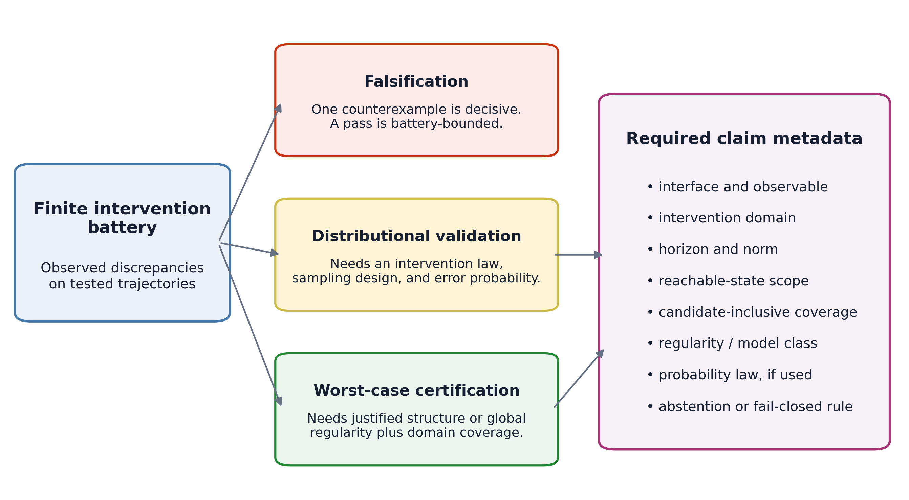
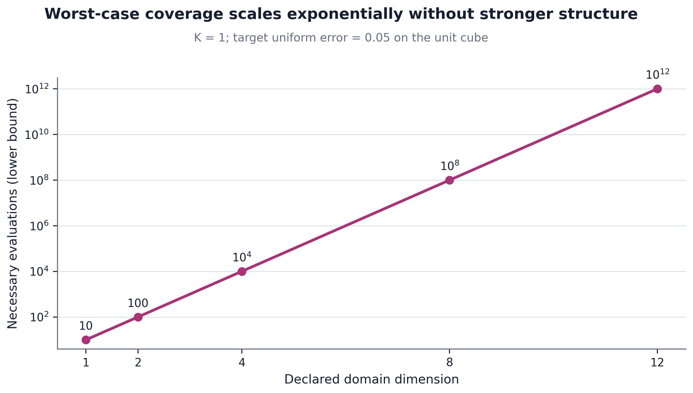
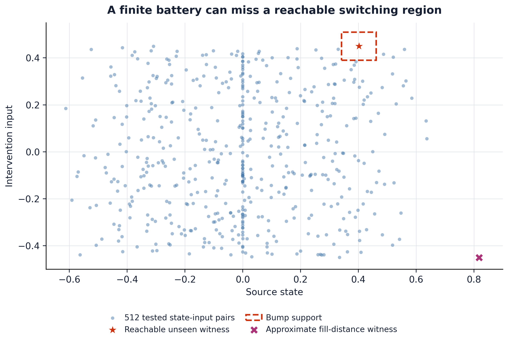
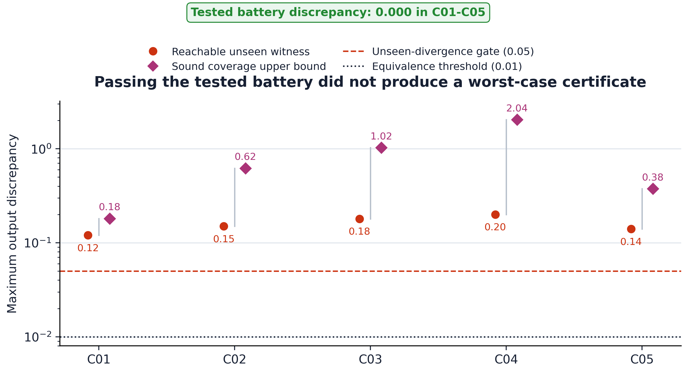
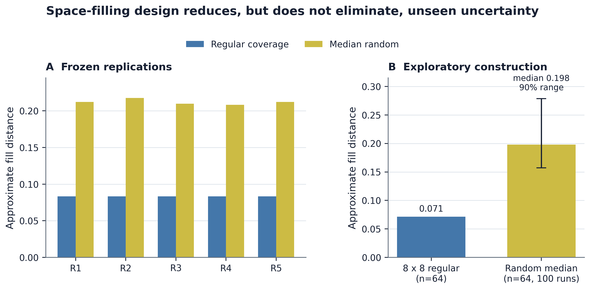

# The Intervention-Coverage Barrier: Why Finite Functional Tests Cannot Certify Neural Replacement Fidelity

**Thomas Ryan**  
Independent Researcher, San Francisco, California, USA  
**Status:** Public preprint; not peer reviewed  
**Version:** 1.0.0 - 29 August 2026

## Abstract

Functional tests are indispensable for evaluating neural replacements, brain emulations, and other dynamical substitutes. A failed test can falsify fidelity at a declared interface. The meaning of a successful finite battery is more limited. This paper formalizes an intervention-coverage barrier: on a continuous state-intervention domain, exact agreement on any finite battery is compatible with a continuous piecewise-linear candidate that diverges at an admissible, reachable, untested intervention. The construction is representable by a finite ReLU network and already applies to a one-state recurrent system. It therefore cannot be dismissed as a discontinuous pathology or as an artifact of purely static functions.

The paper separates three claims that are often compressed into the word "validation": finite-battery falsification, distributional validation under an explicit intervention law, and worst-case certification over a declared domain. For a discrepancy function with a sound global Lipschitz constant $K$, a finite battery $B$ supports the uniform bound

$$\sup_{x \in X}\,d(x) \leq \max_{b \in B}\,d(b) + K\rho(B;X),$$

where $\rho$ is the fill distance of the battery in the declared domain. The residual term is minimax tight for the information class. On the unit cube under the max norm, a target error $\epsilon$ requires at least $(K/(2\epsilon))^m$ evaluations in dimension $m$ in the worst case, exposing an exponential coverage burden unless stronger structure is justified. For recurrent substitutions, one-step bounds transport only on a domain containing both source and candidate reachable trajectories and are amplified by the incremental dynamics.

A frozen synthetic confirmation tested five parameterized recurrent packets. Across 368 trajectories and 3,632 tested state-input pairs, every candidate matched its source exactly on its battery but diverged by 0.12-0.20 at a reachable unseen intervention. Every sound one-step coverage audit rejected a 0.01 uniform certificate. Equal-budget space-filling designs reduced approximate fill distance relative to random batteries in all five frozen replications, but did not erase the claim distinction. These deterministic fixtures validate the implementation, not the theorem by repetition.

The result is a claim-audit framework, not an impossibility theorem for whole-brain emulation. It does not show that any specific replacement fails, that functional fidelity is unattainable, or that consciousness is preserved or lost. It shows what evidence must be added before finite functional success can be called distributional validation or worst-case certification.

**Keywords:** neural replacement; whole-brain emulation; functional fidelity; interventions; system identification; coverage; verification; falsification; recurrent dynamics

## 1. Introduction

An engineered neural substitute is usually evaluated by making it do things. Investigators present stimuli, intervene on states or mechanisms, record trajectories, and compare the outputs of the source and candidate. This is the right basic instinct. Anatomy alone does not determine dynamics, ordinary observations can conceal causal differences, and a replacement that fails under a relevant perturbation is not functionally faithful on the tested interface.

The problem begins when success on a battery changes grammatical category on its way into a conclusion. "The candidate passed every test we ran" can become "the candidate is functionally equivalent" without an explicit intervention distribution, a declared domain, a coverage argument, or a verification step. Those sentences are not synonymous. The first is a finite observation. The second can mean at least two stronger mathematical claims: low expected discrepancy under a probability law, or low worst-case discrepancy over all admissible interventions. Each requires evidence absent from a bare list of passes.

This distinction is not a philosophical technicality. Functional testing is being proposed as a practical way to navigate fidelity tradeoffs in whole-brain emulation (Linssen and Koene, 2025). Brain-emulation roadmaps increasingly treat benchmarks, perturbations, and behavioral validation as central engineering instruments. Controlled-perturbation frameworks similarly define generative fidelity using response distributions under novel interventions (Cipresso, 2026). In consciousness-oriented computational functionalism, complete future input-output roles and, more recently, mechanism-enriched intervention profiles are candidate invariants of functional organization (Kanai and Ma, 2026). The more weight a field places on functional tests, the more important it becomes to state exactly what a passed test licenses.

The core result is simple:

> A finite intervention battery can falsify a universal fidelity claim, but it cannot certify that claim over a continuous domain without additional structural, probabilistic, or regularity assumptions.

That sentence echoes established ideas from system identification, optimal recovery, global optimization, simulation relations, and formal verification. The mathematical ingredients are not claimed as new. The contribution is to assemble them into an operational audit for neural replacement and brain-emulation fidelity, to make the recurrent and reachable-state seam explicit, and to attach a fail-closed reporting standard that preserves the value of both positive and null results.

The paper makes five bounded contributions.

1. It defines a three-level claim ladder: finite-battery falsification, distributional validation, and worst-case certification.
2. It gives a constructive finite-battery indistinguishability result for a recurrent system using a continuous piecewise-linear witness.
3. It states a tight fill-distance audit under a sound global Lipschitz assumption and a corresponding dimensional lower bound.
4. It states the additional candidate-inclusive reachable-domain condition needed to transport local discrepancy through recurrent dynamics.
5. It reports exploratory and frozen confirmatory fixtures with exact shams, deliberately wrong controls, reachability controls, non-normal amplification, equivalent-realization controls, and delayed-mismatch controls.

The claim ceiling is equally important. This study does not infer anything about subjective experience, personal identity, survival, moral status, biological replaceability, or substrate independence. It does not establish that a particular whole-brain emulation is inadequate. It supplies a method for keeping the strength of a fidelity claim aligned with the strength of its evidence.

## 2. From test success to the right claim

### 2.1 Interface-relative fidelity

Let a source system S and candidate system C interact with an intervention sequence through a declared interface. The interface specifies at least:

- which variables may be manipulated;
- which initial states are admissible;
- what output or internal readout is observed;
- the time horizon and sampling convention;
- the discrepancy norm and tolerance; and
- the domain over which the claim is intended to hold.

Without these choices, "functional fidelity" has no unique estimand. A candidate can be exactly faithful at an external behavioral output while differing internally, or exact on ordinary trajectories while differing under internal intervention. Neither is a contradiction. They are different interfaces.

Write $X$ for the declared space of finite-horizon experimental conditions. An element $x$ may encode an initial condition, an intervention sequence, a readout choice, and any fixed contextual variables. Let

$$d(x) = D\!\left(Y_S(x),Y_C(x)\right) \geq 0$$

be the discrepancy between the source and candidate trajectories at the declared interface. A tolerance $\epsilon$ defines a local pass when $d(x) \leq \epsilon$. This paper is agnostic about the particular trajectory distance $D$, provided the choices are declared before the result is interpreted.

### 2.2 Three non-equivalent conclusions

**Finite-battery falsification.** For a finite set $B=\{x_1,\ldots,x_N\}$, the empirical statement is

$$\max_{x \in B}\,d(x) \leq \epsilon.$$

A violation is a valid counterexample to a universal claim, assuming the test is correctly implemented and the intervention is in scope. A pass says only that no violation was observed on B.

**Distributional validation.** Given an explicit intervention law $P$ on $X$, one may instead seek a statement such as

$$\mathrm{Pr}_{x \sim P}\!\left[d(x)>\epsilon\right] \leq \alpha$$

or a bound on expected discrepancy. This requires a sampling design, independence or dependence assumptions, treatment of adaptivity, uncertainty quantification, and a clearly delimited target distribution. A held-out battery can support this kind of claim if it was actually sampled for it. It still does not imply a worst-case bound outside high-probability regions or under distribution shift.

**Worst-case certification.** A uniform claim has the form

$$\sup_{x \in X}\,d(x) \leq \epsilon.$$

It requires proof or a sound certificate for every admissible x. Finite evaluations can contribute to the certificate, but only through justified structure: for example, a known finite model class, symbolic reachability, monotonicity, convexity, a sound regularity constant plus coverage, an approximate simulation relation, or another exhaustive argument.

These levels are complementary. Falsification is often cheap and decisive. Distributional validation is appropriate when an intervention law is meaningful. Worst-case certification is appropriate when rare failures are unacceptable or when the claim is stated universally. The error is not choosing one level; it is reporting one while having evidence only for another.

## 3. Formal results

### 3.1 Finite-battery indistinguishability

Assume $X$ is a compact metric space containing a finite battery $B$ and at least one untested point $x_\star$. Consider a source interface map $f_S:X\to\mathbb{R}$. Define the distance from $x$ to the battery by

$$r_B(x) = \min_{b \in B}\,\mathrm{dist}(x,b).$$

Choose any amplitude $a>0$ and define

$$\phi(x) = a\frac{r_B(x)}{r_B(x_\star)}.$$

Then $\phi(b)=0$ for every tested point $b$, while $\phi(x_\star)=a$. The candidate

$$f_C(x) = f_S(x) + \phi(x)$$

therefore agrees exactly on B and differs at the admissible untested point.

**Proposition 1 (finite-battery indistinguishability).** Let $X$ be a compact metric domain and $B$ a finite proper subset of $X$. For every continuous source interface map and every positive amplitude, there exists a continuous candidate interface map that agrees with the source on $B$ and differs by the chosen amplitude at some point in $X\setminus B$.

**Proof.** A finite set is closed. Because $x_\star$ is outside $B$, $r_B(x_\star)>0$. Distance to a closed set is continuous and 1-Lipschitz. The construction above is therefore continuous, vanishes on $B$, and takes value $a$ at $x_\star$. Adding it to the source yields the result. QED.

The construction is not confined to arbitrary continuous black boxes. On a compact rectangular subset of Euclidean space with the max norm, distances to individual battery points can be written using absolute values and maxima; distance to B is their minimum. Finite compositions of affine functions with minimum, maximum, and absolute value are continuous piecewise-linear functions. Such functions admit finite ReLU representations. When the source is finite-ReLU-representable, the constructed candidate is too. A finite battery therefore cannot obtain a universal guarantee merely by restricting both systems to a broad finite-ReLU class.

The one-step construction also applies to recurrent systems. A memoryless interface is a special case of a stateful system, so the universal statement already fails for the larger stateful class. More constructively, Section 5 places a compact piecewise-linear bump in an untested but reachable state-input region of a one-state recurrence. The source and candidate generate identical trajectories on every tested intervention yet differ after a two-step unseen sequence reaches the bump.

An adaptive tester does not escape the result if it terminates after finitely many queries. Once the algorithm stops, its queried set is finite. A candidate can agree on that realized query history and differ elsewhere. Adaptivity can improve where tests are placed; it does not convert a finite point set into distribution-free certainty over an unrestricted continuous class.

### 3.2 A tight regularity-and-coverage audit

Proposition 1 identifies what a finite battery lacks. A sound regularity assumption can partly fill the gap. Let $d$ itself be globally $K$-Lipschitz on $X$:

$$\left|d(x)-d(z)\right| \leq K\,\mathrm{dist}(x,z).$$

Define the fill distance

$$\rho(B;X) = \sup_{x \in X}\,\min_{b \in B}\,\mathrm{dist}(x,b).$$

**Proposition 2 (fill-distance certificate).** If d is globally K-Lipschitz on the declared domain X, then

$$\sup_{x \in X}\,d(x) \leq \max_{b \in B}\,d(b) + K\rho(B;X).$$

**Proof.** For any $x$, choose a nearest battery point $b$. Lipschitz continuity gives $d(x)\leq d(b)+K\,\mathrm{dist}(x,b)$. Bound the first term by the observed maximum and the second by the fill distance, then take the supremum over $x$. QED.

The residual term cannot be uniformly improved using only the sampled values, K, and the metric domain. When all observed discrepancies are zero, the function

$$d_\star(x) = K r_B(x)$$

is nonnegative, $K$-Lipschitz, zero on $B$, and reaches $K\rho(B;X)$. Thus the certificate is minimax tight for this information class. A large upper bound does not assert that the candidate fails; it correctly says the available evidence cannot certify that it passes.

The word "sound" matters. Estimating a Lipschitz constant from observed slopes is not generally a sound global bound: the steepest region may be unobserved. A usable K must come from verified model structure, analytically bounded components, interval or symbolic methods, or another argument that covers the declared domain. Likewise, an approximate numerical fill distance can support exploration but is not itself a proof unless its approximation error is bounded.

### 3.3 Dimensional coverage burden

For $N$ sample points in the unit cube $[0,1]^m$ under the max norm, covering the cube by $N$ balls of radius $r$ requires

$$N(2r)^m \geq 1.$$

Therefore

$$\rho\!\left(B;[0,1]^m\right) \geq \frac{1}{2N^{1/m}}.$$

Combining this with Proposition 2 in the favorable case of zero measured discrepancy gives a necessary worst-case evaluation count

$$N \geq \left(\frac{K}{2\epsilon}\right)^m.$$

At $K=1$ and $\epsilon=0.05$, the lower bound is $10^m$: 10 tests in one dimension, 100 in two, 10,000 in four, 100 million in eight, and one trillion in twelve. These are not sample-size prescriptions for a particular neural experiment. They expose the information class being claimed. Real intervention domains may have lower intrinsic dimension, anisotropic sensitivity, compositional structure, symmetries, sparsity, reachable-set restrictions, or verified abstractions. Such structure is precisely what must be demonstrated to avoid the generic burden.

### 3.4 Recurrent transport is candidate-inclusive

Pointwise one-step similarity does not automatically survive recurrent composition. Let $V$ compare a source state and candidate state. Suppose that throughout a domain $R$,

$$V\!\left(F_S(s,u),F_C(c,u)\right) \leq L V(s,c) + \delta$$

for every admissible paired state $(s,c)$ and input $u$. If the initial discrepancy is $V_0$, induction gives

$$V_t \leq L^t V_0 + \delta\sum_{j=0}^{t-1}L^j.$$

If the output map adds an $M$-Lipschitz term and a direct mismatch $\delta_y$, then

$$e_t^{\mathrm{out}} \leq M V_t + \delta_y.$$

This familiar simulation-style bound carries a frequently omitted condition: R must contain both source and candidate reachable trajectories for the interventions in scope. Measuring local mismatch only on source-clamped states does not show that the candidate remains in the measured tube. Once candidate state drifts, later comparisons may be evaluated where no bound was established. Non-normal or unstable dynamics can amplify a small local seam even when eigenvalues or ordinary responses appear benign.

The remedy depends on the model class. It may be an invariant tube, incremental input-to-state stability, contraction, an approximate simulation relation, verified reachability, or explicit testing over candidate-inclusive state pairs. The present result does not elevate any one method. It makes the missing obligation visible.

## 4. Relation to prior work and the Papers 1-9 lineage

### 4.1 Established foundations

System identification has long tied what can be inferred to input design, excitation, observability, model class, and noise assumptions (Ljung, 1999). Linear realization theory shows that finite Markov parameters can identify bounded-order minimal linear systems under suitable rank conditions, while distinct state-space realizations related by similarity can have identical input-output behavior. Those positive cases are important: Paper 10 does not claim that finite certification is never possible. It claims that the assumptions making it possible must be carried into the conclusion.

Bisimulation and approximate simulation relations provide structural guarantees for transition systems. Recent work learns candidate bisimulations from finite data but then checks them over the entire state space with satisfiability-modulo-theory solving and counterexample-guided refinement (Abate, Giacobbe, and Schnitzer, 2024). That final verification step is the exact contrast at issue here. Causal abstraction similarly formalizes faithfulness across interventions and mechanism transformations rather than treating observational agreement as sufficient (Geiger et al., 2025).

Neural-network verification asks whether specified input-output properties hold over regions, not merely at sampled points. Exact or complete methods can be expensive; verification is hard for broad ReLU classes, and general verification domains are coNP-hard in recent complexity results (Froese, Grillo, and Skutella, 2025). Probabilistic verification deliberately weakens the claim to a distributional one. These literatures already contain the relevant distinction. The present paper imports it into a fidelity setting where "test battery" and "certificate" are easily conflated.

Global optimization of Lipschitz functions and optimal-recovery theory provide the regularity-and-coverage mathematics. Malherbe and Vayatis (2017), for example, derive minimax behavior for global optimization under Lipschitz assumptions. Proposition 2 is therefore presented as an audit identity and tight witness, not as a new optimization theorem.

### 4.2 Whole-brain emulation, behavior, and consciousness

Linssen and Koene (2025) argue that standardized functional tests can guide complex cost-fidelity tradeoffs in whole-brain emulation. Their proposal makes the practical need for broad batteries clear. The State of Brain Emulation Report 2025 likewise centers benchmarking while acknowledging incomplete functional coverage. Paper 10 is constructive toward this program: it specifies the metadata needed to prevent a useful benchmark from being assigned a stronger evidential meaning than it has.

Cipresso (2026) treats behavioral measurement as system identification through controlled perturbations, emphasizes perturbation richness and domain-specific reconstructability, and validates on unseen interventions. That framework supports a distributional or domain-specific validation program. The present contribution adds a worst-case audit: a finite held-out set still requires a sampling law for a probabilistic statement or a certificate for a universal one.

Kanai and Ma (2026) distinguish boundary behavior from mechanism-enriched intrinsic causal-computational realization. Their complete future input-output roles quantify over all possible input histories under a fixed interface; their enriched proposal additionally includes internal mechanisms and intervention profiles. Paper 10 does not adjudicate that consciousness theory. It shows why finite observation of a subset of those roles is not the same object as the quantified structure.

Kleiner and Hoel (2021) analyze falsification in consciousness science and the possibility of substitutions that preserve predictions while changing theoretical attribution. Their target is the logic of theory testing. The present target is engineering inference from finite intervention success. Both reinforce the asymmetry between finding a counterexample and certifying a universal claim.

### 4.3 Papers 1-9

This work is Paper 10 in a public research program on consciousness preservation and functional continuity.

- Paper 1 mapped theories of consciousness to divergent engineering requirements and emphasized that preservation criteria are theory-relative.
- Paper 2 introduced an exploratory Attention Schema Theory transplant assay in a toy agent.
- Paper 3 turned functional continuity into a benchmark with explicit source-candidate comparisons.
- Paper 4 added history dependence, delayed probes, and counterfactual source-state tests.
- Paper 5 added interchange interventions and source-specific causal continuity.
- Paper 6 exposed the scaffold continuity trap in persistent coding agents: unchanged support systems can mimic continuity.
- Paper 7 exposed purpose disclosure as a confound in AI-welfare evaluation.
- Paper 8 developed the Binding Test for causal choice control, with construction audits and exploratory feasibility boundaries.
- Paper 9 tested local neural-dynamics equivalence inside a 45,669-neuron connectome-constrained fly visual model. Ordinary outputs remained robust for locally eligible substitutions, while a narrow causal gain seam did not clear a matched-control confirmation gate.

Paper 9 most directly motivates the present work. Its 24 moving-edge trajectories, block substitutions, activity impulses, solver checks, exact shams, and deliberately wrong controls formed a serious falsification battery. Paper 9 nevertheless stated a bounded conclusion: it did not establish connectome sufficiency, biological interchangeability, consciousness preservation, or a general composition theorem. An attempted Paper 10 follow-up first sought a positive causal-compression or finite intervention-basis theorem. Hostile prior-art and data audits killed both directions: the empirical aggregate failed frozen reconstruction gates, and the theorem candidate collapsed into classical realization, reachability, simulation, verification, and optimal-recovery results.

The surviving question was therefore not "which small battery certifies replacement?" but "what exactly prevents a finite battery from becoming a certificate, and what additional evidence closes the gap?" Paper 10 makes Paper 9's restraint explicit and reusable across the whole lineage.

## 5. Synthetic methods

### 5.1 Development sequence and preregistration boundary

Exploratory development used a frozen JSON specification before the main fixture was executed. The exploratory specification hash was

`5fecc6bf14b1088f15c593fc8bf245fd3b2f33e0b1d6527c9066489ef94ce2d6`.

The exploratory fixture tested construction logic, measurement plumbing, controls, and figure generation. After reviewing those results, a separate confirmatory specification froze five packets, five coverage-design replications, exact and causal thresholds, conjunctive success rules, failure language, and prohibited changes. Its SHA-256 hash was

`4dcc507a26d1e67e7ad9bce0b6784ea4bc9319d056d921798ec9495da31a7050`.

The runner hash was

`0663d496d7104d28ad7bbe9b8a720b02b4e533dce87803f3ca37c52ead5eadfd`.

No packet, seed, threshold, search grid, or pooling rule was changed after confirmatory execution. Because the fixtures are deterministic and generated by one implementation, different seeds are transport tests, not independent empirical replications.

### 5.2 Recurrent source and candidate

Each packet used the scalar source recurrence

$$s_{t+1} = a s_t + u_t, \qquad s_0=0,$$

where $a$ was packet-specific and $u_t$ was bounded. The battery comprised uniformly sampled finite input sequences. Every state-input pair visited by the source battery was retained.

The candidate added a compact max-norm cone bump:

$$c_{t+1} = a c_t + u_t + A\,\mathrm{max}\!\left(0,1-\frac{\left\|(c_t,u_t)-z\right\|_\infty}{r}\right).$$

The center z was selected on a finite grid to be both clear of every tested state-input pair and reachable after a one-input lead-in from zero. The support radius was 90% of that clearance, so the bump was exactly zero throughout every tested trajectory and throughout the lead-in. A two-step unseen intervention then reached the center and produced discrepancy A. The bump is continuous piecewise-linear and finite-ReLU representable.

The declared state range was the invariant bound $[-U/(1-|a|),U/(1-|a|)]$; the intervention range was $[-U,U]$. Approximate fill distance was evaluated over their Cartesian grid. The bump Lipschitz constant $A/r$ supplied a sound analytic constant for the constructed one-step discrepancy term, while the gridded fill distance was labeled approximate. The reachable sequence witness separately demonstrated trajectory divergence; the fixture did not treat the one-step bound as a Lipschitz constant for the complete sequence-to-trajectory map.

### 5.3 Frozen outcomes

The primary confirmatory estimand was conjunctive: for each of five independently parameterized packets, could the candidate be exactly indistinguishable on the finite battery, exceed 0.05 discrepancy at a reachable unseen intervention, and be rejected by the coverage audit at a 0.01 uniform threshold? A failure in any packet killed implementation generality; pooled success could not rescue it.

The secondary estimand compared a regular 7 by 7 grid with the median fill distance of 50 equal-budget random batteries on a 101 by 101 evaluation grid. Each of five frozen seeds had to yield a regular-to-random ratio at or below 0.75.

### 5.4 Controls

The exploratory control suite included:

- exact replacement, which had to produce zero interface error;
- an output-unobservable hidden-state mismatch, which had to remain invisible at the declared interface;
- a mismatch outside the declared reachable experiment, which had to remain invisible;
- a deliberately wrong interface offset, which had to be detected;
- a stable non-normal recurrence, which had to amplify a small local impulse;
- two linearly similar realizations, which had to match their Markov parameters; and
- a finite-horizon delayed mismatch, which had to agree through the declared number of Markov parameters and then diverge.

These controls distinguish a sound measurement path from an overbroad interpretation. In particular, unobservable and unreachable differences are not false negatives when the claim is explicitly interface- and domain-relative.

## 6. Results

### 6.1 Exploratory construction passed all frozen gates

The exploratory battery contained 64 trajectories and 512 tested state-input pairs. The candidate's maximum discrepancy over the battery was exactly 0. The reachable unseen intervention produced maximum output divergence 0.20. The approximate fill distance over the declared state-input domain was 0.270465. With the analytic bump regularity, the corresponding coverage upper bound was 0.902961, far above the 0.01 uniform-equivalence threshold. The audit therefore failed closed despite perfect empirical success.

At equal budget 64 in two dimensions, an 8 by 8 regular grid had approximate fill distance 0.071429. The median across 100 frozen random batteries was 0.198001. The ratio was 0.360749, below the frozen maximum 0.75. Space-filling design substantially improved the worst uncovered region but did not establish a universal certificate at the selected tolerance.

All shams behaved as declared. Exact replacement, output-unobservable hidden mismatch, and unreachable mismatch produced zero interface error. The wrong-interface control produced 0.10 error. The stable non-normal recurrence amplified the local impulse by 16.384 times. Similar linear realizations differed in their first 16 Markov parameters by at most $8.33\times10^{-17}$. The delayed sham matched eight Markov parameters and first differed at index eight. Five deterministic software tests passed.

### 6.2 Every frozen confirmatory packet reproduced the barrier

The five packets varied seed, trajectory count, horizon, recurrence coefficient, input bound, bump amplitude, and search-grid resolution. Together they contained 368 tested trajectories and 3,632 tested state-input pairs. Every tested discrepancy was exactly zero. Reachable unseen discrepancies were 0.12, 0.15, 0.18, 0.20, and 0.14 for packets C01-C05, respectively. All exceeded the frozen 0.05 threshold.

Approximate fill distances were 0.127340, 0.209941, 0.223666, 0.271177, and 0.127564. The corresponding one-step regularity-and-coverage upper bounds were 0.181099, 0.620551, 1.024686, 2.039261, and 0.375507. Every bound exceeded the 0.01 equivalence threshold, so every certificate correctly abstained. The primary conjunctive gate passed without amendments.

### 6.3 Coverage design helped in every frozen replication

For budget 49 in two dimensions, the regular grid's approximate fill distance was 0.083333 in all five replications. Median random-battery distances ranged from 0.208402 to 0.217750. Regular-to-random ratios ranged from 0.382702 to 0.399869, passing the 0.75 threshold in all five seeds. The secondary conjunctive gate passed.

This result supports a design recommendation, not a universal ranking of designs. Regular grids are poorly suited to high ambient dimension, constrained reachable sets, anisotropic metrics, or costly interventions. The correct general principle is to optimize coverage or discriminatory power with respect to the declared domain and metric, then report what remains uncovered.

## 7. A reporting standard for functional fidelity

A fidelity result should identify its rung on the claim ladder and include the metadata that makes the rung meaningful.

### 7.1 Minimum record for every battery

Every report should declare:

1. source and candidate artifact identities;
2. manipulated variables and allowed intervention policies;
3. initial-state and reachable-state domain;
4. readout interface and whether internal coordinates are compared;
5. horizon, timing, solver, and stopping convention;
6. discrepancy function, normalization, tolerance, and aggregation rule;
7. battery-generation process, adaptivity, and exclusions;
8. exact shams, positive controls, and deliberately wrong controls;
9. candidate-inclusive drift or reachability checks; and
10. the sentence that remains valid if every test passes.

### 7.2 Additional record for a distributional claim

Distributional validation additionally requires the target intervention law, the relationship between test sampling and that law, the probability statement being estimated, uncertainty and dependence treatment, multiplicity rules, and a domain-shift boundary. "Held out" is a data-management property, not by itself a probability model.

### 7.3 Additional record for a worst-case certificate

Worst-case certification additionally requires a sound structural argument. If regularity and coverage are used, the report must give the metric, a globally valid K, a sound bound on fill distance, and the resulting upper bound without replacing it by the sampled maximum. If symbolic or formal verification is used, the specification, solver completeness conditions, numerical assumptions, and unresolved regions must be reported. An inconclusive certificate is not a failed candidate; it is a failed claim at that strength.

### 7.4 Fail-closed language

When a battery passes but the certificate bound exceeds tolerance, the valid conclusion is:

> No discrepancy above the threshold was observed on the declared battery; the available assumptions and coverage do not certify uniform fidelity over the declared domain.

This is a publishable result. It identifies what was tested, what survived, and which next measurement would reduce uncertainty. It avoids both false reassurance and the opposite error of treating inability to certify as evidence of failure.

## 8. Discussion

### 8.1 What is established

The analytic construction establishes that finite pointwise intervention success is insufficient for a universal fidelity claim over a continuous domain when the candidate class can express localized continuous piecewise-linear differences. The fill-distance result establishes a tight worst-case audit under a sound global Lipschitz bound. The recurrent transport inequality establishes the need to control candidate as well as source reachability when local errors are composed through time.

The deterministic fixtures establish that the construction and audit survive variation in recurrence coefficient, intervention bound, trajectory count, horizon, search grid, and bump size. The controls establish that the implementation detects visible mismatches, respects interface-relative equivalence, reproduces finite-horizon ambiguity, and exposes dynamic amplification. They do not provide independent empirical confirmation of a biological phenomenon.

### 8.2 What is not established

The paper does not establish that whole-brain emulation is impossible, that functional testing is futile, or that a tested emulation is unfaithful. It does not show that a biologically plausible candidate can hide an arbitrary cone bump. Candidate classes with verified structure may rule out the witness. Finite tests may identify a bounded-order linear system, validate low average error under a target distribution, or work jointly with a sound verifier.

The paper also does not establish any criterion of consciousness. Functional, causal, and dynamical equivalence are theory-relevant engineering properties; whether they are sufficient for consciousness or personal survival is a separate conditional question. Nothing here measures phenomenal experience.

### 8.3 Why the negative result has positive engineering value

The barrier turns a vague demand for "more tests" into three concrete choices. First, weaken the conclusion to the finite battery actually run. Second, declare an intervention distribution and validate statistically under it. Third, justify enough structure to certify the domain. Each is scientifically respectable. Each produces useful null results.

Coverage design also gives a rational next-test policy. If the discrepancy is believed smooth in a defensible metric, select interventions that reduce fill distance or the corresponding posterior/verification uncertainty. If mechanisms imply anisotropy, use that geometry. If reachability is constrained, cover the reachable set rather than an ambient cube. If a candidate leaves the certified tube, abstain and refine. A benchmark can therefore be both aggressive in falsification and honest about certification.

### 8.4 Implications for neural replacement programs

A neural replacement test should resist four shortcuts.

First, ordinary behavior cannot stand in for the chosen internal causal interface. Second, source-clamped local equivalence cannot stand in for candidate-inclusive recurrent equivalence. Third, a long but finite battery cannot stand in for a distribution-free universal. Fourth, artifact hashes, test counts, repeated seeds, and AI agreement cannot stand in for independent evidence.

The constructive workflow is staged:

1. use broad finite batteries to search efficiently for failures;
2. separate exploratory tuning from frozen confirmation;
3. hold out interventions according to an explicit target law when making distributional claims;
4. audit coverage in a declared metric;
5. prove or verify structural transport where a worst-case claim is needed; and
6. state an abstention boundary before looking at confirmatory outcomes.

This workflow does not guarantee success. It guarantees that failure, null, and positive outcomes retain interpretable publication value.

## 9. Limitations and decisive next experiments

The synthetic domain is deliberately minimal. It shows the logical seam cleanly but does not estimate how severe the seam is in a particular biological model. The bump is adversarial by construction. Real candidate families may be much smoother, lower-dimensional, or more constrained; conversely, real neural systems may contain discontinuities, metastable transitions, plasticity, hidden variables, and long horizons that make certification harder.

The fill distances in the fixtures are numerical grid approximations. They are adequate for deterministic implementation tests because the analytic construction supplies the theorem, but a deployed certificate would require rigorous covering bounds. The recurrence is deterministic and scalar. Stochastic systems require distances between trajectory laws and a separation between aleatoric variation, model error, and rare-event guarantees.

Three next experiments would be decisive.

**Verified small-circuit challenge.** Choose a bounded neural circuit model whose transition and readout maps admit exact or interval verification. Compare three outputs from the same finite battery: sampled maximum, distributional holdout estimate, and verified supremum. The result would measure how often ordinary reporting changes the decision.

**Candidate-inclusive tube test in Paper 9's model class.** Construct a reduced recurrent block in which local substitution error can be bounded on both source and candidate reachable tubes. Test whether the transport bound predicts ordinary and perturbational divergence across horizon. A failed bound with observed preservation would diagnose conservatism; an escaped tube would localize the missing measurement.

**Coverage-aware benchmark competition.** At fixed intervention cost, compare random, regular, discrepancy-seeking, model-disagreement, and reachability-aware designs on hidden candidate families. Freeze candidates and the evaluation domain before design selection. The primary outcome should be worst hidden discrepancy found per unit cost, with a separate soundness score for any claimed certificate.

Kill criteria should remain explicit. If an exact prior source is found that already states and operationalizes the complete three-level audit for stateful neural replacement, the novelty claim should be narrowed to replication or withdrawn. If the proposed metric cannot be justified as relevant to the interface, coverage calculations should not be treated as fidelity evidence. If a regularity constant is estimated only from observed slopes, the worst-case certificate should be killed. If confirmatory interventions are exposed during candidate tuning, the confirmatory label should be removed.

## 10. Conclusion

Functional tests are strongest when their asymmetry is respected. A single well-implemented counterexample can refute fidelity at a declared interface. Any finite collection of successes remains a finite collection unless a probability law or a sound structural certificate connects it to the untested domain.

For neural replacement and brain emulation, the practical rule is concise:

> Report the battery as falsification evidence, report a sampling law for distributional evidence, and report a sound coverage or verification argument for a worst-case certificate.

This rule raises the bar without making null results disposable. A candidate may pass every test and still leave the certificate unresolved. That is not scientific failure. It is the exact boundary the evidence supports.

## 11. Data, code, ethics, and authorship statements

**Data and code availability.** The manuscript, frozen specifications, deterministic source code, unit tests, result JSONs, figures, tables, and checksums are assembled in the local Paper 10 package. External release has not been authorized. No private human or animal data are used.

**Preregistration.** The exploratory and confirmatory specifications are preserved separately. The confirmatory specification was hashed before its runner was executed. The package records prohibited post-execution changes and the conjunctive success rule. This local freeze is an audit artifact, not third-party preregistration.

**Ethics.** This is an in-silico methods and theory study. It involved no human participants or living animals. Its main ethical risk is overclaiming from functional evidence to consciousness, identity, or survival. The claim ceiling in the abstract and Discussion is binding.

**Author contributions.** Thomas Ryan is the sole human author and accountable operator.

**AI assistance disclosure.** AI systems assisted with literature triage, adversarial prior-art review, protocol design, code drafting, deterministic execution, figure generation, manuscript drafting, and package checks under Thomas Ryan's direction. AI systems are not authors, are not independent validators, and bear no accountability. All claims, analyses, code, citations, and release decisions require human review.

**Competing interests.** The author declares no competing interests.

## References

Abate, A., Giacobbe, M., and Schnitzer, Y. (2024). Bisimulation Learning. arXiv:2405.15723. https://doi.org/10.48550/arXiv.2405.15723

Cipresso, P. (2026). Measuring human behavior through controlled perturbations: a framework for reconstructing behavioral systems. *Frontiers in Psychology*, 17, 1833113. https://doi.org/10.3389/fpsyg.2026.1833113

Eleftheriadis, C., Kekatos, N., Katsaros, P., and Tripakis, S. (2022). On neural network equivalence checking using SMT solvers. In *FORMATS 2022*, 237-257. https://doi.org/10.1007/978-3-031-15839-1_14

Froese, V., Grillo, M., and Skutella, M. (2025). Complexity of injectivity and verification of ReLU neural networks. *Proceedings of Thirty Eighth Conference on Learning Theory*, PMLR 291, 2188-2189. https://proceedings.mlr.press/v291/froese25a.html

Geiger, A., Ibeling, D., Zur, A., Chaudhary, M., Chauhan, S., Huang, J., Arora, A., Wu, Z., Goodman, N., Potts, C., and Icard, T. (2025). Causal abstraction: a theoretical foundation for mechanistic interpretability. *Journal of Machine Learning Research*, 26(83), 1-64. https://www.jmlr.org/papers/v26/23-0058.html

Kanai, R., and Ma, S. (2026). Intrinsic computational functionalism and simulated consciousness. arXiv:2606.15348. https://doi.org/10.48550/arXiv.2606.15348

Kleiner, J., and Hoel, E. (2021). Falsification and consciousness. *Neuroscience of Consciousness*, 2021(1), niab001. https://doi.org/10.1093/nc/niab001

Linssen, C., and Koene, R. (2025). Functional tests guide complex fidelity tradeoffs in whole-brain emulation. *Journal of Ethics and Emerging Technologies*, 35(1), 1-14. https://doi.org/10.55613/jeet.v35i1.152

Ljung, L. (1999). *System Identification: Theory for the User*, second edition. Prentice Hall.

Malherbe, C., and Vayatis, N. (2017). Global optimization of Lipschitz functions. *Proceedings of the 34th International Conference on Machine Learning*, PMLR 70, 2314-2323. https://proceedings.mlr.press/v70/malherbe17a.html

Otsuka, J., and Saigo, H. (2022). On the equivalence of causal models: a category-theoretic approach. *Proceedings of the First Conference on Causal Learning and Reasoning*, PMLR 177. https://proceedings.mlr.press/v177/otsuka22a.html

Pilipovsky, J., Sivaramakrishnan, A., Oishi, M., and Tsiotras, P. (2023). Probabilistic verification of ReLU neural networks. *Proceedings of the 5th Annual Learning for Dynamics and Control Conference*, PMLR 211. https://proceedings.mlr.press/v211/pilipovsky23a.html

Ryan, T. (2026a). What must be preserved? Mapping theories of consciousness to engineering requirements for mind preservation. Zenodo. https://doi.org/10.5281/zenodo.19374628

Ryan, T. (2026b). An exploratory transplant assay for Attention Schema Theory in a toy neural agent. Zenodo. https://doi.org/10.5281/zenodo.19738204

Ryan, T. (2026c). The Preservation Benchmark: testing functional continuity across substrate transfer. Zenodo. https://doi.org/10.5281/zenodo.20480505

Ryan, T. (2026d). History-dependent functional continuity under delayed and counterfactual source-state probes. Zenodo. https://doi.org/10.5281/zenodo.20705654

Ryan, T. (2026e). Causal preservation under substrate transfer: interchange intervention tests for source-specific functional continuity. Zenodo. https://doi.org/10.5281/zenodo.20852042

Ryan, T. (2026f). The Scaffold Continuity Trap: a blinded scaffold-lesion test in persistent coding agents. Zenodo. https://doi.org/10.5281/zenodo.21342748

Ryan, T. (2026g). The Purpose-Disclosure Trap in AI-welfare evaluation. Zenodo. https://doi.org/10.5281/zenodo.21782895

Ryan, T. (2026h). The Binding Test: construction audit, synthetic planning, and an exploratory feasibility case study of causal choice-control evaluation for AI systems. Zenodo. https://doi.org/10.5281/zenodo.22020047

Ryan, T. (2026i). Stress-testing local neural-dynamics equivalence in a connectome-constrained visual system. Zenodo. https://doi.org/10.5281/zenodo.22070302

Samari, B., Zaker, M., and Lavaei, A. (2025). Abstraction-based control of unknown continuous-space models with just two trajectories. *Proceedings of the 7th Annual Learning for Dynamics and Control Conference*, PMLR 283, 1167-1179. https://proceedings.mlr.press/v283/samari25a.html

Zanichelli, N., Schons, M., Freeman, I., Shiu, P. K., and Arkhipov, A. (2026). *State of Brain Emulation Report 2025*, version 1. Zenodo. https://doi.org/10.5281/zenodo.18377594
