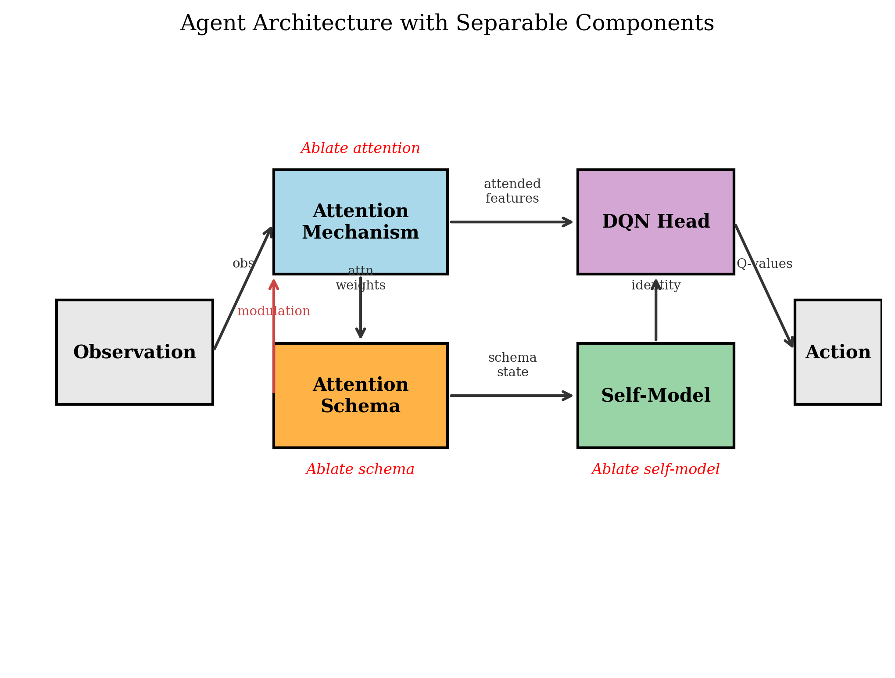
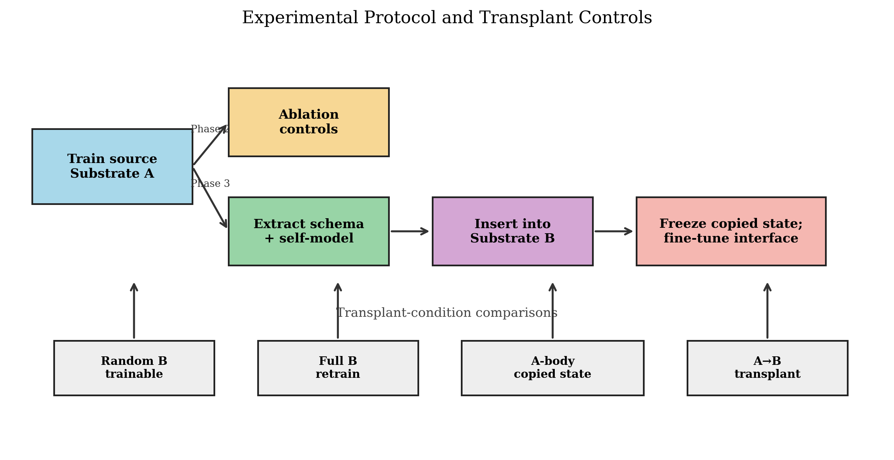
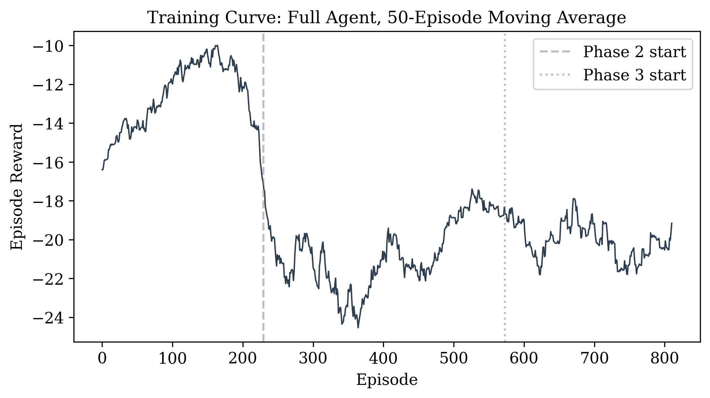
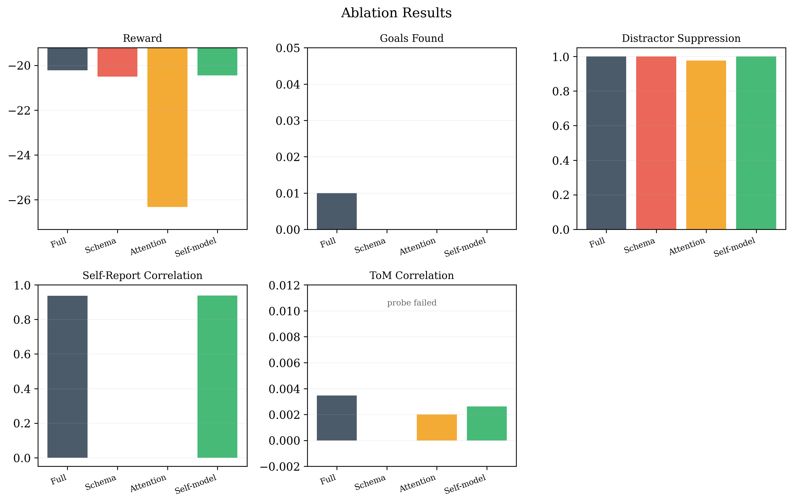
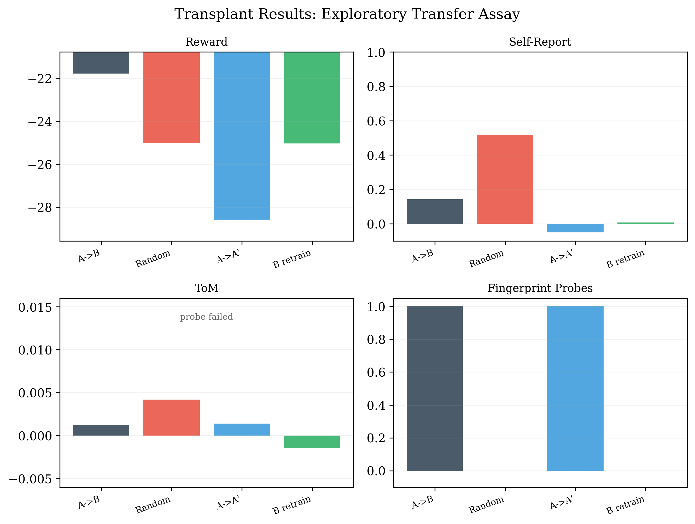
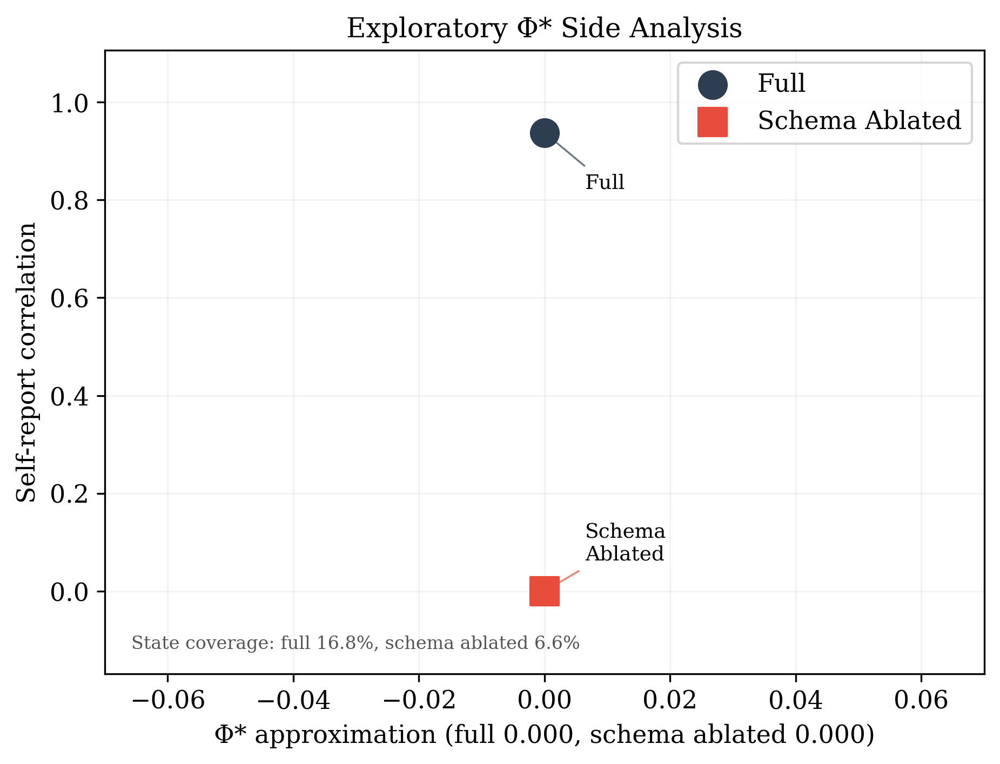
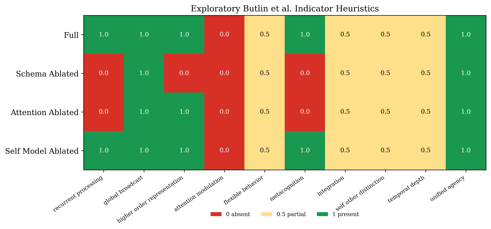
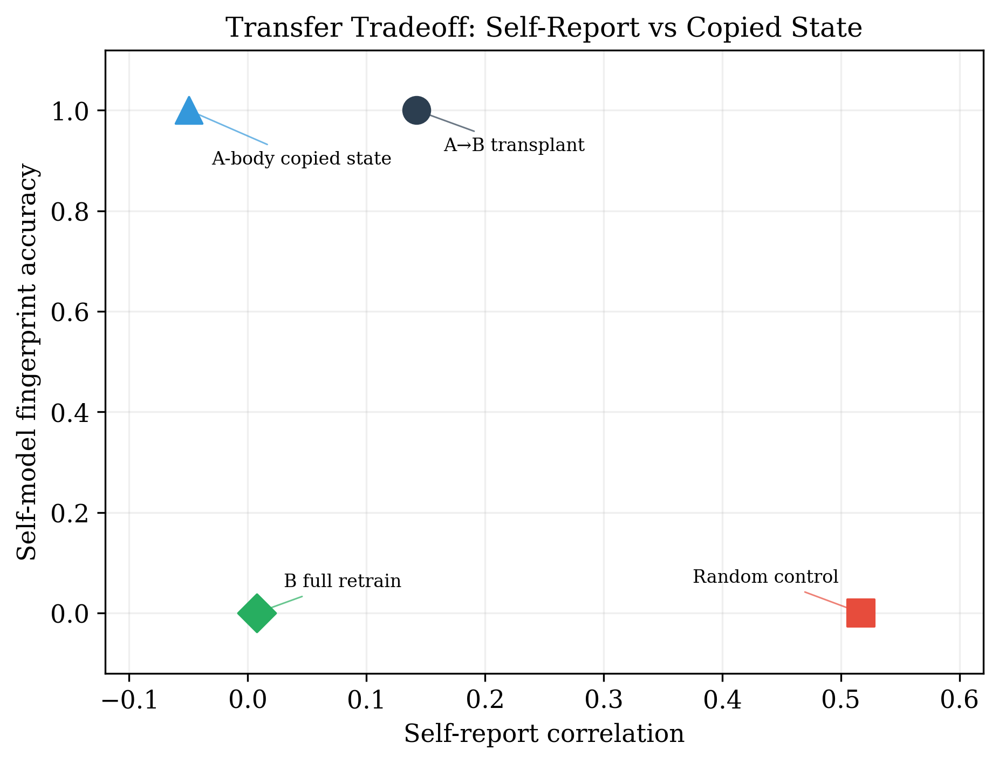

# An Exploratory Transplant Assay for Attention Schema Theory in a Toy Neural Agent

**Author:** Thomas Ryan

**Affiliation:** Independent Researcher, San Francisco, CA

**Date:** April 2026

**Preprint, not yet peer reviewed**

---

## Abstract

A previous analysis (Ryan, 2026) mapped eight theories of consciousness to their engineering requirements for preservation and identified Attention Schema Theory (AST) as one of the most preservation-friendly frameworks. That analysis was theoretical. This paper introduces an exploratory assay, not a consciousness test: can an implemented AST-style attention schema and self-model be copied into an architecturally different neural agent while preserving behavior that AST treats as consciousness-relevant? To my knowledge, prior computational AST work has implemented attention schemas in neural agents and tested their functional benefits, but has not used schema transplantation as a preservation-specific substrate-transfer assay. I build a small neural network agent (~74,000 parameters) with three separable components: an attention mechanism, an attention schema, and a self-model. The task includes endogenous attention control, supervised attention self-report, and a theory-of-mind probe that failed at this scale. Three single-seed pilot results follow. First, ablation shows that the trained schema module is necessary for this architecture's supervised attention-report output: removing the schema changes query-level self-report correlation from 0.937 to 0.000, with little change in task reward (−20.21 vs −20.50), while removing attention produces the clearest behavioral deficit (reward −26.32, distractor suppression 0.975). This result is partly architectural because the null schema outputs a uniform report, and the schema is trained directly to reconstruct attention. Second, in a frozen direct-transfer assay, I transplant the schema and self-model into a transformer-attention agent. The copied self-model fingerprint is preserved (1.0 vs 0.0 in independently initialized controls), but schema-mediated self-report is not: transplant self-report remains low (0.142) and below a randomly initialized trainable control fine-tuned for the same budget (0.517). Third, an attempted Φ* side analysis returns Φ* ≈ 0 for both full and schema-ablated agents under sparse visited-state coverage (16.8% and 6.6%), making it inconclusive. Overall, this pilot supports a conservative conclusion: copied self-model state can survive literal transfer, but frozen schema transfer did not preserve strong introspective-report behavior across architectures.

---

## 1. Introduction

In Ryan (2026), I mapped eight theories of consciousness to their engineering requirements for mind preservation. The central conclusion was a paradox: the theories most favorable to preservation are often the ones that deflate consciousness to a functional property, whereas the theories that treat phenomenal experience as fundamental make preservation hardest or impossible. Attention Schema Theory (Graziano, 2013) came out at 5/5 on preservation friendliness, tied with Higher-Order Thought theory for the most favorable, because it claims consciousness is not some irreducible feature of the universe but a data structure: the brain's simplified model of its own attention process. If that claim is right, then consciousness should, in principle, be portable.

That analysis remained theoretical. It derived engineering requirements from theoretical postulates rather than testing whether those postulates hold in an implemented system. AST says the attention schema is consciousness. To my knowledge, prior computational AST work has not transplanted an implemented attention schema to a new architecture as a preservation-specific substrate-transfer assay. The aim of the present paper is not to claim consciousness in a toy agent, but to test whether functional commitments associated with AST are behaviorally portable at small scale.

### What AST Claims

Attention Schema Theory (Graziano, 2013; 2019; 2022) makes three claims relevant to preservation:

1. **Consciousness is not attention.** Attention is a mechanistic process: competitive selection among signals. Consciousness is a model that the brain constructs of that process. You can have attention without awareness (as in hemispatial neglect after TPJ damage) and potentially awareness without veridical attention (as in dreaming).

2. **The attention schema serves a functional role.** It is not a passive epiphenomenon. The schema enables top-down control of attention, accurate self-report of attentional states, and modeling of others' attention (theory of mind). Remove the schema, and you lose flexible attention control, introspective accuracy, and social cognition. This is testable.

3. **The schema is substrate-independent.** It is a pattern of information, not a property of neurons specifically. This is the claim that matters for preservation: if the schema can be realized in any substrate that supports the right computations, then copying the schema to a new substrate should preserve AST-relevant functional properties.

### What Has Been Tested

Wilterson and Graziano (2021) built a deep Q-learning agent with an attention schema module and showed that access to an attention schema improved visuospatial attention control. Liu et al. (2023) explored attention schemas in multi-agent reinforcement learning and found preliminary evidence that recurrent internal-control implementations can improve social coordination. Piefke et al. (2024) asked when extra resources in an RL agent develop an attention-schema-like representation and found that such representations become useful when attention is uncertain and difficult to infer. Farrell, Ziman, and Graziano (2025) tested components of AST in transformer-based artificial agents, finding improved categorization of other agents' attention and better cooperative/joint-task performance. Saxena et al. (2025) introduced an AST-inspired attention-control module for transformers. The EU-funded ASTOUND project pursued AST-inspired artificial consciousness engineering for virtual agents. These works make computational AST an active research area, but none of them test schema transplantation as a preservation-specific substrate-transfer assay.

The COGITATE Consortium (2025) ran a large-scale, open-science, preregistered adversarial collaboration directly comparing IIT and GNWT, finding results that aligned with some predictions of both theories while substantially challenging key tenets of both. Butlin et al. (2023) proposed 14 theory-derived indicators of consciousness in artificial systems but did not test them in a preservation context.

The preservation question therefore remains open in a direct experimental sense: can the components AST identifies with consciousness be moved to a new substrate while preserving consciousness-relevant behavior?

### This Study

I build an agent with three separable components: attention mechanism, attention schema, and self-model. I run three experiments:

1. **Ablation** (Phase 2): Remove each component independently and test whether behavioral deficits match AST's predictions. This sanity-checks the architecture and identifies which measured outputs depend on which modules.

2. **Preservation-motivated transplant assay** (Phase 3): Extract the schema and self-model from a trained agent and transplant them into a structurally different neural network. This does not test consciousness itself. It tests whether a frozen copy of AST-relevant machinery preserves the narrow behavioral proxies used here.

3. **Exploratory Φ* side analysis** (Phase 4): Estimate a practical Φ* approximation in the full and schema-ablated agents. This is included as a limited IIT-oriented side analysis, not as a decisive theory comparison.

The agent and task serve as experimental scaffolding. The central contribution is the transplant assay, with ablation and the exploratory Φ* side analysis included to interpret it.

## 2. Related Work

### 2.1 AST in Computational Systems

Wilterson and Graziano (2021) is the direct predecessor. They trained a deep Q-learning agent to control a visuospatial attention spotlight with and without access to an attention schema. The schema-equipped agent showed improved attention control compared to a schema-less baseline, consistent with AST's prediction that the schema serves a functional role. Their agent performed a visuospatial attention-control/ball-catching task; mine adds a preservation-motivated transplant assay, supervised self-report, and an attempted social-attention probe.

Liu et al. (2023) studied attention schemas in multi-agent reinforcement learning, asking whether agents could use an internal model of attention to improve coordination and social intelligence. Piefke et al. (2024) investigated whether an attention-schema-like representation can emerge in an RL agent without being hard-wired. Farrell, Ziman, and Graziano (2025) tested AST components in transformer-based agents and found that including an attention schema improved categorizing other agents' attention states and cooperative/joint-task performance. Saxena et al. (2025) introduced Attention Schema-based Attention Control (ASAC), an AST-inspired transformer module aimed at improving attention management and robustness. These studies support the computational usefulness of attention schemas, but they do not test whether a trained schema can be copied into a new substrate while preserving AST-relevant behavior.

### 2.2 Consciousness Testing Frameworks

Butlin et al. (2023) proposed 14 theory-derived indicators of consciousness in AI systems, drawing on multiple theories including AST. I use a subset of these indicators as an evaluation framework (Section 4.5), but the indicators were not designed for preservation experiments and do not include a substrate transfer test.

The COGITATE Consortium (2025) ran a large-scale, preregistered adversarial collaboration comparing IIT and GNWT in human subjects, finding evidence partially consistent with both theories while also challenging key claims of both. My Phase 4 is much narrower: an exploratory Φ* side analysis in a toy artificial agent, included only to test whether this setup produced a usable integrated-information contrast.

### 2.3 Whole-Brain Emulation

In March 2026, Eon Systems announced what it describes as an embodied Drosophila whole-brain-emulation demonstration, integrating a simplified leaky-integrate-and-fire model based on the adult fly central-brain connectome (~140,000 neurons, ~50 million synaptic connections) with a MuJoCo/NeuroMechFly body. Eon's own technical note frames the embodied fly as a work-in-progress research and demonstration platform with substantial simplifications. OpenWorm is an open-source effort to build a virtual C. elegans; its c302 subproject simulates the 302-neuron connectome at varying levels of biological detail. Neither project provides a controlled consciousness-transfer assay of the kind tested here. My experiment is not a whole-brain emulation, but it targets the same abstract engineering question: does moving a mind-relevant computation to a new substrate preserve the relevant functional properties?

## 3. Methods

### 3.1 Task Environment

The agent operates in a 15×15 grid world with partial observability (7×7 observation window). The environment contains one goal object, high-salience distractor objects placed preferentially near the goal, and a scripted partner agent that moves toward randomly chosen targets with epsilon-greedy noise.

The task requires three capabilities simultaneously:

**Endogenous attention control.** The agent must approach and collect the goal while suppressing capture by nearby high-salience distractors. To make attention matter behaviorally, collecting a goal requires the current attention map to allocate at least a small threshold of mass to the visible goal location. Touching the goal without sufficient attention incurs a penalty rather than a reward.

**Introspective self-report.** At random time steps, the environment queries "What are you attending to?" The agent outputs a report vector scored by correlation with its actual attention distribution. An agent without a schema has no internal model of its own attention and cannot report accurately.

**Theory of mind.** At random time steps, the environment queries "What is the partner attending to?" The agent must predict the partner's attention distribution. Under AST, the schema that models one's own attention can be reused to model another's. This is Graziano's account of social cognition. Without the schema, this should fail.

Reward: +4 for collecting a goal with sufficient attention, +0.2 for moving closer to the nearest goal, +0.6 × visible goal attention mass, −1.2 × visible distractor attention mass, −0.75 for stepping onto a distractor, −0.3 for touching a goal without sufficient attention, and −0.1 per step. Self-report and partner-prediction signals are trained as auxiliary losses rather than direct environment reward.

### 3.2 Agent Architecture

The agent consists of three architecturally separable modules plus a decision head.

**Attention mechanism.** Two convolutional layers process the observation, producing a 49-dimensional soft attention map (softmax over spatial positions) and a 64-dimensional attended feature vector. The attended feature path is a true weighted spatial-pooling bottleneck rather than a flattened weighted feature map, so a uniform attention policy removes location-specific information instead of merely rescaling it. The mechanism accepts an optional top-down modulation signal from the schema that biases the attention map.

**Attention schema.** Takes the current attention weights as input. A GRU maintains a temporal model of attention patterns. Three output heads produce: (1) a self-report of own attention, (2) a prediction of the partner's attention, and (3) a modulation signal fed back to the attention mechanism. The modulation signal implements the intended feedback role: the schema can influence subsequent attention rather than only passively observing it.

**Self-model.** Takes attended features and schema state as input. Produces an identity embedding and a preference vector. Maintains an extractable episodic memory buffer storing hashed state summaries plus reward and step metadata. For the transplant assay, I also derive source-specific fingerprint probes from the serialized self-model weights plus episodic memory contents; these probes are intended to distinguish literal state-copy from merely relearning the same task.

**DQN head.** Concatenates attended features, schema state, and identity embedding. Two linear layers produce Q-values for five actions (up, down, left, right, stay).

Total parameters: 73,688. Trainable on a laptop CPU.

### 3.3 Training

Online recurrent TD learning with a target network (soft update τ=0.005) and ε-greedy exploration (1.0→0.10 over 120,000 steps). Adam optimizer, learning rate 10^−4. Hidden state is preserved within episodes and detached between updates (truncated BPTT) rather than being reset on replayed single transitions.

Multi-component loss: L_task (Huber loss on TD error) + 0.3 × L_self_report (MSE between self-report and actual attention) + 0.3 × L_tom (MSE between partner prediction and partner's actual attention, masked to query steps).

Curriculum: Phase 1 (steps 0-40,000) trains basic navigation with no distractors. Phase 2 (40,000-100,000) adds distractors. Phase 3 (100,000+) adds partner agent and introspective/ToM queries. All downstream ablation, transplant, and IIT analyses use the final checkpoint from the full curriculum rather than an earlier reward peak.

### 3.4 Ablation Protocol

Four conditions, each replacing one module with a null version that preserves tensor shapes but removes function:

| Condition | Attention | Schema | Self-Model | AST Prediction |
|---|---|---|---|---|
| Full agent | ✓ | ✓ | ✓ | AST-positive proxy condition: good attention control, accurate self-report, theory of mind if the probe works. |
| Schema ablated | ✓ | ✗ | ✓ | Schema-dependent report and modulation should fail. |
| Attention ablated | ✗ | ✓ | ✓ | Schema receives uniform attention input; behavior should degrade if attention matters. |
| Self-model ablated | ✓ | ✓ | ✗ | Schema-mediated report should remain, but identity/memory continuity should fail. |

The schema-ablated null module outputs a recorded mean schema state from the trained agent, zero modulation, uniform self-report, and uniform partner predictions. The attention-ablated null module outputs uniform attention but preserves the original pooled feature-readout path under that uniform map. The self-model-ablated null module outputs a recorded mean identity vector and empty memory.

100 evaluation episodes per condition. Wilcoxon signed-rank tests with Bonferroni correction (6 pairwise comparisons per metric). Effect sizes reported as paired Cohen's d.

### 3.5 Transplant Protocol

**Substrate B.** A structurally different neural network using transformer-style multi-head self-attention instead of convolutional attention. The observation is split into 49 patches (1×1×6), embedded, and processed through 2-head self-attention. Spatial attention weights are computed by a learned readout over the post-attention transformer outputs. The internal feature pathway is genuinely architecturally distinct from Substrate A.

**Transplant procedure:**
1. Train Substrate A agent through the full curriculum and save the final checkpoint.
2. Extract schema module weights and self-model module weights including episodic memory buffer.
3. Instantiate Substrate B with randomly initialized transformer attention and DQN head.
4. Insert extracted schema and self-model into Substrate B.
5. Add interface adapters (linear projections) between Substrate B's attention outputs and the transplanted schema's expected inputs.
6. Fine-tune non-transplanted parameters for 10,000 steps. In transplanted conditions, the copied schema and self-model are frozen; the new substrate's attention pathway, adapters, and action head are trainable.
7. Evaluate.

The interface adapters are a narrow engineering analogue of adaptation between a copied internal model and a new input/output pathway. In transplanted conditions, the schema and self-model are frozen while the target substrate's attention pathway, interface adapters, and decision head learn around them.

**Control conditions:**
- **Random control.** Substrate B with randomly initialized schema and self-model, same fine-tuning budget.
- **Full retrain.** Substrate B trained from scratch for the same total number of steps.
- **A-body copied-state control.** Schema and self-model from Substrate A transplanted into a new randomly initialized instance of Substrate A. This is a same-architecture-family frozen-state control, not a full competence-transfer control because the peripheral mappings are newly initialized.

**Success criteria:**
1. Transplant outperforms random control on all metrics (schema carries useful information).
2. Transplant approaches full retrain on task performance (competence transfers).
3. Transplant retains self-report accuracy (the schema's model of attention generalizes to new hardware).
4. Transplant preserves source-specific self-model fingerprint probes (literal self-model state survives transfer).
5. Transplant retains theory of mind (partner prediction accuracy transfers).

The self-model fingerprint assay is deliberately conservative: if the copied self-model state survives intact, the transplanted agent should answer source-specific hash probes exactly. Passing this assay is not sufficient for consciousness preservation, identity preservation, or autobiographical memory; it only demonstrates exact continuity of the serialized self-model representation.

### 3.6 Phi Measurement

I estimate a practical integrated-information proxy for the attention mechanism's core circuit. I extract activations from the 8 most variable neurons in the attention pathway, binarize at the median, compute an empirical transition probability matrix from 1,000 time steps, and then compute a Φ* approximation following Barrett and Seth (2011), based on time-delayed mutual information across minimum information partitions. For tractability, I limit the analysis to 8 nodes. I also report visited-state coverage from the pre-imputation TPM counts, because sparse empirical coverage makes any Φ* estimate difficult to interpret.

The intended comparison is Φ* in the full agent versus Φ* in the schema-ablated agent. Under IIT, consciousness is identified with a system's irreducible cause-effect structure; under AST, the relevant functional proxy is the attention schema. The present implementation is only an exploratory approximation and should not be treated as a decisive IIT test.

### 3.7 Evaluation Framework

Six primary behavioral metrics: mean episode reward, mean goals found, distractor suppression rate, self-report correlation, partner prediction correlation (theory of mind), and source-specific self-model fingerprint accuracy. I also report memory-overlap as a backward-looking diagnostic, but not as a primary preservation metric.

Butlin et al. indicators (Butlin et al., 2023): I adapt a subset of Butlin et al.'s indicator framework into 10 task-level heuristics for an exploratory side analysis, scored as present (1.0), partial (0.5), or absent (0.0). These include recurrent processing, global broadcast, higher-order representation, attention modulation, flexible behavior, metacognition, integration, self-other distinction, temporal depth, and unified agency. Several are architecture-anchored heuristics rather than direct measurements or verbatim Butlin labels, so I do not treat their totals as primary evidence.

Statistical framework: 100 evaluation episodes per condition, from a single trained checkpoint/seed. Wilcoxon signed-rank tests are used for paired behavioral metrics across matched environment seeds where applicable. Bonferroni correction is applied for 6 pairwise comparisons within each metric family. Cohen's d is reported for effect sizes. Table values report query-level means for self-report and theory-of-mind correlations; statistical tests use per-episode means, assigning 0.0 when an episode contains no query.

## 4. Results

### 4.1 Training Convergence

The full agent trained for 860 episodes (150,118 steps) across three curriculum phases. Mean episode reward improved from −15.1 over the first 100 episodes to −11.2 by late Phase 1, fell to −16.6 when distractors were introduced and to −22.0 mid-Phase 2, then partially recovered to −18.7 after the full task was enabled in Phase 3. The final 100-episode mean was −20.5. The best 100-episode moving average during training was −10.38, but downstream analyses use the final checkpoint because the late curriculum is the target task. At evaluation time, the full agent learned self-report with high accuracy (0.937 correlation) but still found goals rarely (0.01 per episode). The task remains hard at this scale.

### 4.2 Ablation Results

Table 1 reports primary behavioral metrics across the four ablation conditions. The results show that the trained schema module is necessary for this architecture's supervised attention-report output. They provide weaker support for the broader claim that the schema improves attention control.

**Table 1: Ablation Results (100 evaluation episodes per condition)**

| Condition | Reward | Goals Found | Distractor Supp. | Self-Report Corr. | ToM Corr. |
|---|---|---|---|---|---|
| Full agent | −20.21 | 0.01 | **1.000** | **0.937** | 0.003 |
| Schema ablated | −20.50 | 0.00 | **1.000** | **0.000** | 0.000 |
| Attention ablated | −26.32 | 0.00 | 0.975 | 0.000 | 0.002 |
| Self-model ablated | −20.45 | 0.00 | **1.000** | **0.939** | 0.003 |

The critical result remains the self-report column. Removing the schema changes query-level self-report correlation from 0.937 to 0.000 (episode-level Wilcoxon signed-rank p < 10^−17, Cohen's d = 8.82). Two caveats matter. First, the null schema outputs a uniform distribution by design, which guarantees zero correlation with non-uniform actual attention. Second, the schema was trained directly to reconstruct the attention map. The result therefore shows dependency of this supervised attention-report pathway on the schema module, not emergent metacognition. The more informative pattern is that the schema-ablated agent retains task function with a small, non-significant reward change (−20.50 vs −20.21 for full) while losing the architecture's attention-report pathway.

The schema-ablated agent no longer outperforms the full agent. Reward is nearly unchanged and distractor suppression is effectively identical. The schema's modulation signal is therefore not obviously helping navigation, but neither is it producing the large behavioral cost seen in earlier, less well-controlled runs. At this scale, the clearest supported schema function is attention self-report, not improved navigation.

A related concern: the schema is trained explicitly on a self-report loss (MSE between its output and the actual attention weights). Evaluating it on self-report accuracy is partly circular: the component trained to do X succeeds at X. A stronger test would train the schema only through task reward, or only on masked query events, and check whether self-report ability emerges without direct per-step reconstruction supervision. I did not do that here.

Theory of mind scores are near zero across all conditions, including the full agent (0.003). The partner prediction task failed. The target-seeking partner is only partially visible within the 7×7 window, and the ToM head likely received too few useful supervision events. This is a non-result, and I do not draw conclusions from it.

The self-model ablation preserved high self-report (0.939 vs 0.937 for full) with only a small reward change (−20.45 vs −20.21). Removing identity overhead had minimal effect on the narrow report measure used here. In AST terms, this is a depersonalized proxy condition: schema-mediated report remains while persistent identity/memory is removed.

Attention ablation is now a much cleaner and more informative control. It uses the same pooled feature path as the full model, but forces a uniform attention map through a true spatial bottleneck. Under that cleaner control, it produces the clearest behavioral deficit in the table: reward drops to −26.32, mean goals found falls to 0.00, and distractor suppression falls from essentially perfect (0.9999) to 0.975. The goal effect is too sparse to survive significance testing, but distractor captures rise sharply in absolute terms (4.91 per episode versus 0.02 for the full agent). This is the first version of the task in which attention itself clearly matters behaviorally.

### 4.3 Transplant Results

Table 2 reports results for the four transplant conditions. The key inferential emphasis is on self-report and self-model fingerprint transfer; reward differences are useful descriptively but comparatively noisy at this scale.

**Table 2: Transplant Results (100 evaluation episodes per condition)**

| Condition | Reward | Self-Report Corr. | ToM Corr. | Fingerprint Probes | Memory Overlap (diag.) |
|---|---|---|---|---|---|
| Transplant (A→B) | **−21.77** | 0.142 | 0.001 | **1.000** | 1.000 |
| Random control | −25.01 | **0.517** | 0.004 | **0.000** | 0.000 |
| A-body copied-state control (A→A') | −28.57 | −0.050 | 0.001 | **1.000** | 1.000 |
| Full retrain (B from scratch) | −25.03 | 0.008 | −0.001 | **0.000** | 0.000 |

**Fingerprint probes vs memory overlap.** The self-model fingerprint assay scores 1.000 only when the self-model state is literally copied (transplant and A-body copied-state controls) and 0.000 in independently initialized controls (random control and full retrain). In this fresh run the diagnostic memory-overlap score happens to track the same split, but I still treat fingerprint probes as the primary exact-copy assay because they are source-specific and derived from the serialized self-model state, not merely from overlap in stored episode hashes.

**Copied state transfers; self-report does not transfer cleanly.** The transplanted agent preserves self-model fingerprint probes perfectly (1.000) and achieves the best mean reward in the table (−21.77), but its self-report correlation remains low (0.142). That is significantly above the full retrain baseline (0.008) yet far below the randomly initialized trainable control fine-tuned for the same budget (0.517). The copied self-model state survives, but the frozen copied schema does not carry over strong self-report performance. The A-body copied-state control performs worst on both reward and self-report (−28.57 reward, −0.050 self-report), but this condition uses newly initialized peripheral mappings and should be interpreted as a strict frozen-state control rather than evidence that same-architecture transfer is intrinsically brittle.

**Task performance is mixed rather than uniformly negative.** Descriptively, the transplanted agent has the best reward and the strongest distractor suppression of the transplant conditions. But those reward differences do not survive multiple-comparison correction against the main controls, and the key AST-specific metric is self-report, where the transplant substantially underperforms the random control. The transplant therefore carries useful state and perhaps some task-relevant bias, but it does not preserve the schema-mediated report function tested here.

Taken together, the transplant result is negative on the behavioral criterion that matters most here. The copied self-model state survives direct transfer, but the frozen schema's learned model of attention does not generalize to transformer attention under this fine-tuning protocol. This does not refute AST. The theory does not predict that any schema can run on any hardware with minimal adaptation. But it does show that, at this scale and with this architecture gap, frozen direct-state transfer does not preserve the self-report behavior AST emphasizes.

### 4.4 Φ* Side Analysis

Both the full agent and the schema-ablated agent showed Φ* = 0.000 (8-node circuit, 1,000 time steps). Visited-state coverage was low (16.8% for full, 6.6% for ablated), meaning the empirical TPM was sparsely populated.

The appropriate interpretation is that this Φ* side analysis is inconclusive. Both values are zero, and the TPM coverage is too sparse to support strong claims. Figure 6 plots Φ* against self-report correlation only as a visual summary of this failed side assay. The behavioral dissociation still holds within this toy architecture: supervised self-report depends on the schema module, not on this Φ* proxy. But this does not amount to a meaningful falsification of IIT. A stronger IIT test would require a validated small-system Φ calculation, a network explicitly designed for high integration, and much denser empirical coverage.

### 4.5 Butlin et al. Indicators

Figure 7 shows the 10 consciousness indicators scored across all four ablation conditions. I treat this as an exploratory heuristic side analysis, not a primary result.

The schema ablation still produces the sharpest indicator contrast: higher-order representation drops from 1.0 to 0.0 (the schema *is* the higher-order representation), metacognition drops from 1.0 to 0.0, and recurrent feedback is scored absent when either the schema or active attention pathway is ablated. But the updated run also exposes the limits of the heuristic scaffold: the attention-modulation indicator is 0.0 in every condition, including the full agent, reflecting a known weakness of the current task/agent rather than a decisive consciousness signal.

The self-model ablation preserves most indicators, consistent with its near-baseline self-report accuracy (0.939). This is interesting descriptively, but I do not overinterpret it because the indicator scaffold is too heuristic to support strong claims.

## 5. Discussion

### 5.1 What This Means for AST

The ablation results show a clean dependency of supervised attention-report behavior on the schema module. Removing the attention schema eliminates query-level self-report accuracy (0.937 → 0.000, d = 8.82, p < 10^−17 in the episode-level paired test) while leaving reward only modestly changed (−20.50 vs −20.21). This is compatible with the narrow dissociation AST predicts: attention-like task behavior without introspective access. But the result should not be overstated because the report head is directly supervised and the null schema outputs a uniform report.

The self-model ablation preserved self-report (0.939) with only a small reward cost, suggesting the schema-mediated report function is separable from identity in this architecture.

The updated task also makes the attention component behaviorally consequential. Removing attention now sharply reduces reward and distractor suppression. That matters because AST is a theory about an internal model of attention; if attention itself is behaviorally optional, the assay is weak. The new bottlenecked attention path and attention-gated goal capture address that earlier problem.

The transplant result remains negative on the behavioral metric that matters here. Self-report correlation in the transplanted agent is low (0.142) and is decisively worse than the random trainable control (0.517), even though the copied self-model state still answers the source agent's fingerprint probes perfectly. The issue is therefore not simple loss of serialized state. The issue is that the frozen copied schema does not model the new attention process well enough to preserve self-report function.

### 5.2 What This Means for Preservation

I am not aware of prior work using schema transfer under AST as a preservation-motivated assay. The result is mixed in a revealing way: copied self-model state survives literal transfer, the transplant condition has the best descriptive reward, but the main behavioral proxy used here (schema-mediated self-report) does not transfer cleanly across architectures at this scale.

The copied self-model state survives literal transfer, as shown by the fingerprint assay. The transplant also posts the best mean reward of the four transplant conditions, although that reward difference does not survive correction and all transplant conditions find zero goals. This is therefore only weak descriptive evidence that the copied state is not behaviorally inert. The schema's learned report function does not transfer cleanly. A randomly initialized trainable control relearns self-report much better than the frozen transplanted schema (0.517 vs 0.142), and the A-body copied-state control performs worst of all. The implication is straightforward: under these conditions, moving stored self-model state is not enough. The functional coupling between schema and substrate must be re-established, and the schema itself may need to adapt.

This result does not, by itself, rule out the preservation program under AST. There are at least three plausible explanations for the failure. First, the schema may need substantially more adaptation time than the 10,000-step fine-tuning budget used here. Second, the convolutional and transformer attention mechanisms may produce attention distributions that are too different for the schema to bridge without additional adaptation pressure. Third, this agent is small and only partially competent on the base task, so the schema may never have learned a sufficiently general model of attention to support transfer.

Even so, the conservative reading is that this experiment implemented a frozen direct-transfer protocol and did not observe successful preservation of the main behavioral proxy. The 1-10 TB estimate from Ryan (2026) assumed that the schema would be both extractable and transferable. The extraction works in the narrow engineering sense; frozen transfer does not, at least not at this scale and with this architecture gap.

Figure 8 summarizes the main transplant tension. The copied-state conditions preserve the self-model fingerprint, while the best self-report score comes from the trainable random control rather than the frozen transplant.

### 5.3 The Φ* Side Analysis

Both agents showed Φ* ≈ 0 under a sparse empirical TPM, so there is nothing substantive to compare. The attempted IIT-oriented side analysis produced no usable discrimination. The behavioral dissociation stands on its own, but it does not tell us much about IIT.

### 5.4 Limitations

**The agent is not conscious.** A 73,688-parameter DQN-style agent operating in a grid world does not have consciousness under any plausible interpretation. The claim is not that this agent is conscious, but that the functional properties AST associates with consciousness can be tested for transferability at small scale. Whether this result scales to biological complexity is entirely unknown.

**The evaluation is partly circular.** The schema is trained with an explicit self-report loss, then evaluated on self-report accuracy. This makes the evaluation partly circular: the component is trained directly on the target it is later evaluated against. A stronger design would train the schema only through task reward and test whether self-report emerges without supervision. The current design shows the schema *can* learn self-report and that this learning is partially retained across substrates, but it does not show emergent metacognition.

**The task is still sparse.** Even the full agent finds very few goals (0.01 per episode). The updated task now makes attention behaviorally relevant, which is a major improvement, but the absolute difficulty remains high. That limits the strength of any conclusion about competence transfer.

**This is a single-seed pilot.** The experiment uses one trained source checkpoint and 100 evaluation episodes per condition. Episode-level statistics estimate conditional performance for that checkpoint and environment distribution; they do not establish robustness across independent training seeds, architecture initializations, or hyperparameter choices.

**The schema still does not show a strong reward benefit.** In ablation, removing the schema barely changes reward. In transplant, the copied schema does not preserve self-report well enough to justify a strong portability claim. AST predicts the schema should improve attention control; this experiment still supports that claim more weakly than the self-report claim.

**The transplant comparison is deliberately strict and asymmetric.** In the copied-state conditions, the transplanted schema and self-model are frozen during fine-tuning. In the random control, everything is trainable because there is no transplanted state to preserve. That makes the comparison appropriate for testing frozen direct portability, but it also means the random control is a relearning benchmark, not a matched frozen-state placebo. A fuller experiment would include freeze-matched random controls and copied-but-trainable controls.

**The "different substrate" is still a neural network.** Substrate A (convolutional) and Substrate B (transformer) differ architecturally, but they share the same representation dimensions, loss functions, and hardware. A stronger test would use genuinely different representation spaces or computational paradigms.

**The Phi computation is inconclusive.** Both conditions returned Φ* ≈ 0 under low visited-state coverage. IIT proponents will rightly note that 8 nodes is a toy circuit, the empirical TPM is sparse, and this is not a validated IIT 3.0 system-level calculation. The Φ* side analysis should be treated as a limited first pass for future work with a properly designed network.

**Identity continuity is still only partially assayed.** The old hash-overlap memory metric has been demoted to a diagnostic because it remains an overlap test on stored episode summaries rather than a source-specific continuity assay. The new self-model fingerprint test is better for verifying exact copied state: independently initialized controls score 0.0 and copied self-models score 1.0. But it is still a direct-copy hash test of serialized self-model state, not a behavioral proof of autobiographical memory or personal continuity.

**The Butlin analysis is heuristic.** Some indicators are architecture-anchored rather than directly measured from behavior or circuit dynamics. The pattern is descriptively useful, but the totals should not be treated as primary evidence.

**Theory of mind failed entirely.** ToM scores were near zero for all conditions, including the full agent. The partner prediction task did not work at this scale. No conclusions can be drawn about AST's social cognition claims.

### 5.5 The Deflation Paradox Revisited

Ryan (2026) identified a deflation paradox: theories most favorable to preservation are those that deflate consciousness. AST deflates consciousness to a data structure, an internal model. This paper's transplant test is formulable precisely because of that deflation. The schema is extractable, copyable, and transplantable because it is "merely" information. If consciousness were something deeper, such as irreducible integrated information, quantum coherence, or biological substrate-dependence, this style of experiment would be much harder to specify at all.

On a functionalist reading, preservation becomes an engineering problem with a finite-data target. On a non-functionalist reading, the theories that preserve the intuition that consciousness is more than a model are the same theories that make preservation hardest. This experiment does not resolve the paradox. It makes it sharper and more concrete.

## 6. Conclusion

This paper presents an exploratory, preservation-motivated transplant assay for a theory of consciousness. Under Attention Schema Theory, consciousness is the brain's internal model of its own attention. I tested whether an implemented analogue of that model can be extracted from one neural network and transplanted into another while retaining narrow functional properties.

Three results, one bounded-positive, one mixed-negative, one inconclusive. First, ablation: removing the schema eliminates supervised self-report accuracy (0.937 → 0.000, d = 8.82, p < 10^−17 in the episode-level paired test) with only a modest reward change, while removing attention now produces a clear behavioral deficit. This supports schema-dependence of the architecture's trained report pathway; its stronger modulation-improves-navigation claim remains only weakly supported. Second, the transplant: copied self-model state still passes source-specific fingerprint probes (1.0 for copied self-models, 0.0 for independently initialized controls), but self-report does not transfer cleanly. The transplanted agent reaches only 0.142 self-report correlation, well below a randomly initialized trainable control fine-tuned for the same budget (0.517). Frozen direct state transfer is therefore not sufficient for behavioral transfer. Third, the Φ* side analysis produced no usable discrimination. Φ* was zero for both conditions under sparse coverage (16.8% and 6.6%).

These results do not constitute a proof of concept for consciousness preservation. They indicate that the problem is harder than the theory alone suggests, at least at this scale. The schema is an extractable module trained to model attention, and the updated task now shows that attention itself matters behaviorally. But the schema is not behaviorally portable under this frozen transfer protocol: transplantation to new hardware preserves copied state while failing to preserve strong self-report. A stronger experiment would need a more capable base agent, multiple training seeds, more adaptation time, freeze-matched and trainable-copy controls, more careful choices about what to freeze during transplant, and ideally a schema trained through task reward alone rather than explicit self-report supervision.

The deflation paradox from Paper 1 still holds: AST deflates consciousness to a data structure, which should make it copyable. This experiment shows that an AST-style data structure can be implemented, extracted, and copied, but copying it is not sufficient in this pilot. It needs to be functionally coupled to the new hardware. Whether better adaptation methods or more training can solve this is an open question. The engineering path from Ryan (2026) is not closed, but it is substantially harder than the theory alone would suggest.

## Acknowledgments

This work builds on Paper 1 (Ryan, 2026) and would not exist without the theoretical foundations laid by Michael Graziano and the AST research program. The experimental design draws on Wilterson and Graziano (2021) for the attention schema agent architecture and Butlin et al. (2023) for the consciousness indicator framework.

## References

Albantakis, L., Barbosa, L., Findlay, G., Grasso, M., et al. (2023). Integrated information theory (IIT) 4.0. *PLOS Computational Biology*, 19(10), e1011465.

Barrett, A. B., and Seth, A. K. (2011). Practical measures of integrated information for time-series data. *PLOS Computational Biology*, 7(1), e1001052.

Butlin, P., Long, R., Elmoznino, E., Bengio, Y., et al. (2023). Consciousness in artificial intelligence: Insights from the science of consciousness. *arXiv preprint*, arXiv:2308.08708.

COGITATE Consortium (2025). Adversarial testing of global neuronal workspace and integrated information theories of consciousness. *Nature*, 642(8066), 133-142.

Eon Systems (2026). How the Eon team produced a virtual embodied fly. eon.systems.

European Commission CORDIS (2026). ASTOUND: Improving social competences of virtual agents through artificial consciousness based on the Attention Schema Theory. Project 101071191.

Farrell, K. T., Ziman, K., and Graziano, M. S. A. (2025). Testing components of the Attention Schema Theory in artificial neural networks. *arXiv preprint*, arXiv:2411.00983.

Gleeson, P., Lung, D., Grosu, R., Hasani, R., and Larson, S. D. (2018). c302: a multiscale framework for modelling the nervous system of *Caenorhabditis elegans*. *Philosophical Transactions of the Royal Society B*, 373, 20170379.

Graziano, M. S. A. (2013). *Consciousness and the Social Brain*. Oxford University Press.

Graziano, M. S. A. (2019). *Rethinking Consciousness*. W.W. Norton.

Graziano, M. S. A. (2022). A conceptual framework for consciousness. *Proceedings of the National Academy of Sciences*, 119(18), e2116933119.

Liu, D., Bolotta, S., Zhu, H., Bengio, Y., and Dumas, G. (2023). Attention schema in neural agents. *arXiv preprint*, arXiv:2305.17375.

Oizumi, M., Albantakis, L., and Tononi, G. (2014). From the phenomenology to the mechanisms of consciousness: Integrated Information Theory 3.0. *PLOS Computational Biology*, 10(5), e1003588.

Piefke, L., Doerig, A., Kietzmann, T., and Thorat, S. (2024). Computational characterization of the role of an attention schema in controlling visuospatial attention. *Proceedings of the Annual Meeting of the Cognitive Science Society*, 46.

Ryan, T. (2026). What must be preserved? Mapping theories of consciousness to engineering requirements for mind preservation. *Zenodo*. DOI: 10.5281/zenodo.19374628.

Saxena, K., Jurado Ruiz, F., Manzi, G., Liu, D., and Lamb, A. (2025). Attention Schema-based Attention Control (ASAC): A cognitive-inspired approach for attention management in transformers. *arXiv preprint*, arXiv:2509.16058.

Webb, T. W., and Graziano, M. S. A. (2015). The attention schema theory: A mechanistic account of subjective awareness. *Frontiers in Psychology*, 6, 500.

Wilterson, A. I., and Graziano, M. S. A. (2021). The attention schema theory in a neural network agent. *Proceedings of the National Academy of Sciences*, 118(33), e2102421118.
