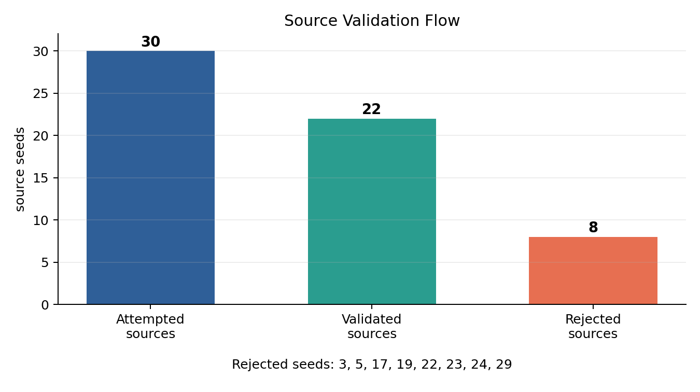
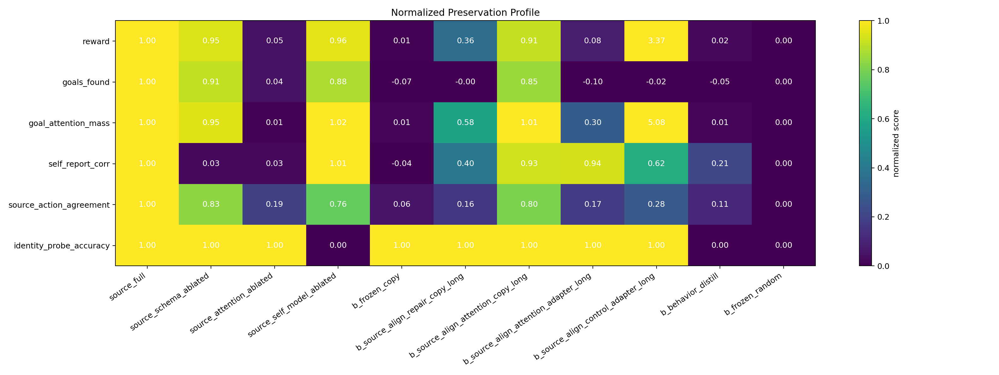
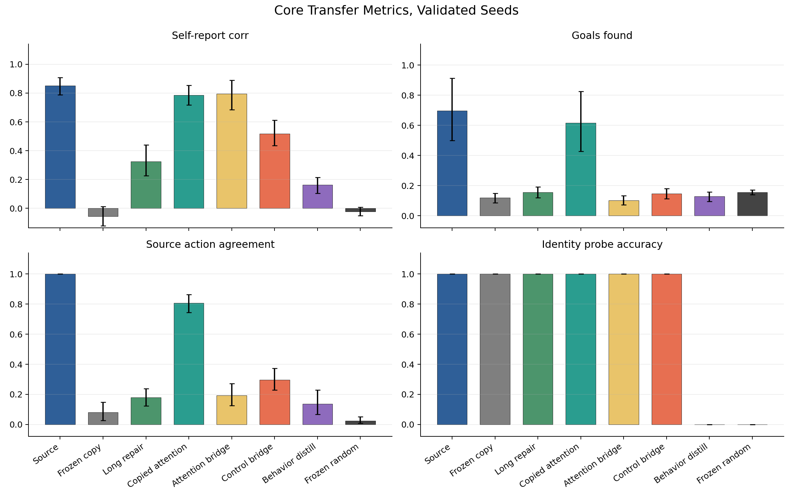

# The Preservation Benchmark: Testing Functional Continuity Across Substrate Transfer

**Author:** Thomas Ryan

**Affiliation:** Independent Researcher, San Francisco, CA

**Date:** April 2026

**Preprint draft, not yet peer reviewed**

---

## Abstract

Mind-preservation proposals often depend on claims about functional, psychological, or computational continuity, but these claims are rarely tested as explicit substrate-transfer interventions. This paper introduces PreservationBench, a benchmark framework for measuring preservation-relevant functional continuity after a source agent is copied, transplanted, adapted, or relearned in a target substrate. The benchmark is not a consciousness test and does not decide personal identity. It asks a narrower engineering question: which source-specific functions remain active after transfer, and which apparent recoveries are better explained by relearning, behavioral mimicry, or proxy optimization?

As a first validation tier, I implement PreservationBench-AST v0 in a toy neural agent inspired by Attention Schema Theory. A source agent is trained in a small grid-world task with attention control, self-report, and source-specific identity probes. Selected source modules are transferred into a target architecture under matched controls: frozen copied state, source-alignment repair, copied attention, source-facing attention and control bridges, behavior-only distillation, and frozen random controls. In an expanded core replication, 30 independent source seeds were attempted and 22 passed source validation. The resulting preservation profile shows four dissociations. Frozen copied schema and self-model state preserved source-specific identity-probe behavior but did not recouple report or control. Long source-alignment repair improved report but did not restore source-like task control. A source-facing attention bridge recovered report behavior without source-like action agreement. A control bridge drove reward and goal-attention mass above source levels but remained weak on goals found and source-action agreement, indicating proxy optimization rather than preserved control. Copying source attention yielded the strongest combined profile, with identity-probe preservation, high self-report, near-source goals found, and high source-action agreement, but this condition narrows the substrate gap. These results support PreservationBench as a profile-based assay for separating copied provenance, report continuity, task competence, proxy reward, and source-like control.

---

## 1. Introduction

The central question in mind preservation is usually phrased as a metaphysical one: would a copied, emulated, repaired, or transferred system still be the same conscious subject? That question is not directly settled by current neuroscience, philosophy, or engineering. But it contains a more tractable subquestion. If a preservation proposal claims that some functional organization matters, can we test whether that organization survives a controlled transfer?

This paper takes that subquestion seriously. It proposes PreservationBench: a benchmark framework for preservation-relevant functional continuity across substrate transfer. The framework does not test consciousness itself. It does not prove personal survival. It instead asks whether theory-specified functions survive when a source agent is moved into a target substrate under matched controls.

This distinction matters because preservation claims can fail in several different ways. A copied state may survive as inert information but no longer affect behavior. A target may relearn a behavior without inheriting source-specific organization. A reward proxy may improve while the target no longer acts like the source. A report channel may look source-like while control and memory channels fail. A useful benchmark should separate these cases rather than collapse them into one score.

Paper 1 mapped theories of consciousness to preservation requirements and identified Attention Schema Theory (AST) as one of the more preservation-friendly theories because it treats consciousness as a functional model of attention rather than as a substrate-specific physical property. Paper 2 tested a narrow AST-style transplant assay in a single toy agent. The result was mixed-negative: copied self-model state survived as a source-specific fingerprint, but frozen schema transfer did not preserve strong self-report behavior across an architecture change.

This paper extends that assay into a benchmark scaffold with independent source seeds, validation gates, matched transfer controls, paired evaluation episodes, source-level statistical analysis, and profile-style reporting. The pilot domain remains AST-derived, but the benchmark is meant to generalize: for any theory that specifies preservation-relevant functional invariants, PreservationBench asks whether those invariants remain source-specific and active after transfer.

The core contribution is methodological. PreservationBench shows how a preservation claim can be decomposed into measurable channels: copied identity probes, report continuity, task competence, attention alignment, source-action agreement, memory overlap, and adaptation cost. The AST v0 experiment then demonstrates why this decomposition is necessary.

## 2. Related Work

### 2.1 Consciousness Indicators And AI Evaluation

Butlin et al. (2023) proposed theory-derived indicators of consciousness in artificial systems, drawing on several major theories including recurrent processing, global workspace theory, higher-order theories, predictive processing, and AST. That work asks whether an artificial system has features that may indicate consciousness. PreservationBench asks a different question: if a system has theory-relevant functional organization, does that organization remain active after transfer?

Question-answering consciousness benchmarks and emerging AI-consciousness evaluation projects are also adjacent. They usually evaluate static system behavior or self-description. PreservationBench instead makes substrate transfer the intervention. It is not enough for a target to answer questions or perform well. The target must be compared to random, frozen, behavior-only, and copied-state controls to ask whether source-specific organization survived.

### 2.2 Continuity, Memory, And Identity

Philosophical work on psychological continuity and personal identity, especially Parfit-style fission and continuity cases (Parfit, 1971; Parfit, 1984), motivates the benchmark but is not resolved by it. PreservationBench does not claim that source-specific functional continuity equals personal identity. It only measures whether functional and mnemonic channels that some preservation theories treat as relevant remain intact after transfer.

Recent AI continuity and memory benchmarks evaluate whether agents maintain context, long-range memory, narrative coherence, or stable identity-like behavior across time. Long-horizon conversational memory benchmarks such as LoCoMo evaluate whether models can retrieve, summarize, and reason over extended interaction histories (Maharana et al., 2024). These are useful but distinct. A memory benchmark can show that an agent remembers facts. A continuity benchmark can show that an agent behaves coherently over time. PreservationBench asks whether source-specific internal machinery remains active after a controlled transfer into a target substrate.

### 2.3 Model Transfer And Component Reuse

Machine learning already contains many techniques for moving behavior or internal structure across models: distillation (Hinton et al., 2015), feature transfer (Yosinski et al., 2014), function-preserving network transformations (Chen et al., 2016), model stitching (Bansal et al., 2021), representation alignment, adapters, model merging, and component transfer. PreservationBench borrows this engineering vocabulary but changes the target of evaluation. The question is not only whether a target model performs well. The question is whether the performance is caused by copied source-specific organization rather than random initialization, behavior-only mimicry, or ordinary retraining.

### 2.4 Whole-Brain Emulation And Preservation Engineering

Whole-brain emulation roadmaps ask what biological detail must be captured to reproduce a brain (Sandberg and Bostrom, 2008). Recent WBE fidelity work argues that standardized functional tests will be needed to compare behavioral performance against cost and modeling detail (Linssen and Koene, 2025). Biological emulation projects such as OpenWorm, Drosophila connectome simulations, and embodied nervous-system models ask how much structure is enough to reproduce organism-level behavior. PreservationBench is complementary. It does not attempt biological fidelity. It provides a controlled artificial testbed for asking which preservation-relevant functions survive transfer and whether apparent fidelity is due to copied source organization rather than relearned behavior.

## 3. PreservationBench Framework

### 3.1 Benchmark Question

The benchmark asks:

> When source state is moved into a target substrate, which preservation-relevant functions remain active because of copied state rather than relearning, random structure, or behavior-only mimicry?

This question is intentionally narrower than consciousness preservation. A positive benchmark result would not prove survival. A negative result would not refute functionalism, AST, or any theory of consciousness. But the benchmark can identify concrete engineering obstacles for preservation programs.

### 3.2 Core Definitions

**Substrate transfer** means moving selected source organization into a target implementation and evaluating whether relevant capacities remain active.

**Functional continuity** means persistence of causal roles, control relations, memory access, self-model use, attention dynamics, report dynamics, and policy-relevant internal organization across transfer.

**Preservation-relevant functional continuity** means functional continuity for properties that matter to preservation theories, such as psychological connectedness, autobiographical memory, self-model integrity, metacognitive access, agency, temporal integration, and source-specific dispositions.

**Causal continuity** means the target state is caused by extraction, copying, adaptation, or replacement from the source rather than by independent retraining alone.

**Phenomenal continuity** means continuity of subjective experience itself. PreservationBench does not measure this directly.

### 3.3 Benchmark Axes

PreservationBench varies four axes.

First, the substrate gap: same architecture, same family with changed interfaces, different architecture, changed representation space, or changed sensor and action mapping.

Second, the copied payload: full agent, attention module, schema module, self-model, memory store, recurrent state, policy head, or combinations.

Third, the adaptation regime: frozen copied state, copied but trainable state, adapter-only tuning, supervised source alignment, behavior-only distillation, or full retraining.

Fourth, the evaluation domain: matched environment, shifted environment, delayed query setting, sensor remap, social setting, or hidden provenance probes.

### 3.4 Benchmark Output

The output is a profile, not a consciousness score. A useful report includes:

- task competence continuity: reward and goals found
- report continuity: self-report correlation and stability
- self-model continuity: source-specific identity probes
- attention continuity: goal-attention mass and source-attention distance
- control continuity: source-action agreement
- copied-state diagnostics: memory overlap and copied parameter status
- control comparisons: behavior-only, random, frozen-random, and source ablations

The AST v0 experiment below instantiates this profile in a toy domain.

## 4. AST v0 Methods

### 4.1 Task Domain

The AST v0 task uses a small grid-world agent inspired by computational AST work on attention-schema agents (Wilterson and Graziano, 2021; Liu et al., 2023; Piefke et al., 2024) and by the earlier transplant assay in Ryan (2026b). The competence v2 version used for the core replication has a 7 by 7 grid, a full 7 by 7 observation window, two goals, one distractor, and 100-step episodes. The source agent must move through the grid, allocate attention to visible goals, avoid distractor capture, and answer self-report queries about its own attention state.

The task is designed to separate three channels:

- attention control, measured by reward, goals found, goal-attention mass, and distractor capture
- attention-schema report, measured by self-report correlation
- self-model provenance, measured by source-specific identity probes and memory overlap

The task does not claim to instantiate consciousness. It is a toy validation tier for testing whether AST-relevant functional channels survive transfer.

### 4.2 Source Agent And Target Substrate

The source agent uses the original AST-style architecture from the Paper 2 line of work: an attention module, an attention-schema module, a self-model, and a policy head. The target substrate uses a different attention front end with target-side adapters and heads. The benchmark conditions vary which source modules are copied, frozen, adapted, or replaced.

The self-model contains source-specific state used for fingerprint probes. These probes are deterministic source-specific queries derived from copied self-model state and episodic memory. Passing them shows literal copied-state provenance. It does not show personal identity.

### 4.3 Source Validation

Each source seed is trained independently for 60,000 source steps. Before transfer, the source must pass a validation gate:

- self-report correlation at or above 0.50
- at least 20 self-report query events
- goals found at or above 0.10
- memory not required for validation

Source validation prevents target-transfer failures from being interpreted when the source itself does not demonstrate the relevant capacity.

### 4.4 Core Conditions

The core replication uses these conditions:

| Condition | Purpose |
| --- | --- |
| `source_full` | validated source reference |
| `source_schema_ablated` | validates schema dependence of report |
| `source_attention_ablated` | validates attention dependence of control |
| `source_self_model_ablated` | validates self-model dependence of identity probes |
| `b_frozen_copy` | strict frozen copy of schema and self-model into target |
| `b_source_align_repair_copy_long` | frozen copied schema and self-model with long source-alignment repair |
| `b_source_align_attention_copy_long` | copied and frozen source attention, schema, and self-model |
| `b_source_align_attention_adapter_long` | target attention with residual source-facing attention bridge |
| `b_source_align_control_adapter_long` | attention bridge plus explicit control and attention-mass losses |
| `b_behavior_distill` | target trained to mimic behavior without copied source state |
| `b_frozen_random` | freeze-matched random negative control |

The copied-attention condition is a coupling diagnostic, not a clean substrate-transfer success, because it deliberately narrows the substrate gap. The bridge conditions keep the target attention substrate but alter the source-facing interface.

### 4.5 Evaluation And Analysis

Every condition is evaluated on matched paired evaluation episodes for each source seed. The unit of inference is the trained source seed, not the evaluation episode. Episode-level metrics are aggregated to one row per condition per source seed. Paired contrasts are computed at the source-seed level using bootstrap confidence intervals over source seeds, paired Cohen dz, and sign-flip permutation p-values. The current draft reports raw means and paired intervals as descriptive evidence. Holm-corrected significance is not used as the headline because the current run is a preprint-scale benchmark run.

The expanded core replication attempted 30 source seeds and evaluated 100 paired episodes per condition. Twenty-two source seeds passed validation and were included in transfer contrasts.

## 5. Results

### 5.1 Source Validation

Thirty independent source seeds were trained. Twenty-two passed the source validation gate. Eight were rejected and retained in the run records but excluded from target-transfer contrasts. Seven rejected seeds failed the goals-found gate, and one rejected seed failed the self-report gate.

Among validated sources, `source_full` achieved mean reward -1.711, goals found 0.698, self-report correlation 0.850, identity probe accuracy 1.000, goal-attention mass 0.165, and source-action agreement 1.000 by definition. Source ablations behaved as expected. Schema ablation eliminated self-report correlation while preserving identity probes. Self-model ablation eliminated identity probe accuracy while leaving report behavior largely intact. Attention ablation caused the largest source-side control deficit, reducing reward to -9.930 and goals found to 0.180.

### 5.2 Continuity Profile

Figure 2 shows the normalized profile across the core condition family. Normalized scores are descriptive and are always interpreted alongside raw means. They make the main dissociations visible: frozen copy preserves identity-probe behavior but fails report and control; copied attention recovers the strongest combined profile; the attention bridge recovers report but not source-like control; and the control bridge overshoots reward and goal-attention mass while remaining weak on source-action agreement.

### 5.3 Frozen Copy And Long Repair

The strict frozen cross-substrate copy preserved source-specific identity probes but failed to recouple most active behavior. It retained identity probe accuracy at 1.000, but its mean self-report correlation was -0.054, goals found was 0.118, and source-action agreement was 0.080. This is a negative profile: copied source state remains detectable but largely inactive.

Long source-alignment repair improved report relative to frozen copy, but did not restore source-like control. Mean self-report correlation increased from -0.054 to 0.326, with paired mean difference 0.380 and 95 percent bootstrap CI 0.249 to 0.522. Goals found remained low at 0.155, and source-action agreement remained low at 0.178. Identity probes stayed at 1.000.

### 5.4 Copied Attention

Copying and freezing the source attention module produced the strongest combined transfer profile. This condition preserved identity probes at 1.000, reached mean self-report correlation 0.786, restored goals found to 0.616, and recovered source-action agreement to 0.808. Compared with long repair, copied attention improved self-report by 0.460, with 95 percent CI 0.367 to 0.552. It also improved source-action agreement by 0.629, with 95 percent CI 0.568 to 0.695.

This should not be described as a clean cross-architecture success, because the attention module itself is copied. The useful result is bottleneck identification. In this AST-derived task, preserving the attention interface recovers the most source-like combined profile observed in the benchmark.

### 5.5 Report Bridge Without Control

The attention-adapter bridge recovered report behavior without restoring source-like control. It reached mean self-report correlation 0.795, statistically indistinguishable from copied attention in this expanded run, but goals found remained low at 0.102 and source-action agreement remained low at 0.193. Compared with copied attention, the bridge had much lower source-action agreement, with paired mean difference -0.615 and 95 percent CI -0.691 to -0.538.

This is one of the central dissociations. A target can be report-like without being control-like. A benchmark that measured self-report alone would overstate this condition.

### 5.6 Proxy Control Without Source-Like Action

The control-adapter bridge showed a different failure mode. It drove reward and goal-attention mass far above source levels, with mean reward 18.686 and goal-attention mass 0.730. However, it did not restore source-like goals found or source-action agreement. Mean goals found was 0.147, and source-action agreement was 0.296. Self-report correlation was 0.518, below both copied attention and the attention-adapter bridge.

Compared with copied attention, the control adapter had higher reward by 21.147 and higher goal-attention mass by 0.563, but lower source-action agreement by -0.511 and lower self-report by -0.268. This pattern is best interpreted as optimization of the attention-reward proxy rather than preservation of source-like task control.

### 5.7 Behavior-Only And Random Controls

Behavior-only distillation and frozen random controls failed copied identity probes, as intended. Behavior distillation reached self-report correlation 0.162 and source-action agreement 0.136, while identity probe accuracy remained 0.000. Frozen random had self-report correlation -0.023, source-action agreement 0.025, and identity probe accuracy 0.000. These controls support the interpretation that identity-probe success in copied conditions reflects copied source state rather than independent relearning or random target structure.

### 5.8 Focused Transfer Metrics

Figure 3 shows raw means and bootstrap confidence intervals across the four clearest transfer metrics. The copied-attention condition has the strongest combined profile. The attention bridge is report-like without source-like control. The control bridge preserves copied identity-probe behavior and improves some proxy measures, but remains weak on goals found and source-action agreement.

### 5.9 Summary Table

| Condition | n | Reward | Goals found | Self-report corr | Identity probe | Goal attention | Source action |
| --- | --- | --- | --- | --- | --- | --- | --- |
| source_full | 22 | -1.711 | 0.698 | 0.850 | 1.000 | 0.165 | 1.000 |
| source_schema_ablated | 22 | -2.150 | 0.648 | 0.000 | 1.000 | 0.159 | 0.837 |
| source_attention_ablated | 22 | -9.930 | 0.180 | 0.000 | 1.000 | 0.028 | 0.209 |
| source_self_model_ablated | 22 | -2.067 | 0.630 | 0.855 | 0.000 | 0.168 | 0.768 |
| b_frozen_copy | 22 | -10.267 | 0.118 | -0.054 | 1.000 | 0.029 | 0.080 |
| b_source_align_repair_copy_long | 22 | -7.253 | 0.155 | 0.326 | 1.000 | 0.107 | 0.178 |
| b_source_align_attention_copy_long | 22 | -2.462 | 0.616 | 0.786 | 1.000 | 0.167 | 0.808 |
| b_source_align_attention_adapter_long | 22 | -9.654 | 0.102 | 0.795 | 1.000 | 0.068 | 0.193 |
| b_source_align_control_adapter_long | 22 | 18.686 | 0.147 | 0.518 | 1.000 | 0.730 | 0.296 |
| b_behavior_distill | 22 | -10.145 | 0.127 | 0.162 | 0.000 | 0.029 | 0.136 |
| b_frozen_random | 22 | -10.320 | 0.155 | -0.023 | 0.000 | 0.027 | 0.025 |

## 6. Discussion

### 6.1 What The Benchmark Adds

The main contribution is diagnostic. PreservationBench does not test consciousness preservation. It tests whether specified preservation-relevant functions survive controlled transfer. In AST v0, those functions split apart in ways that a single behavioral score would hide.

The frozen-copy result shows that copied source state can remain intact while failing to recouple to active behavior. The attention-adapter result shows that report-like behavior can be recovered without source-like control. The control-adapter result shows that reward and attention proxies can be optimized without restoring source-like action. The copied-attention result shows that the current architecture can recover a strong combined continuity profile, but only when the substrate gap is narrowed by copying the attention module itself.

Together, these findings support the benchmark framing. Preservation claims should not be evaluated by one score. They need profiles that distinguish identity probes, report dynamics, control dynamics, memory overlap, source-specific action agreement, and adaptation costs.

### 6.2 Interpretation For Attention Schema Theory

The AST-derived task separates attention, attention-schema report, and self-model identity probes. Source ablations support this separation. Schema ablation destroys report. Self-model ablation destroys identity probes. Attention ablation harms control.

The transfer results suggest that attention/interface coupling is the practical bottleneck in the current implementation. Copying schema and self-model state preserves source identity probes, but that state is mostly inert when the target attention interface is not source-like. Repairing the interface improves report somewhat. Adding a source-facing bridge can recover report strongly. But broad source-like control only appears when the attention module itself is copied.

This does not show that AST preservation in real systems would require literal attention-module copying. It shows that, in this toy architecture, the copied schema and self-model depend on a particular attention interface.

### 6.3 Why The Proxy Failure Matters

The control-adapter condition is especially important. It improves reward dramatically and concentrates attention on goals, yet it does not recover source-like goals found or source-action agreement. This means the reward channel can be driven by proxy behavior that does not match source control. A target can look improved on a headline objective while failing the continuity properties that motivated transfer.

This motivates reporting preservation profiles rather than reward alone. A preservation benchmark should catch proxy success, behavioral mimicry, and inert copied state.

### 6.4 Seed Count Decision

The current result is sufficient to justify a preprint-scale AST v0 report. It is not sufficient for a final benchmark claim. The expanded core replication attempted 30 source seeds and retained 22 validated sources, with paired evaluation across conditions. The major qualitative dissociations replicated from the earlier 5-seed pilot and the reduced 10-seed run.

For a larger journal-style version, the next step should be a more stable source-training protocol or a larger task family rather than simply adding more target-transfer conditions. A later run could also increase paired evaluation episodes from 100 to 200 per condition, but the main remaining uncertainty is source-seed variability rather than episode-level noise.

## 7. Limitations

The task is a toy grid-world, not a general mind-preservation test. The source validation rate, 22 of 30 attempted seeds, shows that even this small environment has seed-sensitive learning dynamics. The target conditions are engineered diagnostics rather than realistic upload procedures. Identity probes are source-specific functional fingerprints, not personal identity. Memory overlap is diagnostic and is not yet a behavioral autobiographical memory task. The reward channel can be exploited, which is itself informative but limits any simple interpretation of reward as preservation success.

The copied-attention condition deliberately narrows the substrate gap, so it should not be described as a clean cross-architecture transfer win. It is evidence about a bottleneck, not evidence that preservation is easy.

The statistics should be read as preprint-scale rather than definitive. The source-seed unit of inference is correct, but validated n = 22 is still modest for estimating population-level effect sizes. The main value is the replicated dissociation structure, not a final benchmark norm.

## 8. Conclusion

PreservationBench turns substrate-transfer preservation claims into a measurable engineering profile. In an AST-derived toy transfer benchmark, copied source state, report behavior, reward optimization, and source-like control dissociate. Frozen copied state preserves identity probes without functional recoupling. A report bridge recovers report without source-like control. A control bridge optimizes reward and attention proxies without restoring source-like action. Copied attention recovers the strongest combined profile, but only by narrowing the substrate gap.

The safe conclusion is not that any condition preserves consciousness or personal identity. The safe conclusion is that preservation-relevant functional continuity can be benchmarked, and that profile-based controls reveal failure modes that single-score evaluations would miss.

## References

Baars, B. J. (1988). *A Cognitive Theory of Consciousness*. Cambridge University Press. ISBN: 9780521427432.

Barrett, A. B., and Seth, A. K. (2011). Practical measures of integrated information for time-series data. *PLOS Computational Biology*, 7(1), e1001052. https://doi.org/10.1371/journal.pcbi.1001052

Bansal, Y., Nakkiran, P., and Barak, B. (2021). Revisiting model stitching to compare neural representations. *Advances in Neural Information Processing Systems*, 34, 225-236. https://arxiv.org/abs/2106.07682

Butlin, P., Long, R., Elmoznino, E., Bengio, Y., Birch, J., Constant, A., Deane, G., Fleming, S. M., Frith, C., Ji, X., Kanai, R., Klein, C., Lindsay, G., Michel, M., Mudrik, L., Peters, M. A. K., Schwitzgebel, E., Simon, J., and VanRullen, R. (2023). Consciousness in artificial intelligence: Insights from the science of consciousness. *arXiv preprint*, arXiv:2308.08708. https://doi.org/10.48550/arXiv.2308.08708

Chalmers, D. J. (2010). The singularity: A philosophical analysis. *Journal of Consciousness Studies*, 17(9-10), 7-65. https://consc.net/papers/singularity.pdf

Chen, T., Goodfellow, I., and Shlens, J. (2016). Net2Net: Accelerating learning via knowledge transfer. *International Conference on Learning Representations*. https://arxiv.org/abs/1511.05641

Dehaene, S., and Changeux, J.-P. (2011). Experimental and theoretical approaches to conscious processing. *Neuron*, 70(2), 200-227. https://doi.org/10.1016/j.neuron.2011.03.018

Graziano, M. S. A. (2013). *Consciousness and the Social Brain*. Oxford University Press.

Graziano, M. S. A. (2017). The attention schema theory: A foundation for engineering artificial consciousness. *Frontiers in Robotics and AI*, 4, 60. https://doi.org/10.3389/frobt.2017.00060

Graziano, M. S. A. (2019). *Rethinking Consciousness: A Scientific Theory of Subjective Experience*. W. W. Norton. ISBN: 9780393652611.

Hinton, G., Vinyals, O., and Dean, J. (2015). Distilling the knowledge in a neural network. *arXiv preprint*, arXiv:1503.02531. https://doi.org/10.48550/arXiv.1503.02531

Linssen, A. M., and Koene, R. A. (2025). Functional tests guide complex fidelity tradeoffs in whole-brain emulation. *Journal of Ethics and Emerging Technologies*, 35(1), 1-14. https://doi.org/10.55613/jeet.v35i1.152

Liu, F., Graesser, L., Nair, S., Robins, A., and Graziano, M. S. A. (2023). Attention schema in neural agents. *arXiv preprint*, arXiv:2305.17375. https://doi.org/10.48550/arXiv.2305.17375

Maharana, A., Lee, D.-H., Tulyakov, S., Bansal, M., Barbieri, F., and Fang, Y. (2024). Evaluating very long-term conversational memory of LLM agents. *Proceedings of the 62nd Annual Meeting of the Association for Computational Linguistics*. https://aclanthology.org/2024.acl-long.747/

Parfit, D. (1971). Personal identity. *The Philosophical Review*, 80(1), 3-27. https://doi.org/10.2307/2184309

Parfit, D. (1984). *Reasons and Persons*. Clarendon Press.

Piefke, M., Sidorenko, V., Porta Mana, P. G. L., and Kroner, S. (2024). A computational characterization of the role of attention schema in controlling visuospatial attention. *Proceedings of the Annual Meeting of the Cognitive Science Society*, 46. https://doi.org/10.48550/arXiv.2402.01056

Ryan, T. (2026a). What must be preserved? Mapping theories of consciousness to engineering requirements for mind preservation. *Zenodo*. https://doi.org/10.5281/zenodo.19374628

Ryan, T. (2026b). An exploratory transplant assay for Attention Schema Theory in a toy neural agent. *Zenodo*. https://doi.org/10.5281/zenodo.19738204

Sandberg, A., and Bostrom, N. (2008). *Whole Brain Emulation: A Roadmap*. Technical Report 2008-3, Future of Humanity Institute, University of Oxford. https://ora.ox.ac.uk/objects/uuid:a6880196-34c7-47a0-80f1-74d32ab98788

Wilterson, A. I., and Graziano, M. S. A. (2021). The attention schema theory in a neural network agent: Controlling visuospatial attention using a descriptive model of attention. *Proceedings of the National Academy of Sciences*, 118(33), e2102421118. https://doi.org/10.1073/pnas.2102421118

Yosinski, J., Clune, J., Bengio, Y., and Lipson, H. (2014). How transferable are features in deep neural networks? *Advances in Neural Information Processing Systems*, 27, 3320-3328. https://arxiv.org/abs/1411.1792
