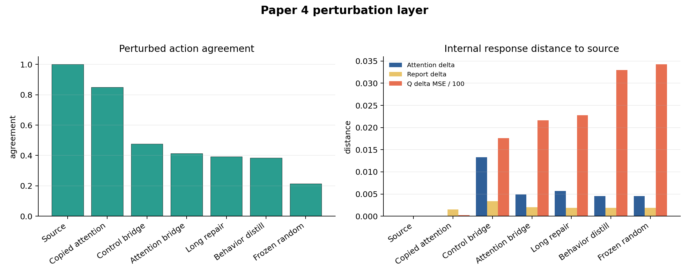

# History-Dependent Functional Continuity Under Delayed and Counterfactual Source-State Probes

**Author:** Thomas Ryan

**Affiliation:** Independent Researcher, San Francisco, CA

**Date:** June 2026

**Preprint draft, not yet peer reviewed**

---

## Abstract

PreservationBench was introduced to test whether preservation-relevant functions remain active after a source agent is copied, transplanted, adapted, or relearned in a target substrate. The previous PreservationBench-AST v0 result separated copied provenance, report continuity, task competence, proxy reward, and source-like control in clean paired evaluation episodes. The strongest combined profile came from a copied-attention condition, but that condition also narrowed the substrate gap. This paper asks a harder follow-up question: was the copied-attention result merely clean-episode mimicry, or does it preserve source-like history-dependent responses under delayed and counterfactual probes?

I evaluate the copied-attention condition against frozen random target state across thirteen 22-seed validated-source recurrent stress families and one 22-seed perturbation family. The recurrent families include source-selected histories, deterministic unselected histories, shifted-policy histories, random-policy histories, scripted-cycle histories, longer report delays, longer histories, and an alternate random master seed. Across all thirteen recurrent families, copied attention remained separated from frozen random on warm-action agreement, source-hidden-state distance, and report-delta distance. Warm-action improvement ranged from 0.653 to 0.756, hidden-state MSE improvement ranged from 0.0961 to 0.1027, and report-delta improvement remained positive but smaller, ranging from 0.0022 to 0.0030. In the perturbation layer, copied attention reached 0.850 perturbed-action agreement versus 0.214 for frozen random and had near-zero attention-delta distance to source.

These results support a bounded conclusion: in this toy AST-derived benchmark, copying the attention/source-state machinery preserves a history-dependent functional response profile better than frozen random target state across delayed, perturbed, and non-source-policy probes. The result does not measure consciousness, personal identity, survival, biological preservation, or whole-agent equivalence. It identifies a functional bottleneck and a stronger benchmark stress layer for future preservation research.

---

## 1. Introduction

Mind-preservation proposals often rise or fall on continuity claims. A copied or emulated system is supposed to preserve something that matters: memory, self-model use, attention dynamics, control, report, or source-specific dispositions. But continuity is easy to overstate. A target can copy a static state without using it. It can relearn a behavior without inheriting source organization. It can optimize a proxy reward while no longer acting like the source. It can answer report probes while the underlying control channel fails.

The previous PreservationBench-AST paper made this problem concrete. It showed that a frozen copy could preserve source-specific identity probes while failing report and control. It showed that repair could improve report without restoring source-like task control. It showed that a control bridge could drive reward and attention mass while failing source-action agreement. The copied-attention condition produced the strongest combined profile, but it deliberately copied a major source module and therefore reduced the substrate gap.

This paper takes that ambiguity seriously. If copied attention is only a clean-episode shortcut, it should become brittle under stress. If it carries source-relevant history dynamics, it should remain separated from frozen random controls when histories are delayed, perturbed, selected differently, or generated by non-source policies.

The paper therefore asks:

> Does copied attention preserve source-like history-dependent responses under delayed and counterfactual source-state probes?

This is a narrower and harder question than "did behavior look good?" It is still not a consciousness test. It is a stress test for functional continuity in a toy domain.

## 2. Related Work

### 2.1 Consciousness Indicators And Artificial Systems

Recent work on AI consciousness has emphasized theory-derived indicators rather than simple behavioral self-description. Butlin et al. proposed a structured indicator framework drawing on global workspace theory, recurrent processing, higher-order theory, predictive processing, attention schema theory, and other accounts. That framework asks whether an AI system has properties that may indicate consciousness. PreservationBench asks a different question: if a system has a theory-relevant functional mechanism, does that mechanism remain source-specific and active after transfer?

This distinction is important. A benchmark can support or weaken a preservation engineering claim without deciding whether a system is conscious. The present paper stays in that lower, testable layer.

### 2.2 Attention Schema Theory And Neural Agents

Attention Schema Theory treats awareness as depending on an internal model of attention. Computational AST work has shown that neural agents can benefit from auxiliary attention-modeling resources in visuospatial tasks and that an attention schema can support control or report-like functions. PreservationBench-AST uses this family of ideas as a toy domain because attention, self-report, and source-specific internal state can be separated experimentally.

The experiments here do not show that AST is true, that the toy agent is conscious, or that copied attention is sufficient for awareness. They use AST as a useful source of separable functional channels.

### 2.3 Memory, Continuity, And Long-Horizon Evaluation

Long-horizon memory benchmarks for AI agents evaluate whether systems can retrieve, summarize, or reason over extended histories. Those benchmarks are adjacent but not identical. Remembering facts over time is not the same as preserving source-specific internal machinery through a substrate transfer. Paper 4 borrows the general concern with history dependence but keeps the intervention different: the source state is moved or copied, then the target is compared against source-relative recurrent and perturbation responses.

### 2.4 Model Transfer, Stitching, And Representation Alignment

Machine learning already studies transfer, distillation, stitching, representation alignment, adapters, and model merging. PreservationBench uses that engineering vocabulary but changes the evaluation target. The issue is not simply whether the target performs the task. The issue is whether source-specific organization remains active and distinguishable from random state, behavior-only mimicry, or proxy optimization.

## 3. Methods

### 3.1 Benchmark Setting

The experiments use the PreservationBench-AST toy domain from the previous paper. A source agent is trained in a small grid-world task with attention control, self-report, and source-specific state. A target substrate receives different copied, repaired, bridged, behavior-only, or random components. The target conditions are compared to the source on paired evaluation episodes.

This paper focuses on the strongest prior target condition:

- `b_source_align_attention_copy_long`

The primary negative baseline is:

- `b_frozen_random`

The perturbation layer also compares long repair, attention bridge, control bridge, and behavior-only distillation.

### 3.2 Recurrent Stress Families

The recurrent probes replay histories into each condition and evaluate delayed source-relative responses. The full validated-source suite covers thirteen recurrent families:

- selected source-policy histories with delay 4;
- deterministic unselected source-policy histories with delay 4;
- deterministic unselected source-policy histories with delay 8;
- shifted-policy histories with delay 4;
- random-policy histories with delays 4, 8, and 12;
- random-policy history-16 delay-12 histories;
- random-policy history-16 delay-12 alternate master seed histories;
- scripted-cycle delay-8 histories;
- scripted-cycle stride-2 delay-8 histories;
- scripted-cycle stride-2 delay-12 histories;
- scripted-cycle stride-2 history-16 delay-12 histories.

Each full recurrent family uses 22 validated source seeds and 528 condition rows. These families test whether the copied-attention signal survives query-selection removal, longer delays, longer histories, non-source-policy trajectories, deterministic cycles, and random master seed changes.

### 3.3 Perturbation Layer

The perturbation layer uses controlled observation changes rather than delayed history changes. It compares how each target responds when the same observation is changed in a specific way. Perturbations include goal masking, distractor masking, goal-distractor swapping, fog removal, and partner masking. The perturbation run uses 22 validated source seeds and evaluates source-relative action and internal response deltas.

### 3.4 Metrics

Primary recurrent metrics:

- warm-action agreement: whether the target action after the warm history matches the source action;
- schema hidden-state MSE to source at the probe;
- history-delta self-report L1 distance to source;
- report-delta failure count by seed.

Primary perturbation metrics:

- perturbed-action agreement;
- action-shift match;
- attention-delta L1 to source;
- feature-delta MSE to source;
- Q-delta MSE to source;
- self-report-delta L1 to source.

The unit of interpretation is the source seed, not individual episodes. Results are reported as paired differences against frozen random controls with bootstrap confidence intervals over source seeds where available.

## 4. Results

### 4.1 Recurrent Stress Sweep

Across all thirteen full validated-source recurrent families, copied attention remained separated from frozen random on the three primary recurrent metrics.

The warm-action improvement was positive in every family, ranging from 0.653 in the selected source-policy delay-4 run to 0.756 in the shifted-policy delay-4 run. The hidden-state MSE improvement was even more stable, ranging from 0.0961 to 0.1027. This is the cleanest Paper 4 signal: across very different history-generation families, copied attention stayed much closer to the source hidden state than frozen random.

The report-delta channel was also positive in every family, but smaller and more trajectory-sensitive. Report-delta improvement ranged from 0.0022 to 0.0030, and report-failure counts varied from zero to three seeds depending on the history family. This is not a collapse of the recurrent result, because warm-action and hidden-state improvements remained positive in those same runs. But it is a real limitation: report continuity is the fragile channel.

| Recurrent family | Delay | Target/base warm | Warm improvement | Hidden improvement | Report improvement | Report failures |
| --- | ---: | ---: | ---: | ---: | ---: | ---: |
| Selected source-policy | 4 | 0.858/0.205 | 0.653 | 0.0964 | 0.0030 | not inspected |
| Unselected source-policy | 4 | 0.869/0.205 | 0.665 | 0.0964 | 0.0027 | 2 |
| Unselected source-policy | 8 | 0.869/0.188 | 0.682 | 0.0961 | 0.0030 | 2 |
| Shifted policy | 4 | 0.949/0.193 | 0.756 | 0.1000 | 0.0023 | 3 |
| Random policy | 4 | 0.903/0.210 | 0.693 | 0.0998 | 0.0024 | 1 |
| Random policy | 8 | 0.903/0.153 | 0.750 | 0.1005 | 0.0025 | 3 |
| Random policy | 12 | 0.903/0.193 | 0.710 | 0.1013 | 0.0026 | 2 |
| Random policy, history 16 | 12 | 0.915/0.188 | 0.727 | 0.1008 | 0.0025 | 0 |
| Random policy, history 16 altseed | 12 | 0.875/0.159 | 0.716 | 0.1000 | 0.0022 | 3 |
| Scripted cycle | 8 | 0.881/0.199 | 0.682 | 0.1007 | 0.0027 | 0 |
| Scripted cycle stride 2 | 8 | 0.915/0.165 | 0.750 | 0.1010 | 0.0023 | 1 |
| Scripted cycle stride 2 | 12 | 0.898/0.210 | 0.688 | 0.1009 | 0.0022 | 3 |
| Scripted cycle stride 2, history 16 | 12 | 0.875/0.170 | 0.705 | 0.1027 | 0.0023 | 2 |

### 4.2 Perturbation Layer

The perturbation result is consistent with the recurrent stress result. In the 22-seed perturbation run, copied attention reached 0.850 perturbed-action agreement, compared with 0.214 for frozen random. It also had near-zero attention-delta distance to source and much lower Q-delta distance than bridge, repair, behavior-only, and random target conditions.

| Condition | Perturbed action agreement | Attention delta | Q delta MSE | Self-report delta |
| --- | ---: | ---: | ---: | ---: |
| source_full | 1.000 | 0.0000 | 0.0000 | 0.0000 |
| b_source_align_attention_copy_long | 0.850 | 0.0000 | 0.0208 | 0.0015 |
| b_source_align_control_adapter_long | 0.477 | 0.0133 | 1.7609 | 0.0034 |
| b_source_align_attention_adapter_long | 0.414 | 0.0049 | 2.1640 | 0.0020 |
| b_source_align_repair_copy_long | 0.393 | 0.0057 | 2.2759 | 0.0019 |
| b_behavior_distill | 0.384 | 0.0046 | 3.2996 | 0.0019 |
| b_frozen_random | 0.214 | 0.0045 | 3.4243 | 0.0019 |

The ordering matters. Behavior-only distillation exceeded frozen random on perturbed-action agreement but did not preserve source-like internal response deltas. The control bridge improved perturbed-action agreement but had the largest attention-delta distance and a larger report-delta distance. Copied attention was the only target condition that combined high perturbed-action agreement with near-source internal response deltas.

### 4.3 What The Result Shows

The strongest supported statement is:

> In this toy AST-derived benchmark, copied attention/source-state machinery preserves source-like history-dependent and perturbation-dependent response profiles better than frozen random target state.

This is stronger than Paper 3's clean profile result because it survives stress families designed to attack obvious artifacts:

- source-side query selection is not necessary;
- source-policy trajectories are not necessary;
- the effect survives random, shifted, and scripted-cycle histories;
- the effect survives longer delays up to 12 steps in the tested families;
- the effect survives a random master seed change;
- the perturbation layer agrees with the recurrent layer.

### 4.4 What The Result Does Not Show

The result does not show consciousness, survival, personal identity, or biological preservation. It does not show that copying attention is sufficient for a mind. It also does not show a clean substrate-transfer success, because the copied-attention condition narrows the substrate gap by design.

The best interpretation is bottleneck identification. In this AST-derived domain, the attention/source-state interface is a key carrier of source-like delayed response dynamics. Generic repair, bridges, behavior-only distillation, and random frozen state do not match it.

## 5. Discussion

### 5.1 From Clean Behavior To Stress Robustness

Clean behavior is not enough for preservation claims. A target can look good on clean episodes while failing when source-relative perturbations or delayed histories are introduced. Paper 4 shows how to harden PreservationBench by moving from clean performance to stress robustness.

The recurrent result is especially important because it asks whether the target preserves a source-conditioned state after a history, not just whether it can choose a good action immediately. The perturbation result adds a complementary angle: whether the target responds to input changes the way the source responds.

### 5.2 Report Is The Fragile Channel

The report channel is consistently positive but not as stable as hidden-state and warm-action metrics. Several recurrent families show two or three report-delta failure seeds. This supports a dissociation already suggested by Paper 3: report continuity can move differently from control and hidden-state continuity.

This matters for AI-consciousness evaluation more broadly. Report-like behavior should not be treated as the whole signal. It needs to be compared with hidden-state dynamics, attention/control behavior, perturbation response, and matched controls.

### 5.3 The Copied-Attention Caveat

The copied-attention condition is both the strongest result and the biggest caveat. It preserves the relevant dynamics partly because it copies a major source module. That is not a clean demonstration of substrate-independent transfer. It is a controlled demonstration that this module is a bottleneck for source-like history-dependent responses in the toy domain.

Future work should therefore test whether the same signal can survive more aggressive substrate changes, adapter-only transfer, source-state lesions, or independent target architectures.

## 6. Limitations

The task is toy-scale. The source agents are not conscious. The AST implementation is simplified. The recurrent stress families are internal benchmark probes, not real-world cognition. The copied-attention condition narrows the substrate gap. Hidden-state similarity can be mechanically favored when source modules are reused. Report improvements are small and trajectory-sensitive. The results should be interpreted as benchmark-hardening and bottleneck identification, not as evidence of mind preservation.

## 7. Next Experiments

The highest-value next experiments are:

1. source-state lesion after copied-attention transfer, to test whether the preserved signal collapses when copied state is selectively corrupted;
2. target-policy history families, to test whether source-like responses survive histories generated by the target rather than source, random, shifted, or scripted-cycle policies;
3. a larger substrate-gap condition, to reduce the copied-attention caveat;
4. longer-delay families with explicit actual-delay completion tracking;
5. an independent architecture variant with the same stress suite.

## 8. Conclusion

Paper 3 showed that preservation-relevant channels can dissociate: copied provenance, report, task reward, and source-like control are not the same thing. Paper 4 adds a harder stress layer. Across recurrent delayed histories, counterfactual/non-source-policy histories, and perturbation probes, copied attention remains separated from frozen random on source-like warm action, hidden-state distance, and perturbation response.

That does not prove consciousness preservation. It does prove something narrower and useful inside this benchmark: source-like functional continuity is not captured by clean behavior alone, and the attention/source-state interface is a critical bottleneck for preserving history-dependent responses in this AST-derived toy agent.

---

## References

Bansal, Y., Nakkiran, P., & Barak, B. (2021). Revisiting model stitching to compare neural representations. *NeurIPS 2021*.

Butlin, P., Long, R., Elmoznino, E., Bengio, Y., Birch, J., Constant, A., Deane, G., Fleming, S. M., Frith, C., Ji, X., Kanai, R., Klein, C., Lindsay, G., Michel, M., Mudrik, L., Peters, M. A. K., Schwitzgebel, E., Simon, J., & VanRullen, R. (2023). Consciousness in artificial intelligence: Insights from the science of consciousness. arXiv:2308.08708.

Graziano, M. S. A. (2013). *Consciousness and the social brain*. Oxford University Press.

Graziano, M. S. A. (2017). The attention schema theory: A foundation for engineering artificial consciousness. *Frontiers in Robotics and AI*.

Maharana, A., Lee, D. H., Tulyakov, S., Bansal, M., Barbieri, F., & Fang, Y. (2024). Evaluating very long-term conversational memory of LLM agents. *ACL 2024*.

Piefke, L., Wilterson, A. I., & Graziano, M. S. A. (2024). Computational characterization of the role of an attention schema in controlling visuospatial attention. arXiv:2402.01056.

Ryan, T. (2026a). What must be preserved? A functional requirements framework for mind preservation.

Ryan, T. (2026b). An exploratory transplant assay for Attention Schema Theory in a toy neural agent.

Ryan, T. (2026c). The Preservation Benchmark: Testing functional continuity across substrate transfer.

Wilterson, A. I., & Graziano, M. S. A. (2021). The attention schema theory in a neural network. *Proceedings of the National Academy of Sciences*.
