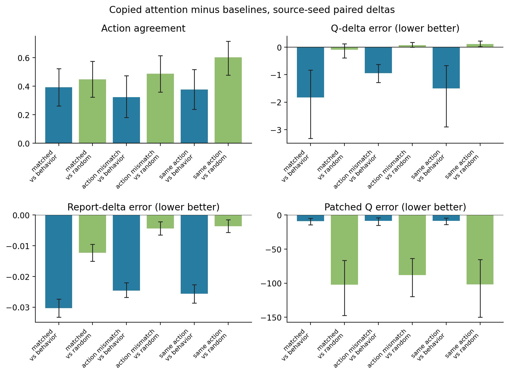
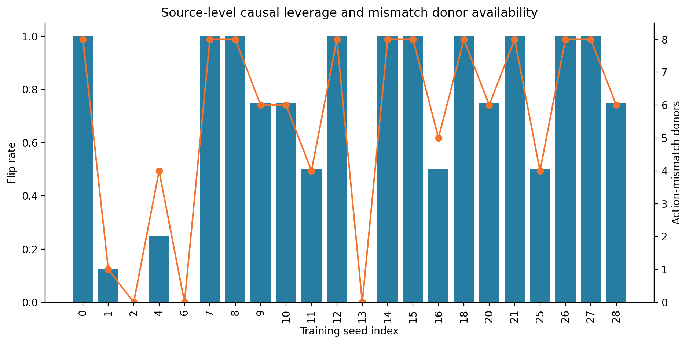
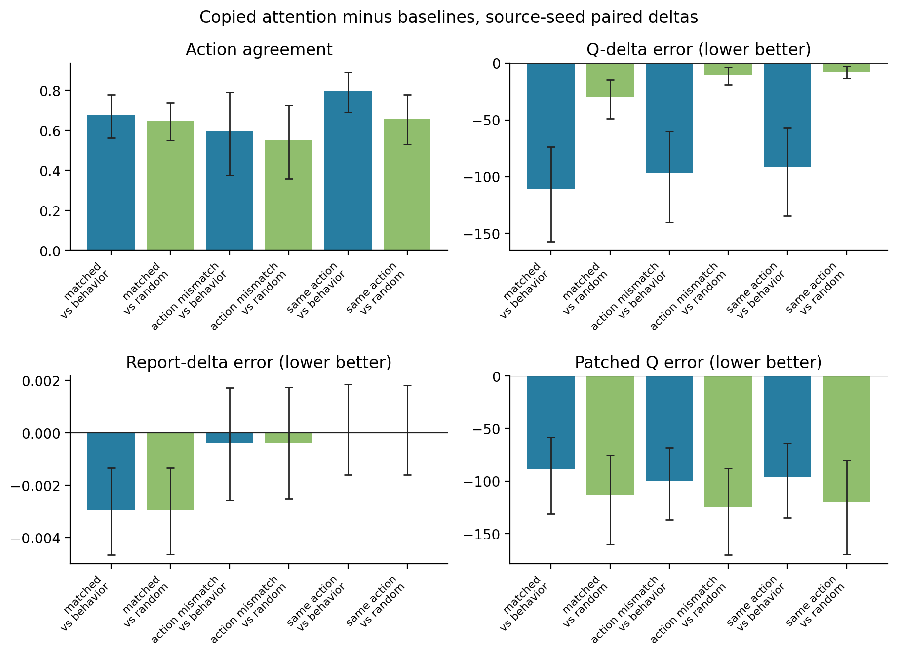
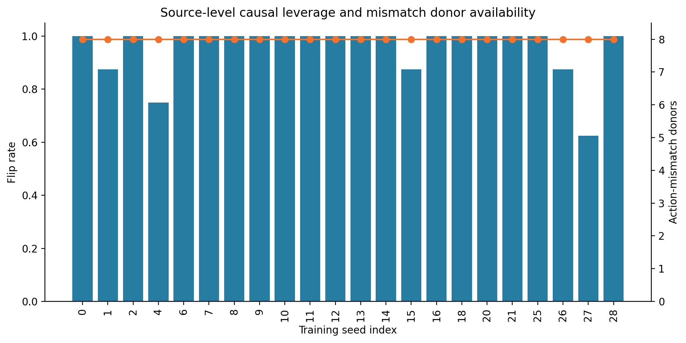
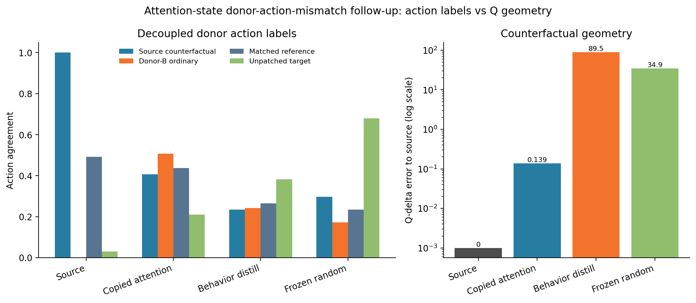
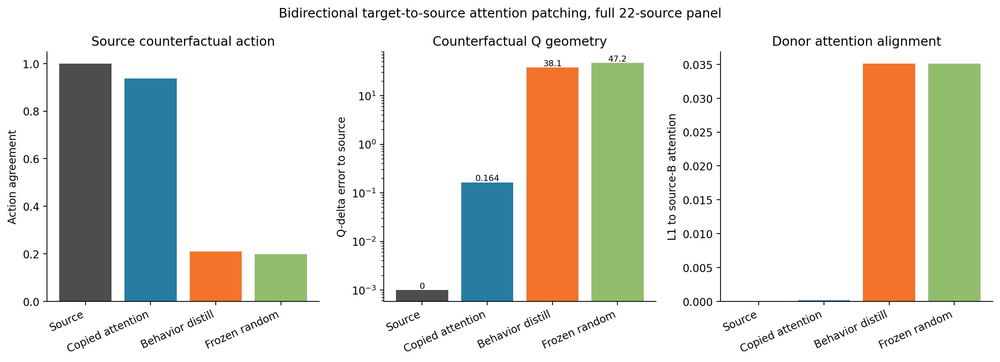
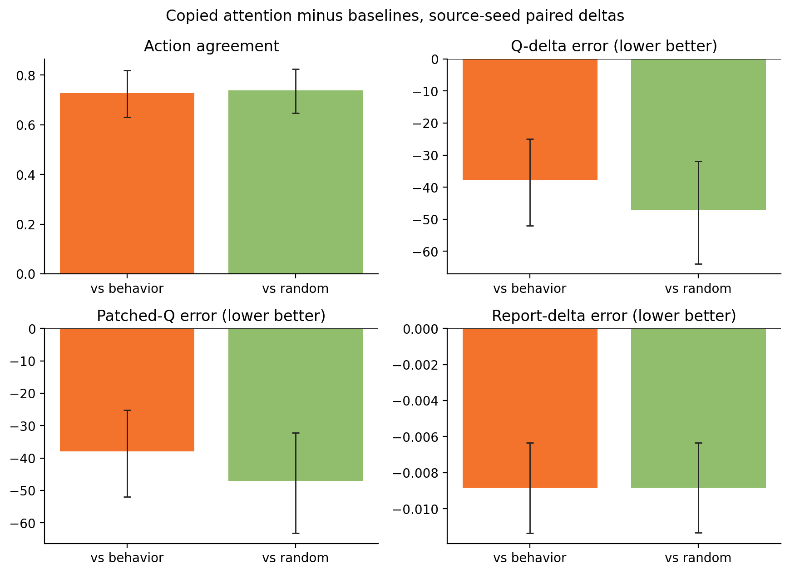

# Causal Preservation Under Substrate Transfer: Interchange Intervention Tests for Source-Specific Functional Continuity

**Author:** Thomas Ryan

**Affiliation:** Independent Researcher, San Francisco, CA

**Date:** June 2026

**Preprint, not yet peer reviewed**

---

## Abstract

PreservationBench previously showed that copied provenance, report continuity, task competence, proxy reward, source-like control, recurrent history dependence, and perturbation response can dissociate after substrate transfer. This paper asks a sharper question: when a target resembles a source from the outside, does it preserve the source's behaviorally relevant causal mechanisms, or only match selected behavioral and report surfaces?

I introduce a causal-preservation test for the PreservationBench-AST toy setting using interchange interventions. For paired source histories A and B, I first identify source activation interventions that change the source response or response geometry. I then patch a source-B activation into a target evaluated on source context A and ask whether the target follows the source's counterfactual response. The main experiments test schema-state and attention-state activations across four conditions: `source_full`, copied source attention (`b_source_align_attention_copy_long`), behavior-only distillation (`b_behavior_distill`), and frozen random target state (`b_frozen_random`).

In a 22-validated-source panel, schema-state interchange interventions produced a bounded causal-preservation signal. Within-source patching was a valid positive control. Copied attention separated from behavior distillation on donor-specific counterfactual action agreement, Q-delta geometry, self-report-delta geometry, and absolute patched-Q distance to the source counterfactual. Forced action-mismatch donor controls showed copied attention tracking the donor-specific counterfactual more than the original matched reference, with a specificity gap of 0.549 versus 0.164 for behavior distillation and -0.033 for frozen random. A second attention-state path produced a stronger high-leverage result: copied attention reached 0.864 donor-specific agreement under both matched and action-mismatch donors, while behavior distillation reached 0.188 and 0.267. A bidirectional target-to-source follow-up strengthened the causal-role interpretation: target-B activations from the copied-attention condition patched back into source-A produced 0.938 source-counterfactual action agreement, compared with 0.210 for behavior distillation and 0.199 for frozen random. Behavior distillation does not provide a clean ordinary-behavior success case in these selected causal subsets, so the claim is deliberately narrower: causal interchange exposes source-specific intervention geometry that raw behavior and single action labels miss. The result does not measure consciousness, personal identity, survival, biological preservation, or AST truth. It is a toy benchmark result about causal mechanism preservation under substrate transfer.

---

## 1. Introduction

Mind-preservation arguments often lean on behavioral or functional continuity. A copied, emulated, repaired, or transferred system is supposed to preserve memory, report, agency, attention dynamics, or some other property that matters to the original system. The previous PreservationBench papers made this testable in a toy AST-derived benchmark. Paper 3 showed that several preservation-relevant channels dissociate after transfer: copied source fingerprints can persist while report or control fails, and proxy reward can improve without source-like behavior. Paper 4 showed that the strongest copied-attention condition remains separated from frozen random controls under delayed histories and perturbations.

Those results still leave an important caveat. A target can match source behavior under ordinary evaluation without preserving the same behaviorally relevant internal causes. Conversely, a target can share internal state with the source in a static sense without using that state in the same causal role. For preservation research, neither static provenance nor external behavior is enough. The stronger question is whether the target preserves source-specific causal variables that remain active under counterfactual intervention.

This paper therefore asks:

> After substrate transfer, does a target preserve source-relevant causal mechanisms, or only match source-like behavior and report from the outside?

The answer here is intentionally bounded. The experiment is not a consciousness test, not a personal-identity test, and not a biological preservation model. It is a method paper and a toy empirical result: causal preservation should be measured by source-specific interchange interventions, not only by behavior, report, copied-state fingerprints, or perturbation robustness.

## 2. Related Work

### 2.1 PreservationBench And AI-Consciousness Evaluation

This paper continues the PreservationBench line of work. Paper 1 mapped consciousness theories to preservation requirements (Ryan, 2026a). Paper 2 tested a narrow AST transplant assay in a toy neural agent (Ryan, 2026b). Paper 3 introduced PreservationBench-AST and showed that copied provenance, report continuity, task competence, proxy reward, and source-like control dissociate under substrate transfer (Ryan, 2026c). Paper 4 added delayed-history and perturbation probes, showing that copied attention remains separated from frozen random controls under stress (Ryan, 2026d).

AI-consciousness indicator frameworks ask a different question. Butlin et al. (2023) derive theory-linked indicators for artificial systems, including recurrent processing, global workspace, higher-order, predictive-processing, and attention-schema considerations. PreservationBench does not decide whether those indicators are sufficient for consciousness. It asks whether theory-relevant mechanisms remain source-specific and causally active after transfer.

### 2.2 Attention Schema Theory

The toy benchmark uses Attention Schema Theory as a tractable source of separable functional channels. AST treats awareness as depending on an internal model of attention rather than as a substrate-specific substance (Graziano, 2013, 2017). Computational AST work has shown that attention-schema-like resources can be implemented and tested in neural agents (Wilterson and Graziano, 2021; Liu et al., 2023). This paper uses AST only as a toy mechanism family. It does not claim AST is true, sufficient for consciousness, or fully captured by the benchmark.

### 2.3 Causal Abstraction And Interchange Interventions

The immediate methodological ancestor is causal abstraction for neural networks. Geiger et al. (2021) align neural representations with variables in interpretable causal models and use interchange interventions to test whether the representations have the aligned variables' causal properties. Geiger et al. (2022) extend this into interchange intervention training, where neural models are trained to realize a target causal model's counterfactual behavior. Paper 5 borrows the intervention logic but changes the scientific target: instead of asking whether one model realizes a known symbolic causal model, it asks whether a target substrate preserves source-specific causal variables after transfer.

Mechanistic interpretability work on activation patching and causal tracing is also adjacent. Meng et al. (2022) use causal interventions on neuron activations to identify computations that mediate factual predictions in GPT. Paper 5 uses direct activation patching in a smaller and more controlled setting, but the reason is similar: behavior alone does not identify which internal variables are causally responsible.

### 2.4 Transfer, Distillation, And Model Stitching

Machine learning already contains tools for moving behavior or representations across systems. Distillation transfers input-output behavior from a teacher to a student (Hinton et al., 2015). Model stitching compares whether representations from one network can be connected to later layers of another network through a learned stitch (Bansal et al., 2021). PreservationBench borrows this engineering vocabulary while changing the evaluation criterion. The question is not whether a target performs well or whether two representations are stitch-compatible in general. The question is whether source-specific variables remain causally active under counterfactual intervention after transfer.

## 3. Conceptual Frame

### 3.1 Behavioral Continuity Is Not Causal Preservation

Behavioral continuity asks whether the target does what the source does. Causal preservation asks whether the target does it for source-aligned reasons. In a substrate-transfer setting, this distinction is central. A target could imitate source actions through distillation, relearn a policy independently, or optimize a proxy objective while no longer relying on source-specific mechanisms.

The practical test is counterfactual: if a behaviorally relevant source variable is changed, does the target respond like the source would respond under the same intervention? If not, then external behavioral match is incomplete evidence for preservation.

### 3.2 Interchange Interventions

The experiment uses interchange-style interventions. Given source contexts A and B:

1. Run the source on A and B.
2. Identify the source response on A.
3. Patch a source variable from B into the source at A to obtain a source counterfactual.
4. Run the target on A.
5. Patch the same source-B variable into the target at A.
6. Ask whether the patched target follows the source counterfactual.

The positive control is within-source patching. A patch path is not interpretable unless patching the source itself produces stable effects. Negative controls include behavior-only distillation and frozen random target state. Donor controls test whether the target follows the actual donor intervention rather than a trivial output label, matched-reference leak, or generic perturbation response.

## 4. Methods

### 4.1 Benchmark Setting

The experiments reuse the PreservationBench-AST source checkpoints from the validated Paper 3/4 run:

```text
experiments/preservation_bench/runs/ast_competence_v2_core_10seed
```

The main run uses all 22 validated source seeds available through the existing seed-validation loader. Each source is evaluated on held-out paired histories generated by stable benchmark seeds. The source is warmed for eight steps before the probe.

### 4.2 Conditions

The main causal-patching run compares:

**Table 1. Experimental conditions.**

| Condition | Role |
| --- | --- |
| `source_full` | within-source positive control |
| `b_source_align_attention_copy_long` | copied source-attention/source-state condition from Papers 3-4 |
| `b_behavior_distill` | behavior-only transfer baseline |
| `b_frozen_random` | freeze-matched random negative control |

### 4.3 Patch Paths

The first proof path patches the schema activation at the probe. This is not a recurrent-snapshot patch; it replaces the schema activation immediately before report, self-model, and policy readout. Direct recurrent `schema_hidden` and `last_modulation` snapshot patches were implemented but produced weaker source-side effects in early bounded smoke runs.

The second proof path patches the attention activation at the probe: the source-B attention weights and attended feature vector are injected before schema, self-model, and policy readout. This is a stronger and more direct source-state intervention than schema activation alone. It asks whether the target preserves the downstream causal use of source attention state. Because copied attention deliberately narrows the substrate gap, this path is interpreted as a causal-mechanism preservation diagnostic, not as a clean uploading-style transfer success.

### 4.4 Candidate Selection

For each source seed, the runner samples 80 candidate A/B pairs. It evaluates the source-only patch effect for each pair and ranks candidates by a selection score that prioritizes source action changes, Q-value delta, self-report delta, and schema-state delta. The top 8 pairs per source seed are replayed across conditions.

This selection procedure intentionally asks a hard question: when the source has an intervention-relevant schema-state response, does the target preserve it? It also creates an interpretation constraint. Results are about a causally selected subset, not the full ordinary behavior distribution.

### 4.5 Donor Controls

The current donor controls are:

**Table 2. Donor controls.**

| Donor control | Purpose |
| --- | --- |
| `matched` | original selected source-B donor |
| `same_action` | donor chosen so the source patch does not change the source action |
| `action_mismatch` | donor chosen so the donor-specific source counterfactual action differs from the original matched source counterfactual action |

The action-mismatch control is the strongest current leakage check. If a target is merely biased toward the matched reference action, it should not follow the donor-specific counterfactual under a forced mismatch.

### 4.6 Metrics

Primary metrics:

- source patch action changed;
- target donor-specific interchange action agreement;
- matched-reference action agreement;
- action specificity gap: donor-specific action agreement minus matched-reference action agreement;
- target patch shift match;
- Q-delta MSE to the source counterfactual delta;
- self-report-delta L1 to the source counterfactual delta;
- absolute patched-Q MSE to the source counterfactual state.

Discrete action agreement is reported but not treated as sufficient. The current results show why: action labels can be fragile, especially when source causal leverage varies across seeds or when target policies have different unpatched baselines.

### 4.7 Bidirectional Target-To-Source Patch

The main interchange direction patches source-B activations into target context A. A bidirectional follow-up reverses that direction for the attention-state path: it obtains target-B attention activations from each condition, patches those activations back into source context A, and compares the resulting source response with the source's own B-to-A counterfactual. This asks whether a target activation can play the source variable's causal role inside the source, not only whether a source activation can drive the target.

This is an identity-aligned attention-state test. It is strongest for the copied-attention condition by design and should not be interpreted as a general representation-alignment solution. It is included as a causal-role robustness check: if the target's attention state preserves the source variable, then the target-B state should substitute for the source-B state when injected back into the source.

## 5. Results

### 5.1 Full 22-Source Schema-State Interchange Run

The main run used all 22 validated source seeds, 80 candidate A/B pairs per source seed, and the top 8 selected source patch pairs per seed. It produced 1,892 rows:

- 176 matched-donor rows per condition;
- 175 same-action donor rows per condition;
- 122 action-mismatch donor rows per condition.

The matched donor rows are the primary source-counterfactual test. Source patching changed the source action in 0.676 of matched rows, and `source_full` had perfect interchange agreement. Copied attention reached 0.642 donor-specific interchange action agreement, compared with 0.250 for behavior distillation and 0.193 for frozen random. It also remained much closer than behavior distillation on Q/report counterfactual geometry.

**Table 3. Schema-state matched-donor results.**

| Donor | Condition | n | Source flip | Donor action | Shift match | Q-delta error | Report-delta error |
| --- | --- | ---: | ---: | ---: | ---: | ---: | ---: |
| matched | `source_full` | 176 | 0.676 | 1.000 | 1.000 | 0.0000 | 0.0000 |
| matched | `b_source_align_attention_copy_long` | 176 | 0.676 | 0.642 | 0.568 | 0.1571 | 0.0069 |
| matched | `b_behavior_distill` | 176 | 0.676 | 0.250 | 0.443 | 1.9835 | 0.0372 |
| matched | `b_frozen_random` | 176 | 0.676 | 0.193 | 0.347 | 0.2459 | 0.0192 |

Restricting to matched rows where the source action actually flipped produced the same qualitative ordering. On 119 source-action-flip rows from 19 source seeds, copied attention reached 0.521 interchange action agreement, behavior distillation reached 0.227, and frozen random reached 0.202. Copied attention had lower Q-delta error than behavior distillation (0.1491 versus 1.6097) and much lower absolute patched-Q-to-source-counterfactual error than frozen random (0.1711 versus 93.6085).

### 5.2 Forced Action-Mismatch Specificity

The action-mismatch control is the main leakage test. It chooses a donor whose donor-specific source counterfactual action differs from the original matched source counterfactual action, when such a donor exists. In the full run, action-mismatch donors were available for 19 of 22 source seeds and produced 122 rows per condition.

Within those rows, the source positive control behaved as expected: `source_full` followed the donor-specific source counterfactual with 1.000 agreement and the original matched reference with 0.000 agreement. Copied attention preserved the same direction at reduced strength. It followed the donor-specific counterfactual with 0.689 agreement and the stale matched reference with 0.139 agreement, for a specificity gap of 0.549. Behavior distillation had a smaller gap of 0.164, and frozen random had a slightly negative gap of -0.033.


**Table 4. Schema-state action-mismatch specificity.**

| Donor | Condition | n | Donor action | Matched-reference action | Specificity gap | Q-delta error | Report-delta error |
| --- | --- | ---: | ---: | ---: | ---: | ---: | ---: |
| action-mismatch | `source_full` | 122 | 1.000 | 0.000 | 1.000 | 0.0000 | 0.0000 |
| action-mismatch | `b_source_align_attention_copy_long` | 122 | 0.689 | 0.139 | 0.549 | 0.1694 | 0.0084 |
| action-mismatch | `b_behavior_distill` | 122 | 0.361 | 0.197 | 0.164 | 1.1794 | 0.0326 |
| action-mismatch | `b_frozen_random` | 122 | 0.164 | 0.197 | -0.033 | 0.0762 | 0.0123 |

This is the central Paper 5 result. It shows that copied attention is not merely matching the original selected source action or responding generically to any donor. It tracks the donor-specific causal intervention more than the stale reference action, and it does so more strongly than behavior-only distillation.

### 5.3 Source-Seed Paired Deltas

The row-level results are supported by source-seed paired deltas. For each source seed, rows were averaged within a donor-control/condition cell, then copied attention was compared against behavior distillation and frozen random. Bootstrap intervals are percentile intervals over source seeds.

Under action-mismatch donors, copied attention exceeded behavior distillation by 0.324 action-agreement points with a 95% bootstrap interval of [0.182, 0.473]. It also reduced Q-delta error by 0.941, reduced absolute patched-Q-to-source-counterfactual error by 8.772, and reduced report-delta error by 0.025. The corresponding intervals did not cross zero.

Against frozen random, copied attention exceeded action agreement by 0.489 under action-mismatch donors and reduced absolute patched-Q-to-source-counterfactual error by 88.064. The Q-delta metric alone was not a reliable frozen-random separator under action-mismatch donors (0.076, interval [-0.003, 0.171]), because frozen random can have small deltas while remaining far from the absolute source counterfactual state. This is why both delta geometry and absolute counterfactual-state distance are reported.



### 5.4 Source-Level Causal Leverage

The full panel confirms that source causal leverage is heterogeneous. Of 22 validated source seeds, 10 had a matched source action flip rate of 1.000, 9 had a partial flip rate between 0 and 1, and 3 had no action flips under this schema-state selection path. Action-mismatch donors were available for 19 of 22 sources.



This heterogeneity is a finding, not noise. Causal-preservation tests should first ask whether the chosen source variable has source-side causal leverage, then ask whether the target preserves that intervention response. A single pooled action score hides that structure.

### 5.5 Attention-State Interchange

The second patch path tests attention-state activation directly. It patches source-B attention weights and attended features into source or target context A before schema, self-model, and policy readout. This path produced stronger source-side action leverage than schema-state patching: the matched source action flip rate was 0.955, with no null source seeds. Seventeen of 22 source seeds had a flip rate of 1.000; the remaining five had partial flip rates.

The target ordering was also sharper. Under matched donors, copied attention reached 0.864 donor-specific action agreement, compared with 0.188 for behavior distillation and 0.216 for frozen random. Under action-mismatch donors, copied attention again reached 0.864, compared with 0.267 for behavior distillation and 0.312 for frozen random.

**Table 5. Attention-state matched and action-mismatch results.**

| Donor | Condition | n | Source flip | Donor action | Shift match | Q-delta error | Report-delta error |
| --- | --- | ---: | ---: | ---: | ---: | ---: | ---: |
| matched | `source_full` | 176 | 0.955 | 1.000 | 1.000 | 0.0000 | 0.0000 |
| matched | `b_source_align_attention_copy_long` | 176 | 0.955 | 0.864 | 0.892 | 0.1117 | 0.0053 |
| matched | `b_behavior_distill` | 176 | 0.955 | 0.188 | 0.619 | 111.0710 | 0.0083 |
| matched | `b_frozen_random` | 176 | 0.955 | 0.216 | 0.369 | 29.9075 | 0.0083 |
| action-mismatch | `b_source_align_attention_copy_long` | 176 | 0.506 | 0.864 | 0.903 | 0.1268 | 0.0053 |
| action-mismatch | `b_behavior_distill` | 176 | 0.506 | 0.267 | 0.625 | 96.9758 | 0.0057 |
| action-mismatch | `b_frozen_random` | 176 | 0.506 | 0.312 | 0.409 | 10.2535 | 0.0057 |

Action-mismatch specificity was strongest for copied attention. It followed the donor-specific counterfactual with 0.864 agreement, the stale matched reference with 0.085 agreement, and therefore had a specificity gap of 0.778. Behavior distillation had a near-zero specificity gap of 0.006. Frozen random reached 0.170.


Source-seed paired deltas support the same result. Under matched donors, copied attention exceeded behavior distillation by 0.676 action-agreement points with a 95% bootstrap interval of [0.563, 0.778], reduced Q-delta error by 110.959, and reduced absolute patched-Q-to-source-counterfactual error by 89.092. Under action-mismatch donors, copied attention exceeded behavior distillation by 0.597 action-agreement points with a 95% bootstrap interval of [0.375, 0.790], reduced Q-delta error by 96.849, and reduced absolute patched-Q-to-source-counterfactual error by 100.007.





This second path strengthens the paper's central claim because it shows a second, higher-leverage causal variable: source attention state. It also clarifies the mechanistic profile. Schema-state patching exposes subtler source-counterfactual geometry and source heterogeneity; attention-state patching exposes a more direct action-relevant causal bottleneck preserved by the copied-attention condition.

### 5.6 Behavior-Matched Subsets

Across the full selected causal subsets, behavior distillation is already weaker than copied attention on unpatched source-A action agreement. This means the paper should not claim global behavioral equivalence plus causal divergence. However, the row-level records allow a narrower behavior-matched check: restrict to paired cases where behavior distillation matches the ordinary source-A action, and ask whether it still follows the source counterfactual under intervention.

For schema-state matched donors, behavior distillation matched the ordinary source-A action on 91 rows from 21 source seeds. On those behavior-matched rows, behavior distillation reached only 0.209 causal interchange action agreement, while copied attention reached 0.626. On the stricter subset where both behavior distillation and copied attention matched the ordinary source-A action, behavior distillation reached 0.234 and copied attention reached 0.571.

For attention-state matched donors, the result is stronger. Behavior distillation matched the ordinary source-A action on 65 rows from 19 source seeds. On those behavior-matched rows, behavior distillation reached 0.108 causal interchange action agreement, while copied attention reached 0.923. On the stricter subset where both conditions matched the ordinary source-A action, behavior distillation reached 0.115 and copied attention reached 0.934.

The behavior-matched subset therefore supports the paper's central distinction in a bounded way. It does not show that the full behavior distributions are equal. It does show that even when behavior-only distillation is locally correct on the ordinary source action, it can fail the source counterfactual intervention that copied attention preserves.

### 5.7 Cross-Path Robustness Summary

**Table 6. Cross-path causal preservation summary.**

| Patch path | Donor subset | Copied-attention donor action | Behavior-distill donor action | Frozen-random donor action | Copied-attention specificity gap | Behavior-distill specificity gap |
| --- | --- | ---: | ---: | ---: | ---: | ---: |
| schema state | action-mismatch | 0.689 | 0.361 | 0.164 | 0.549 | 0.164 |
| attention state | action-mismatch | 0.864 | 0.267 | 0.312 | 0.778 | 0.006 |
| schema state | behavior-matched ordinary action | 0.626 | 0.209 | n/a | n/a | n/a |
| attention state | behavior-matched ordinary action | 0.923 | 0.108 | n/a | n/a | n/a |

The two patch paths do not have identical source-side leverage, and they should not be collapsed into one pooled estimate. Their shared pattern is the important point: copied attention preserves donor-specific counterfactual response better than behavior distillation, including in rows where behavior distillation already matches the ordinary source-A action.

### 5.8 Leakage And Shortcut Audit

The final action-level audit asks whether the result can be explained by simpler shortcuts: preserving the target's unpatched action, copying the donor's ordinary source-B action, or following the stale matched-reference counterfactual action.

For schema-state action-mismatch rows, copied attention followed the source counterfactual with 0.689 agreement, compared with 0.770 agreement with the target's unpatched action, 0.451 agreement with the donor's ordinary source-B action, and 0.139 agreement with the stale matched reference. Behavior distillation reached 0.361 source-counterfactual agreement, 0.746 unpatched-action agreement, 0.434 donor-B action agreement, and 0.197 stale-reference agreement.

The stricter schema-state subset is more diagnostic. On the 67 action-mismatch rows where the source counterfactual action differed from the donor's ordinary source-B action, copied attention reached 0.627 source-counterfactual agreement but only 0.194 donor-B action agreement and 0.179 stale-reference agreement. Behavior distillation showed the opposite tendency: 0.299 source-counterfactual agreement and 0.433 donor-B action agreement. This makes raw donor-action copying an insufficient explanation for the schema-state result.

For attention-state action-mismatch rows, copied attention reached 0.864 source-counterfactual agreement, compared with 0.523 unpatched-action agreement and 0.085 stale-reference agreement. This makes pure target-action inertia and stale matched-reference leakage implausible explanations. However, attention-state donors do not cleanly separate the source counterfactual action from the donor's ordinary source-B action: in action-mismatch rows, those actions coincide in 0.972 of cases. The attention-state result is therefore the stronger causal-preservation effect, but the schema-state path is the cleaner raw-donor-action leakage disambiguation.

A follow-up attention-state donor-selection pass directly targeted that weakness. It searched for donors where the source counterfactual action differed from the donor's ordinary source-B action. This produced 128 decoupled rows across 18 source seeds. The source positive control remained valid: `source_full` followed the source counterfactual with 1.000 agreement while raw donor-B action agreement was 0.000.

**Table 7. Attention-state donor-action-mismatch audit.**

| Condition | n | Seeds | Source flip | Source-cf action | Unpatched action | Donor-B action | Matched-ref action | Q-delta error |
| --- | ---: | ---: | ---: | ---: | ---: | ---: | ---: | ---: |
| `source_full` | 128 | 18 | 0.969 | 1.000 | 0.031 | 0.000 | 0.492 | 0.0000 |
| `b_source_align_attention_copy_long` | 128 | 18 | 0.969 | 0.406 | 0.211 | 0.508 | 0.438 | 0.1386 |
| `b_behavior_distill` | 128 | 18 | 0.969 | 0.234 | 0.383 | 0.242 | 0.266 | 89.4973 |
| `b_frozen_random` | 128 | 18 | 0.969 | 0.297 | 0.680 | 0.172 | 0.234 | 34.8843 |



This harder attention-state audit is mixed. Copied attention still exceeds behavior distillation on source-counterfactual action agreement by 0.259 source-seed paired action points with a 95% bootstrap interval of [0.035, 0.484], and it remains far closer on Q-delta geometry: -89.074 copied-minus-behavior Q-delta error with interval [-121.813, -61.687]. It also remains far closer than frozen random on Q geometry. But copied attention no longer dominates the simple donor-B action label on discrete action agreement, and its action advantage over frozen random is weaker and has a bootstrap interval crossing zero. On behavior-matched decoupled rows, copied attention does not beat behavior distillation on action agreement.

This audit narrows the paper's claim in the right way. The result is not shortcut-proof in every possible sense. It is stronger than raw behavior matching, stronger than stale-reference matching, and stronger than raw donor-action copying in the schema-state disambiguation subset. In the attention-state disambiguation subset, copied attention preserves counterfactual geometry much better than the controls, but discrete action labels reveal a remaining donor-action shortcut boundary.

### 5.9 Bidirectional Target-To-Source Attention Patching

The final robustness check reverses the patch direction. Instead of patching source-B attention activations into a target at source context A, it patches each condition's target-B attention activations back into the source at context A. The comparison target is still the source's own B-to-A counterfactual. This asks whether the target activation can serve as the same causal variable inside the source.

The full bidirectional run used the same 22 validated source seeds and the same attention-state candidate-selection procedure: 80 candidate A/B pairs per source seed and the top 8 selected pairs. It produced 176 rows per condition. The source positive control passed: `source_full` reached 1.000 source-counterfactual action agreement and zero Q-delta error. Copied attention nearly reproduced that result. When copied-attention target-B activations were patched back into source-A, the source followed its counterfactual action in 0.938 of rows, with Q-delta error 0.164. Behavior distillation and frozen random did not provide source-compatible target activations: their source-counterfactual action agreement was 0.210 and 0.199, with Q-delta errors 38.063 and 47.177.

**Table 8. Bidirectional target-to-source attention patching.**

| Condition | n | Seeds | Source flip | Action agreement | Shift match | Q-delta error | Patched-Q error | Donor attention L1 |
| --- | ---: | ---: | ---: | ---: | ---: | ---: | ---: | ---: |
| Source | 176 | 22 | 0.955 | 1.000 | 1.000 | 0.0000 | 0.0000 | 0.0000 |
| Copied attention | 176 | 22 | 0.955 | 0.938 | 0.972 | 0.1642 | 0.1642 | 0.0002 |
| Behavior distill | 176 | 22 | 0.955 | 0.210 | 0.767 | 38.0626 | 38.0626 | 0.0351 |
| Frozen random | 176 | 22 | 0.955 | 0.199 | 0.761 | 47.1765 | 47.1765 | 0.0351 |



Source-seed paired deltas confirm the separation. Copied attention exceeded behavior distillation by 0.727 action-agreement points with a 95% bootstrap interval of [0.631, 0.818]. It exceeded frozen random by 0.739 with interval [0.648, 0.824]. Lower-is-better geometry metrics showed the same pattern: copied attention reduced Q-delta error by 37.898 against behavior distillation and by 47.012 against frozen random, with intervals far from zero.



This result is stronger than the forward-only attention-state result in one narrow sense: the copied-attention target's attention state is not merely accepted by its own downstream readout. It can be injected back into the source and recover the source's counterfactual response. The limitation is equally important. The alignment is identity-like and deliberately favorable to the copied-attention condition. The result supports a bounded causal-role preservation claim for this toy attention variable, not a general claim that arbitrary target representations are source-compatible.

## 6. Discussion

The current evidence supports a bounded but real Paper 5 claim:

> In a toy AST-derived substrate-transfer benchmark, copied source attention preserves source-specific schema-state and attention-state intervention geometry better than behavior-only distillation and frozen random controls. The attention-state variable also passes a bidirectional target-to-source causal-role check. Raw behavior and single action labels are not sufficient preservation metrics; causal preservation requires source-level intervention tests, donor-specific leakage controls, and directionality checks.

This is not merely another stress test. Papers 3 and 4 asked whether copied attention remains source-like across profiles, histories, and perturbations. Paper 5 asks whether the source-like response is causally organized in a source-specific way. The action-mismatch control directly tests that distinction across the full validated-source panel.

The result is also less clean than a simple "copied attention wins" story. Copied attention does not win every discrete action slice. Some source seeds have little action-level causal leverage under the schema-state path. Frozen random can look misleadingly close on some delta metrics while being far from the absolute source counterfactual state. These are not nuisances to hide; they are the main methodological lesson.

The leakage audit adds another constraint. Schema-state patching provides the clearer anti-leakage result because source counterfactual actions can be separated from donor-B ordinary actions. Attention-state patching provides the larger causal effect. The follow-up attention donor-action-mismatch panel partially preserves that effect under a harder shortcut test, but shows that copied attention's action-level preservation is weaker than its Q-geometry preservation. The bidirectional target-to-source pass then adds a different kind of evidence: under identity attention alignment, the copied-attention target's B-state can substitute for source-B state inside the source, while behavior-distilled and frozen-random target states cannot.

## 7. Limitations

The current result is a bounded manuscript-scale proof for two same-dimensional activation patch paths, not a general theory of preservation.

- Only two causal variables are used: schema activation and attention activation before downstream readout.
- Action-mismatch donors were available for 122 rows across 19 source seeds, not all selected rows.
- The patch paths use direct activation replacement in a toy architecture.
- Behavior distillation is not a strong ordinary-behavior match in the selected causal subset.
- The attention-state donor-action-mismatch pass decouples donor source-B ordinary action from patched source-counterfactual action, but copied attention's discrete action advantage is modest on that harder slice.
- The bidirectional target-to-source pass uses identity attention alignment and is deliberately favorable to the copied-attention condition.
- Copied attention narrows the substrate gap by design and should not be presented as a clean uploading-style success.
- The experiment does not test consciousness, survival, personal identity, biological preservation, or whether AST is true.

## 8. Conclusion

Paper 5 adds a causal layer to PreservationBench. The key result is not that copied attention is "the same mind" or that attention copying is sufficient for preservation. The key result is narrower and more testable: in a toy AST-derived substrate-transfer benchmark, copied attention preserves source-specific counterfactual response geometry under schema-state and attention-state interchange interventions better than behavior-only distillation and frozen random controls, and the copied attention state can pass a same-variable target-to-source causal-role check.

This matters because ordinary behavior, report, and copied provenance can each be misleading. A preservation benchmark should ask whether source variables still have source-like causal roles under intervention. The present result shows that such tests are feasible, that they reveal differences not captured by raw behavior, and that they expose source-level causal leverage as an object of analysis in its own right.

## 9. Future Evidence Gates

The present result supports a bounded toy-benchmark claim. The following are future robustness tests rather than claims made here:

1. Stress the bidirectional result with a non-identity alignment or learned stitch where dimensions allow it.
2. Train stronger behavior-only baselines on richer ordinary trajectories while withholding intervention labels.
3. Repeat the full panel with larger source pools or independent master seeds.
4. Add additional causal variables beyond schema-state and attention-state activations.

## Reproduction Commands

Run the full 22-source action-mismatch panel:

```bash
KMP_DUPLICATE_LIB_OK=TRUE OMP_NUM_THREADS=1 python3 -B \
  experiments/preservation_bench/run_ast_causal_patch_probe.py \
  --config experiments/preservation_bench/configs/ast_causal_patch_schema_state_action_mismatch_full22.json

KMP_DUPLICATE_LIB_OK=TRUE OMP_NUM_THREADS=1 python3 -B \
  experiments/preservation_bench/run_ast_causal_patch_probe.py \
  --config experiments/preservation_bench/configs/ast_causal_patch_attention_state_action_mismatch_full22.json
```

Generate the contrast report:

```bash
python3 experiments/preservation_bench/analyze_causal_patch_contrasts.py \
  experiments/preservation_bench/runs/ast_causal_patch_schema_state_action_mismatch_full22/causal_patch_rows.jsonl \
  --output-json experiments/preservation_bench/runs/ast_causal_patch_schema_state_action_mismatch_full22/causal_patch_contrasts.json \
  --output-md experiments/preservation_bench/runs/ast_causal_patch_schema_state_action_mismatch_full22/causal_patch_contrasts.md

python3 experiments/preservation_bench/analyze_causal_patch_contrasts.py \
  experiments/preservation_bench/runs/ast_causal_patch_attention_state_action_mismatch_full22/causal_patch_rows.jsonl \
  --output-json experiments/preservation_bench/runs/ast_causal_patch_attention_state_action_mismatch_full22/causal_patch_contrasts.json \
  --output-md experiments/preservation_bench/runs/ast_causal_patch_attention_state_action_mismatch_full22/causal_patch_contrasts.md

python3 experiments/preservation_bench/analyze_causal_patch_behavior_matched.py \
  experiments/preservation_bench/runs/ast_causal_patch_schema_state_action_mismatch_full22/causal_patch_rows.jsonl \
  --output-json experiments/preservation_bench/runs/ast_causal_patch_schema_state_action_mismatch_full22/behavior_matched_subsets.json \
  --output-md experiments/preservation_bench/runs/ast_causal_patch_schema_state_action_mismatch_full22/behavior_matched_subsets.md

python3 experiments/preservation_bench/analyze_causal_patch_behavior_matched.py \
  experiments/preservation_bench/runs/ast_causal_patch_attention_state_action_mismatch_full22/causal_patch_rows.jsonl \
  --output-json experiments/preservation_bench/runs/ast_causal_patch_attention_state_action_mismatch_full22/behavior_matched_subsets.json \
  --output-md experiments/preservation_bench/runs/ast_causal_patch_attention_state_action_mismatch_full22/behavior_matched_subsets.md

python3 experiments/preservation_bench/analyze_causal_patch_leakage.py \
  experiments/preservation_bench/runs/ast_causal_patch_schema_state_action_mismatch_full22/causal_patch_rows.jsonl \
  --output-json experiments/preservation_bench/runs/ast_causal_patch_schema_state_action_mismatch_full22/leakage_audit.json \
  --output-md experiments/preservation_bench/runs/ast_causal_patch_schema_state_action_mismatch_full22/leakage_audit.md

python3 experiments/preservation_bench/analyze_causal_patch_leakage.py \
  experiments/preservation_bench/runs/ast_causal_patch_attention_state_action_mismatch_full22/causal_patch_rows.jsonl \
  --output-json experiments/preservation_bench/runs/ast_causal_patch_attention_state_action_mismatch_full22/leakage_audit.json \
  --output-md experiments/preservation_bench/runs/ast_causal_patch_attention_state_action_mismatch_full22/leakage_audit.md

KMP_DUPLICATE_LIB_OK=TRUE OMP_NUM_THREADS=1 python3 -B \
  experiments/preservation_bench/run_ast_causal_patch_probe.py \
  --config experiments/preservation_bench/configs/ast_causal_patch_attention_state_donor_action_mismatch_full22.json

python3 experiments/preservation_bench/analyze_causal_patch_contrasts.py \
  experiments/preservation_bench/runs/ast_causal_patch_attention_state_donor_action_mismatch_full22/causal_patch_rows.jsonl \
  --output-json experiments/preservation_bench/runs/ast_causal_patch_attention_state_donor_action_mismatch_full22/causal_patch_contrasts.json \
  --output-md experiments/preservation_bench/runs/ast_causal_patch_attention_state_donor_action_mismatch_full22/causal_patch_contrasts.md

python3 experiments/preservation_bench/analyze_causal_patch_behavior_matched.py \
  experiments/preservation_bench/runs/ast_causal_patch_attention_state_donor_action_mismatch_full22/causal_patch_rows.jsonl \
  --output-json experiments/preservation_bench/runs/ast_causal_patch_attention_state_donor_action_mismatch_full22/behavior_matched_subsets.json \
  --output-md experiments/preservation_bench/runs/ast_causal_patch_attention_state_donor_action_mismatch_full22/behavior_matched_subsets.md

python3 experiments/preservation_bench/analyze_causal_patch_leakage.py \
  experiments/preservation_bench/runs/ast_causal_patch_attention_state_donor_action_mismatch_full22/causal_patch_rows.jsonl \
  --output-json experiments/preservation_bench/runs/ast_causal_patch_attention_state_donor_action_mismatch_full22/leakage_audit.json \
  --output-md experiments/preservation_bench/runs/ast_causal_patch_attention_state_donor_action_mismatch_full22/leakage_audit.md

python3 experiments/preservation_bench/plot_causal_patch_donor_action_mismatch.py \
  --contrasts experiments/preservation_bench/runs/ast_causal_patch_attention_state_donor_action_mismatch_full22/causal_patch_contrasts.json \
  --leakage experiments/preservation_bench/runs/ast_causal_patch_attention_state_donor_action_mismatch_full22/leakage_audit.json \
  --output-dir paper5/figures/attention_state_donor_action_mismatch

KMP_DUPLICATE_LIB_OK=TRUE OMP_NUM_THREADS=1 python3 -B \
  experiments/preservation_bench/run_ast_bidirectional_patch_probe.py \
  --config experiments/preservation_bench/configs/ast_bidirectional_patch_attention_state_full22.json

python3 experiments/preservation_bench/analyze_bidirectional_patch_contrasts.py \
  --rows experiments/preservation_bench/runs/ast_bidirectional_patch_attention_state_full22/bidirectional_patch_rows.jsonl \
  --output-json experiments/preservation_bench/runs/ast_bidirectional_patch_attention_state_full22/bidirectional_patch_contrasts.json \
  --output-md experiments/preservation_bench/runs/ast_bidirectional_patch_attention_state_full22/bidirectional_patch_contrasts.md

python3 experiments/preservation_bench/plot_bidirectional_patch_results.py \
  --contrasts experiments/preservation_bench/runs/ast_bidirectional_patch_attention_state_full22/bidirectional_patch_contrasts.json \
  --output-dir paper5/figures/bidirectional_attention
```

Generate figures:

```bash
python3 experiments/preservation_bench/plot_causal_patch_results.py \
  --contrasts experiments/preservation_bench/runs/ast_causal_patch_schema_state_action_mismatch_full22/causal_patch_contrasts.json \
  --rows experiments/preservation_bench/runs/ast_causal_patch_schema_state_action_mismatch_full22/causal_patch_rows.jsonl \
  --output-dir paper5/figures

python3 experiments/preservation_bench/plot_causal_patch_results.py \
  --contrasts experiments/preservation_bench/runs/ast_causal_patch_attention_state_action_mismatch_full22/causal_patch_contrasts.json \
  --rows experiments/preservation_bench/runs/ast_causal_patch_attention_state_action_mismatch_full22/causal_patch_rows.jsonl \
  --output-dir paper5/figures/attention_state
```

Primary outputs:

- `experiments/preservation_bench/runs/ast_causal_patch_schema_state_action_mismatch_full22/causal_patch_rows.jsonl`
- `experiments/preservation_bench/runs/ast_causal_patch_schema_state_action_mismatch_full22/causal_patch_summary.json`
- `experiments/preservation_bench/runs/ast_causal_patch_schema_state_action_mismatch_full22/causal_patch_contrasts.md`
- `experiments/preservation_bench/runs/ast_causal_patch_schema_state_action_mismatch_full22/behavior_matched_subsets.md`
- `experiments/preservation_bench/runs/ast_causal_patch_schema_state_action_mismatch_full22/leakage_audit.md`
- `experiments/preservation_bench/runs/ast_causal_patch_attention_state_action_mismatch_full22/causal_patch_rows.jsonl`
- `experiments/preservation_bench/runs/ast_causal_patch_attention_state_action_mismatch_full22/causal_patch_summary.json`
- `experiments/preservation_bench/runs/ast_causal_patch_attention_state_action_mismatch_full22/causal_patch_contrasts.md`
- `experiments/preservation_bench/runs/ast_causal_patch_attention_state_action_mismatch_full22/behavior_matched_subsets.md`
- `experiments/preservation_bench/runs/ast_causal_patch_attention_state_action_mismatch_full22/leakage_audit.md`
- `experiments/preservation_bench/runs/ast_causal_patch_attention_state_donor_action_mismatch_full22/causal_patch_rows.jsonl`
- `experiments/preservation_bench/runs/ast_causal_patch_attention_state_donor_action_mismatch_full22/causal_patch_contrasts.md`
- `experiments/preservation_bench/runs/ast_causal_patch_attention_state_donor_action_mismatch_full22/behavior_matched_subsets.md`
- `experiments/preservation_bench/runs/ast_causal_patch_attention_state_donor_action_mismatch_full22/leakage_audit.md`
- `experiments/preservation_bench/runs/ast_bidirectional_patch_attention_state_full22/bidirectional_patch_rows.jsonl`
- `experiments/preservation_bench/runs/ast_bidirectional_patch_attention_state_full22/bidirectional_patch_contrasts.md`
- `paper5/figures/fig1_action_mismatch_specificity_full22.png`
- `paper5/figures/fig2_paired_seed_deltas_full22.png`
- `paper5/figures/fig3_source_leverage_full22.png`
- `paper5/figures/attention_state/fig1_action_mismatch_specificity_full22.png`
- `paper5/figures/attention_state/fig2_paired_seed_deltas_full22.png`
- `paper5/figures/attention_state/fig3_source_leverage_full22.png`
- `paper5/figures/attention_state_donor_action_mismatch/fig7_attention_donor_action_mismatch.png`
- `paper5/figures/bidirectional_attention/fig8_bidirectional_attention_patch_full22.png`
- `paper5/figures/bidirectional_attention/fig9_bidirectional_paired_deltas_full22.png`
- `paper5/causal_patching_smoke.md`

## References

Bansal, Y., Nakkiran, P., and Barak, B. (2021). Revisiting model stitching to compare neural representations. *Advances in Neural Information Processing Systems*, 34, 225-236. https://arxiv.org/abs/2106.07682

Butlin, P., Long, R., Elmoznino, E., Bengio, Y., Birch, J., Constant, A., Deane, G., Fleming, S. M., Frith, C., Ji, X., Kanai, R., Klein, C., Lindsay, G., Michel, M., Mudrik, L., Peters, M. A. K., Schwitzgebel, E., Simon, J., and VanRullen, R. (2023). Consciousness in artificial intelligence: Insights from the science of consciousness. *arXiv preprint*, arXiv:2308.08708. https://doi.org/10.48550/arXiv.2308.08708

Geiger, A., Lu, H., Icard, T., and Potts, C. (2021). Causal abstractions of neural networks. *Advances in Neural Information Processing Systems*, 34. https://arxiv.org/abs/2106.02997

Geiger, A., Wu, Z., Lu, H., Rozner, J., Kreiss, E., Icard, T., Goodman, N. D., and Potts, C. (2022). Inducing causal structure for interpretable neural networks. *Proceedings of the 39th International Conference on Machine Learning*, PMLR 162, 7324-7338. https://proceedings.mlr.press/v162/geiger22a.html

Graziano, M. S. A. (2013). *Consciousness and the Social Brain*. Oxford University Press.

Graziano, M. S. A. (2017). The attention schema theory: A foundation for engineering artificial consciousness. *Frontiers in Robotics and AI*, 4, 60. https://doi.org/10.3389/frobt.2017.00060

Hinton, G., Vinyals, O., and Dean, J. (2015). Distilling the knowledge in a neural network. *arXiv preprint*, arXiv:1503.02531. https://doi.org/10.48550/arXiv.1503.02531

Liu, D., Bolotta, S., Zhu, H., Bengio, Y., and Dumas, G. (2023). Attention schema in neural agents. *arXiv preprint*, arXiv:2305.17375. https://doi.org/10.48550/arXiv.2305.17375

Meng, K., Bau, D., Andonian, A., and Belinkov, Y. (2022). Locating and editing factual associations in GPT. *Advances in Neural Information Processing Systems*, 35. https://doi.org/10.48550/arXiv.2202.05262

Ryan, T. (2026a). What must be preserved? Mapping theories of consciousness to engineering requirements for mind preservation. *Zenodo*. https://doi.org/10.5281/zenodo.19374628

Ryan, T. (2026b). An exploratory transplant assay for Attention Schema Theory in a toy neural agent. *Zenodo*. https://doi.org/10.5281/zenodo.19738204

Ryan, T. (2026c). The Preservation Benchmark: Testing functional continuity across substrate transfer. *Zenodo*. https://doi.org/10.5281/zenodo.20480505

Ryan, T. (2026d). History-dependent functional continuity under delayed and counterfactual source-state probes. *Zenodo*. https://doi.org/10.5281/zenodo.20705654

Wilterson, A. I., and Graziano, M. S. A. (2021). The attention schema theory in a neural network agent: Controlling visuospatial attention using a descriptive model of attention. *Proceedings of the National Academy of Sciences*, 118(33), e2102421118. https://doi.org/10.1073/pnas.2102421118
