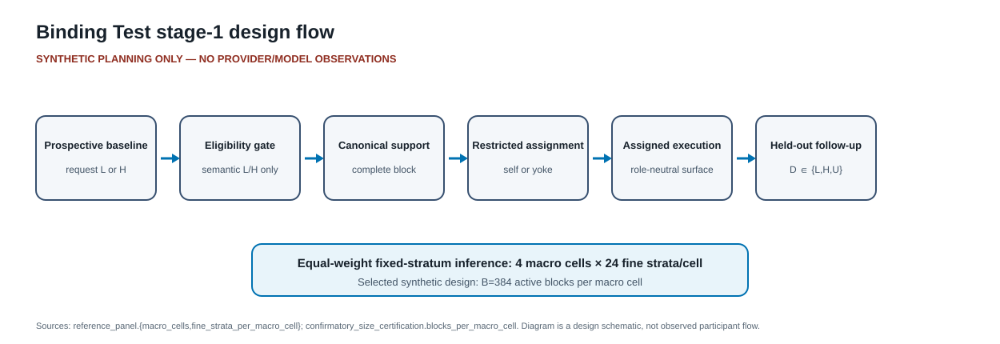
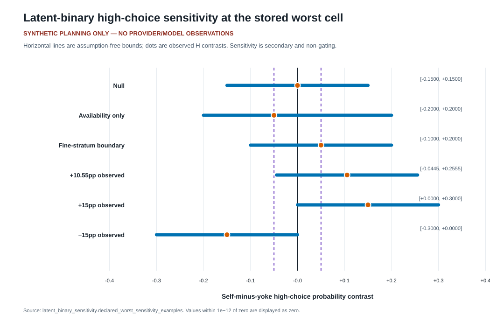
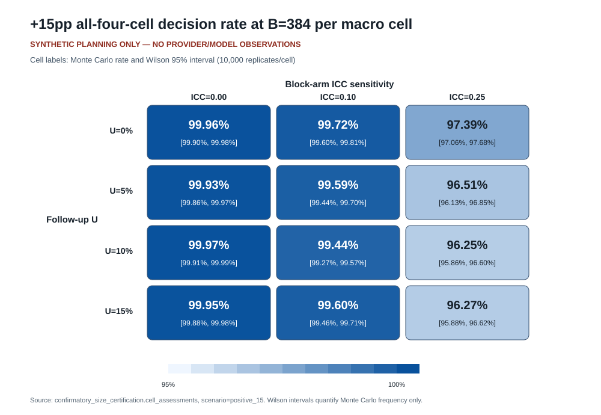
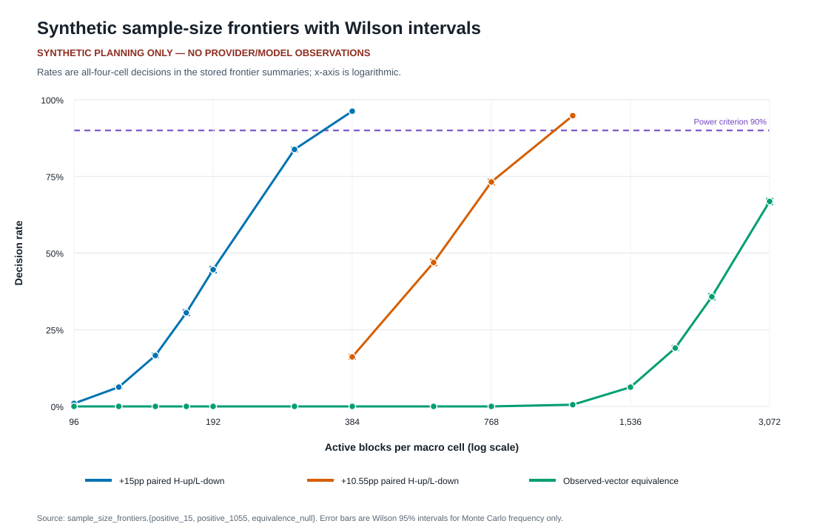
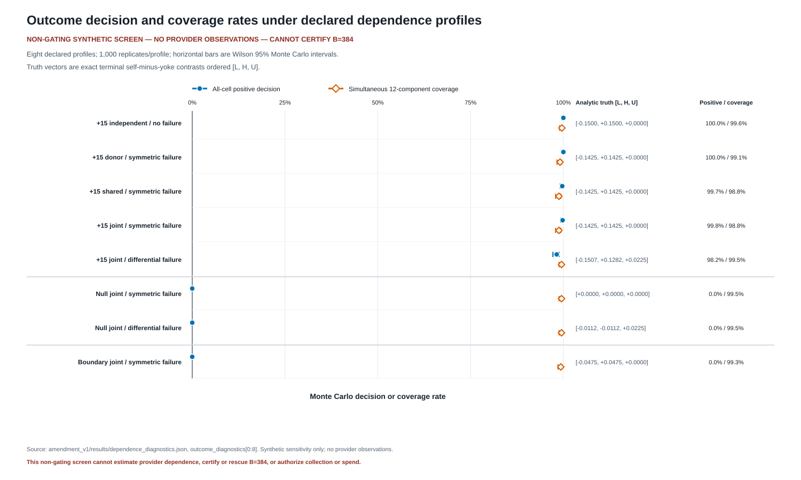
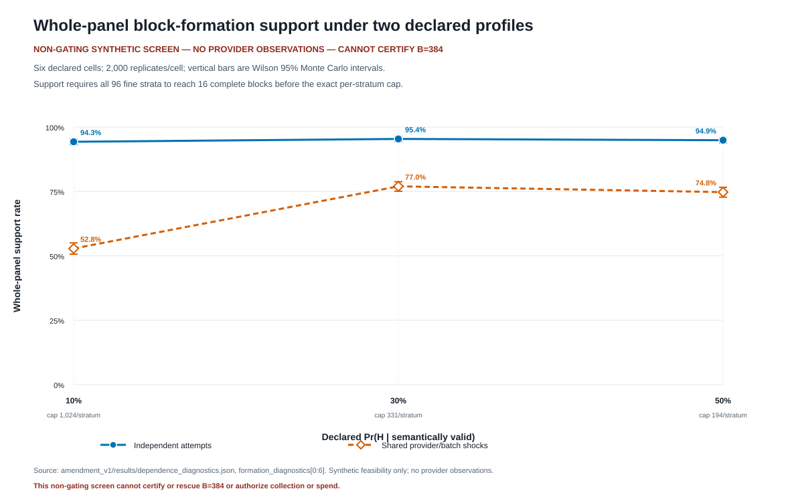

# Paper 8 stage-1 tables and figures

> **SYNTHETIC PLANNING ONLY — NO PROVIDER/MODEL OBSERVATIONS.** The zero-call source reports
> `provider_calls_made=0` and
> `external_spend=0`. Both scientific-data sources
> describe local deterministic construction or seeded synthetic operating
> characteristics; they are not empirical model-behavior results and do not
> authorize collection.
>
> **NON-GATING SYNTHETIC SCREEN — NO PROVIDER OBSERVATIONS — CANNOT CERTIFY B=384.** The amendment-v1 dependence artifact has
> `status=NON_GATING_SYNTHETIC_SCREEN`, `gate_effect=none`,
> and contains no provider observations. It cannot certify or rescue B=384.

## Provenance

- Zero-call source: [`../../zero_call/results/redesign_gate_results.json`](../../zero_call/results/redesign_gate_results.json)
  - Schema: `binding-test-redesigned-zero-call-gate-v1`
  - Generated date: `2026-08-05`
  - SHA-256: `bb52b5feea3fbb94da2226c99c53a648dd7eb0338bf60eae32058fdaf11d5e95`
- Non-gating dependence source: [`amendment_v1/results/dependence_diagnostics.json`](amendment_v1/results/dependence_diagnostics.json)
  - Schema: `binding-test-dependence-diagnostic-v1`
  - Generated date: `2026-08-08`
  - SHA-256: `f1cfcece6e7df658109ee58812fe2883b5964d8c7b73be6d6811a7e1f3e190ef`
  - Evidence class: local seeded synthetic screen; no provider observations;
    cannot certify or rescue B=384.
- Generator: [`generate_tables_figures.py`](generate_tables_figures.py)
- Rebuild: `python3 outputs/paper8_stage1_release_v0/generate_tables_figures.py`
- All CSV rows include a `source_json_path`. Figure footers name the corresponding
  source objects. Values within `1e-12` of zero are normalized to zero only for
  display in the latent-bound artifact.

## Quantitative orientation

- The selected +15pp synthetic design uses
  `B=384` active blocks per macro cell and
  `16` blocks per fine stratum
  (`confirmatory_size_certification.*`).
- Its worst stored U×ICC decision rate is
  **96.25%** with Wilson 95% interval
  **[95.86%, 96.60%]**
  (`confirmatory_size_certification.cell_assessments`, scenario `positive_15`).
- The largest false-control Wilson upper bound is
  **0.019%** across the stored required false-control
  cells (`confirmatory_size_certification.cell_assessments`).
- The +10.55pp supplemental size is
  `B=1152`;
  the broad equivalence headline is
  `ABANDONED`
  (`selected_sizes`).
- All sizes are conditional on the frozen complete-block planning process, which
  models self/yoke arm counts independently and omits terminal execution failure.
  They must be recertified after the required endpoint and dependence amendments.
- In the separate non-gating dependence screen, the lowest positive-all-cell rate
  among the five +15 profiles is
  **98.20%**;
  the lowest simultaneous 12-component coverage across all eight profiles is
  **98.80%**
  (`outcome_diagnostics`). These are synthetic Monte Carlo frequencies, not
  provider-behavior estimates.
- Whole-panel block-formation support spans
  **52.85%** to
  **95.40%** across the
  six declared synthetic formation cells (`formation_diagnostics`). This screen
  is diagnostic only and cannot certify B=384.

## Tables

1. [`tables/design_summary.csv`](tables/design_summary.csv) — frozen panel,
   outcome, margins, selected design, and evidence boundary.
2. [`tables/positive15_u_icc.csv`](tables/positive15_u_icc.csv) — full 4×3
   +15pp U×ICC power grid with Wilson intervals.
3. [`tables/sample_size_frontier.csv`](tables/sample_size_frontier.csv) — +15pp,
   +10.55pp, and observed-vector-equivalence frontiers.
4. [`tables/false_controls.csv`](tables/false_controls.csv) — scenario-wise
   maximum false-headline rate and Wilson upper bound.
5. [`tables/support_request_b384.csv`](tables/support_request_b384.csv) — B=384
   support-assured attempts and active-design request caps under stored planning
   assumptions. Dollar cost remains absent in the source.
6. [`tables/latent_binary_intervals.csv`](tables/latent_binary_intervals.csv) —
   secondary, non-gating assumption-free high-choice bounds.
7. [`tables/dependence_outcome_screen.csv`](tables/dependence_outcome_screen.csv) —
   all eight declared non-gating outcome profiles with analytic L/H/U truth,
   truth roles, decision counts, and Wilson intervals.
8. [`tables/block_formation_screen.csv`](tables/block_formation_screen.csv) — all
   six declared block-formation cells with probability bounds, exact caps,
   support counts and Wilson intervals, and stored support/attempt quantiles.

## Figures

### Figure 1. Prospective design flow

Source keys: `reference_panel` and `confirmatory_size_certification`.
This is a protocol schematic, not an observed participant-flow diagram.

### Figure 2. Latent-binary sensitivity bounds

Source key: `latent_binary_sensitivity.declared_worst_sensitivity_examples`.
These analytical intervals are secondary and cannot create, rescue, or veto the
identified L/H/U planning decision.

### Figure 3. +15pp U×ICC heatmap

Source key: `confirmatory_size_certification.cell_assessments`, filtered to
`scenario=positive_15`. Intervals quantify Monte Carlo frequency only.

### Figure 4. Sample-size frontiers

Source keys: `sample_size_frontiers.positive_15`,
`sample_size_frontiers.positive_1055`, and
`sample_size_frontiers.equivalence_null`. Vertical bars are Wilson 95%
intervals for Monte Carlo frequency.

### Figure 5. Non-gating dependence outcome screen

Suggested manuscript numbering: Figure 5. Source key: `outcome_diagnostics` in
`amendment_v1/results/dependence_diagnostics.json`. The plot compares the
all-cell positive decision rate with simultaneous 12-component coverage and
prints analytic terminal truth vectors. It is a synthetic screen with no
provider observations and cannot certify or rescue B=384.

### Figure 6. Non-gating block-formation support screen

Suggested manuscript numbering: Figure 6. Source key: `formation_diagnostics`
in `amendment_v1/results/dependence_diagnostics.json`. Wilson intervals quantify
Monte Carlo frequency only. The synthetic feasibility comparison contains no
provider observations and cannot certify or rescue B=384.

## Interpretation boundary

The sealed v0 source records the historical claim ceiling
`observed L/H/U disposition reallocation in the exact tested snapshot-by-target cells and prospectively supported randomized population; no latent-choice or mechanism identification`. For this amended release, that wording is narrowed
to: `paired H-increase/L-decrease in observed terminal dispositions, with U
reported separately, in the exact tested snapshot-by-target cells and
prospectively supported randomized population; no latent-choice or mechanism
identification`. Snapshot labels are placeholders, and provider snapshots,
empirical support, token/dollar envelopes, and external approval are not supplied
by this package. The endpoint, `.05` H/L decision boundary, `.05/.05/.02`
secondary margins, exclusion and separate reporting of U, and component-specific
`SE<=1e-12` precedence are statistically frozen only within the amendment
bundle. They are not production-integrated, dependence/resource recertified, or
collection-authorizing. The v0 execution-failure gap additionally blocks
provider collection; see `PROTOCOL_AMENDMENTS_REQUIRED.md`.

The dependence additions are separately bounded by:
`Seeded, non-gating sensitivity results under the eight declared synthetic dependence/failure profiles and two block-formation profiles only. They may flag sensitivity of the complete-block B=384 benchmark but cannot estimate provider dependence, validate the unamended terminal-row schema or state machine, certify or rescue B=384, authorize collection or spend, or support mechanism, latent-choice, preference, welfare, or population-generalization claims.` They are a **NON-GATING SYNTHETIC
SCREEN**, have `gate_effect=none`, contain no provider observations, and cannot
certify B=384.
