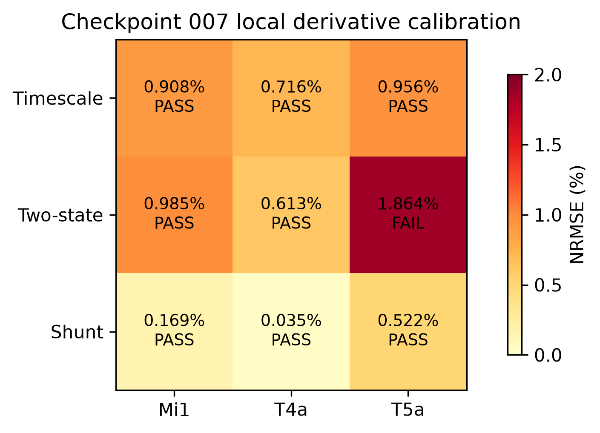
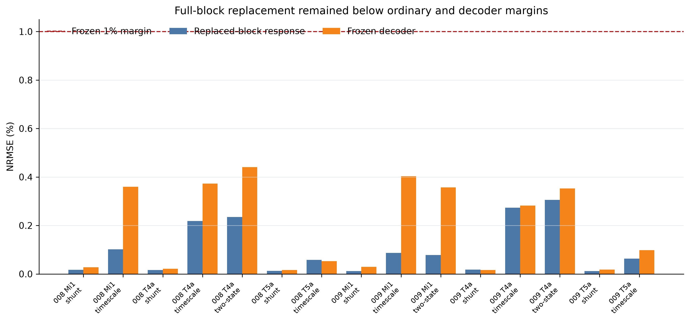
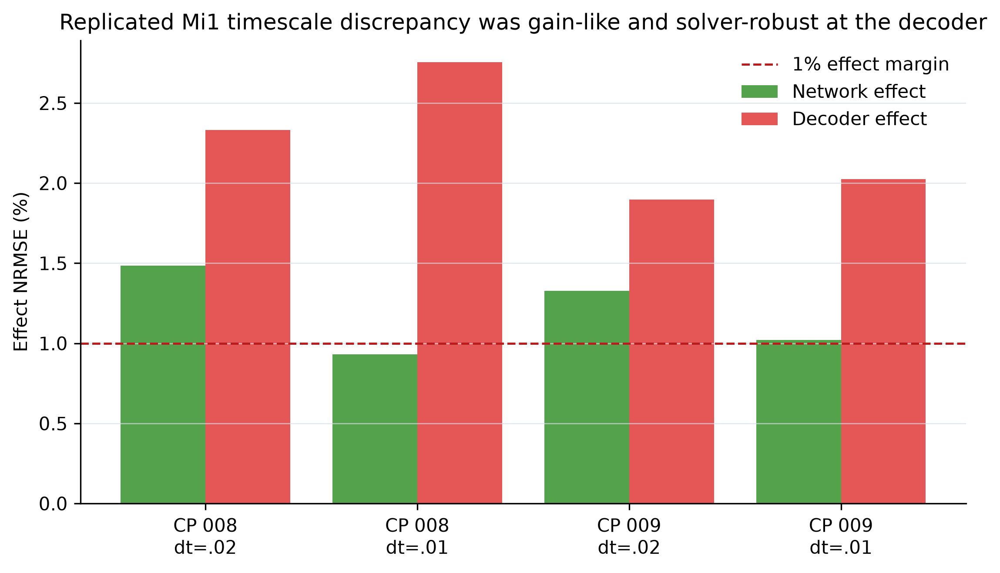
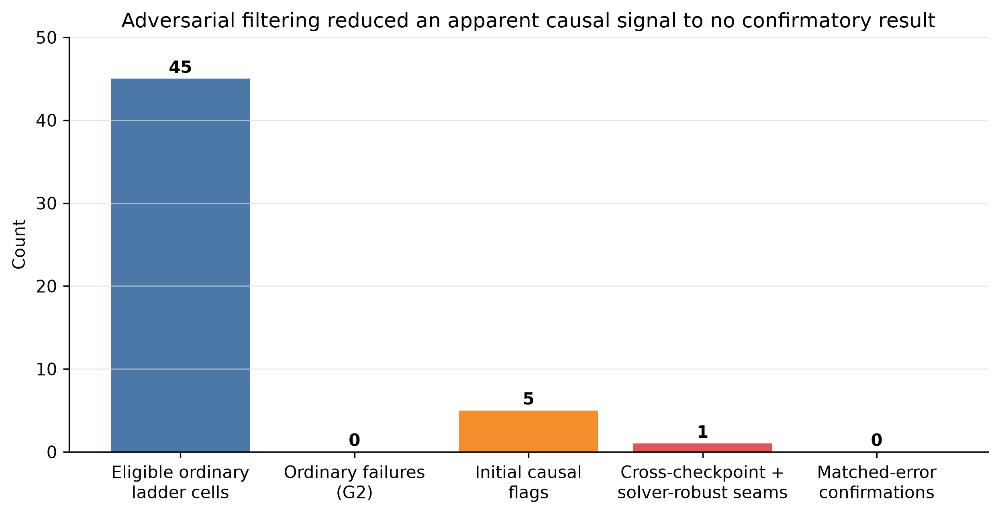

# Stress-Testing Local Neural-Dynamics Equivalence in a Connectome-Constrained Visual System

**Author:** Thomas Ryan  
**Affiliation:** Independent Researcher, San Francisco, California, USA  
**Status:** Internal preprint draft; not peer reviewed; external release not authorized  
**Version:** 0.9 — 23 August 2026

## Abstract

Connectomes constrain which neurons can interact, but neural computation also depends on dynamics that connectomic measurements do not determine. This study asks a compositional question: if an alternative neuron model is locally equivalent to a source model on held-out, source-clamped trajectories, does that equivalence survive when a cell-type block is substituted inside a recurrent connectome-constrained network? I implemented cell-type-masked dynamics substitution in a public model of the *Drosophila* visual system containing 45,669 neurons and 1,513,231 edges. Three alternative dynamics families were calibrated under a frozen 1% local derivative margin and tested in Mi1, T4a, and T5a blocks across 24 moving-edge trajectories, 25–100% replacement, two pretrained checkpoints, an unchanged optic-flow decoder, activity-impulse interventions, and a halved integration step. Exact shams, topology digests, and deliberately wrong controls audited the measurement path.

Local equivalence was neither automatic nor uniform: a two-state substitute failed in T5a and in one Mi1 checkpoint. Among locally eligible cells, however, all 45 replacement-ladder evaluations preserved ordinary block responses and frozen-decoder outputs within the 1% margins; no ordinary composition failure occurred. A more sensitive causal gate found a replicated Mi1 timescale discrepancy: decoder-effect normalized root-mean-square error was 1.897–2.754% across two checkpoints and two step sizes while effect-vector cosines were approximately one. This supports a small gain deviation, not a change in causal direction. A preregistered follow-up attempted to compare dynamics families at matched local error. It stopped before confirmatory holdout exposure because no shunt candidate both passed all local gates and matched the timescale error within the frozen interval.

The resulting claim is bounded. In this model, under these stimuli, interfaces, and margins, locally eligible dynamics substitutions were robust for ordinary responses and decoded output, while perturbation effects exposed a narrow gain sensitivity that did not survive the study's matched-control advance criterion. The study provides a staged falsification protocol and a publishable null boundary; it does not establish connectome sufficiency, biological replaceability, consciousness preservation, or a general composition theorem.

**Keywords:** connectome-constrained model; neural dynamics; model substitution; compositional equivalence; perturbation effects; *Drosophila* visual system; null results

## 1. Introduction

A wiring diagram determines possible routes of influence, not the complete dynamics transmitted along them. Membrane time constants, conductances, synaptic transformations, modulation, state, and other biological details can change how the same connectivity computes. The distinction matters increasingly as connectome-constrained models scale from circuits to complete nervous systems. Such models can generate accurate neural predictions with deliberately simplified dynamics, but their success does not by itself show which local dynamical descriptions are interchangeable after network composition.

Lappalainen et al. (2024) provide an unusually tractable test bed. Their task-optimized deep mechanistic network fixes a consensus connectome for 64 fly visual-system cell types while fitting a compact set of neuron and synapse parameters. The public model predicts many characterized visual responses, including motion selectivity, despite using passive non-spiking point neurons and instantaneous graded synapses. Adjacent theory and empirical work warn against equating anatomy with causal dynamics. Beiran and Litwin-Kumar (2025) show that identical connectome constraints can admit inconsistent recurrent activity solutions, whereas Pospisil et al. (2024) distinguish the connectome from a state-dependent effectome.

This paper asks:

> When an alternative neuron dynamics law matches the source locally, under what measured conditions does that match compose into preserved network activity, decoded output, and perturbation-effect structure?

The contribution is not a new neuron model and not a positive failure headline. It is a controlled substitution assay that separates four questions often collapsed into one: whether the candidate is locally eligible; whether ordinary recurrent activity is preserved; whether an unchanged downstream reader is preserved; and whether causal effects are preserved. The study also reports every local failure, solver-sensitive signal, and stopped follow-up rather than selecting the most favorable endpoint.

## 2. Results

### 2.1 A topology-preserving substitution path passed source-validity controls

The source was `flyvis` 1.2 at commit `92b3845cc426dd309a1a0e1b3890156c42e14021`, executed in an isolated Python 3.12 environment with CPU PyTorch. Twenty-three selected upstream dynamics and network tests passed. The recovered model contained 45,669 nodes, 1,513,231 edges, 64 cell types, 721 retinotopic columns, and 734 fitted source parameters. A frozen 7,427-parameter decoder read the 34 declared model output types.

Cell-type-masked substitution did not alter the node or edge topology. Re-expressing the source equation through the replacement path produced exact zero error in the tested execution path. Deliberately wrong dynamics separated from the source. Three early checkpoints reproduced the expected qualitative L1 OFF preference. These controls establish software-path validity for the tested artifacts; they do not independently validate the biological model.

### 2.2 The local gate rejected a block-specific substitute

The main breadth stage used three dynamics families. The timescale family changed activity velocity by a shared state-dependent timescale coefficient (`alpha=0.01`) without added state. The two-state family added one adaptation scalar per replaced node (`beta=0.25`, `tau=0.1`). The shunt family added a shared conductance-inspired term, `gamma × sigmoid(activity) × (1 − activity)`, with `gamma=0.01` selected on the calibration checkpoint and no added state.

Local equivalence was evaluated on source-clamped velocity trajectories. A candidate had to remain at or below 1% for both NRMSE and a p99 absolute-error ratio, separately for both intensities and for the aggregate battery. This threshold was not relaxed: one quarter of the 10th-percentile source-checkpoint differences was 7.701% for local velocity, 4.872% for block response, and 18.089% for decoder output, all above the authored 1% ceiling.

Timescale and shunt candidates passed in Mi1, T4a, and T5a. The two-state candidate passed Mi1 and T4a but failed T5a with aggregate local NRMSE 1.864%. The failure remained G0—locally ineligible—and could not be used as evidence for either global preservation or composition failure.

### 2.3 Forty-five eligible ladder cells preserved ordinary and decoder outputs

The global battery comprised 12 directions at two intensities, for 24 moving-edge trajectories. Each of Mi1, T4a, and T5a contained 721 nodes. Deterministic spatially balanced masks replaced 25%, 50%, or 100% of a block. The source checkpoint's own pretrained decoder was frozen in evaluation mode and applied unchanged. Because the synthetic moving-edge battery has no ground-truth flow target, the decoder endpoint measures preservation of the source decoder's output, not task accuracy.

Checkpoint 008 produced 21 G1 outcomes, two G0 outcomes, and no G2 outcome. Checkpoint 009 produced 24 G1 outcomes, one G0 outcome, and no G2 outcome. Thus all 45 locally eligible ladder cells remained within ordinary block-response and decoder margins. At full-block replacement, the largest eligible block-response NRMSE was 0.235% on checkpoint 008 and 0.305% on checkpoint 009. The corresponding largest decoder NRMSE values were 0.441% and 0.403%. Wrong controls produced decoder NRMSE of 1.554–2.703% and 1.632–2.792%, respectively. Exact errors were zero and topology was unchanged.

This is an empirical robustness region, not statistical proof of a universal null. The 45 cells are nested combinations of checkpoint, block, family, and fraction; they are not 45 independent experiments.

### 2.4 Causal probes exposed a narrow gain discrepancy

An activity impulse of +0.01 was applied to every neuron in the replaced block at 0.5 seconds under four predeclared direction–intensity conditions. Perturbation effects were computed within each system before source–candidate comparison. At `dt=0.02`, checkpoint 009 initially produced four G3 flags among eight eligible block–family pairs, while checkpoint 008 produced one. Halving the step size to `dt=0.01` killed the T4a timescale and two-state flags; T5a timescale did not replicate across checkpoints.

The sole cross-checkpoint, solver-robust discrepancy was full Mi1 replacement by the timescale family. Decoder-effect NRMSE was 2.331% and 2.754% for checkpoint 008 at `dt=0.02` and `0.01`, and 1.897% and 2.025% for checkpoint 009. Network-effect NRMSE ranged from 0.932% to 1.484%. Ordinary NRMSE on the causal subset was only 0.0127–0.0275%. Effect-vector cosines were approximately 1.0, so the discrepancy was almost collinear with the source response. The appropriate description is altered perturbation gain at a fixed interface, not altered causal organization.

### 2.5 A matched-error falsification attempt stopped before confirmatory exposure

The causal discrepancy could reflect a dynamics-family-specific amplification or simply the amount of residual local mismatch. A frozen follow-up therefore required a shunt candidate that both passed the entire checkpoint-012 local gate and matched timescale local NRMSE within a ratio of 0.8–1.25.

Timescale passed with aggregate local NRMSE 0.909%. Shunt `gamma=0.05` had aggregate NRMSE 0.761% and a matching ratio of 0.836, but failed the intensity-1 gate at 1.027%. The largest passing shunt, `gamma=0.025`, had NRMSE 0.380% and a ratio of only 0.418. No candidate satisfied both conditions. The protocol stopped. No interpolated `gamma≈0.048` was added after seeing the result, and checkpoints 013–014 remained unexposed.

Consequently, the Mi1 causal seam remains an exploratory observation, not a confirmed family-specific effect. The stopped comparison is informative because it records a failed identification condition rather than silently optimizing a control after outcome inspection.

## 3. Discussion

### 3.1 What the study establishes

The experiment establishes three bounded points. First, local equivalence is an empirical gate, not a property that can be assumed from a shared equation family or small parameter change. The T5a two-state failure and checkpoint-dependent Mi1 eligibility demonstrate this directly. Second, within the admitted equivalence class, ordinary recurrent activity and unchanged-decoder output were robust across full block replacement in the tested model. Third, perturbation-effect measures can detect small interface-level differences that ordinary trajectories do not.

The methodological separation matters. Without the local gate, a globally divergent but locally wrong substitute could be mistaken for a failure of composition. Without the unchanged decoder, preserved internal activity could obscure interface drift. Without causal and solver controls, ordinary robustness or numerical artifacts could be overinterpreted. Without a matched-error control, a small causal difference could be attributed to mechanism family when it may follow from unequal residual error.

### 3.2 What the study does not establish

The data do not show that the connectome is sufficient to determine fly visual dynamics. The source already includes task-fitted neuron and synapse parameters, and the alternatives were small, engineered perturbations of that source. Nor do the results show biological interchangeability. The network is a tiled consensus model with passive point neurons and instantaneous graded synapses, not a living fly, and the moving-edge set covers a narrow computation.

The results also do not establish a general theorem that local equivalence composes. Robustness was measured at one threshold, on three blocks, three candidate families, two global checkpoints, and one fixed decoder. Conversely, the Mi1 causal discrepancy does not establish distinct causal organization: the effect direction was preserved, magnitudes were small, and no admissible matched-error comparator reached the confirmatory holdouts.

Finally, nothing in this experiment measures consciousness, experience, personal identity, survival, or subject preservation. Those questions motivated the broader research lineage, but this computational assay does not identify them.

### 3.3 Statistical interpretation

No inferential p-values are reported. Checkpoint was the intended replication unit, but the public archive's metadata did not establish complete independent-randomization provenance across checkpoints. Neurons, columns, frames, directions, contrasts, fractions, and causal cells are repeated or nested measurements. Accordingly, results are descriptive and gate-based. Reported hashes verify artifact identity; exact shams verify an execution path; neither supplies independent evidence.

The absence of G2 among 45 eligible ladder cells is not a binomial confidence statement. It is a full accounting of a fixed exploratory grid. Likewise, four Mi1 causal cells across two checkpoints and two time steps are robustness controls on one seam, not four biological replicates.

### 3.4 Next decisive experiment

A confirmatory continuation should be a new registered generation, not a reinterpretation of these data. It should optimize local-error matching without exposing global outcomes, then freeze a non-interpolated candidate-selection rule. At least three checkpoints with documented independent training seeds should be reserved. Primary outcomes should include the full causal effect vector, signed gain, absolute effect scale, and unchanged-decoder effect. A field-relevant composition claim should require a replicated result in at least two blocks or two informative dynamics families and should remain stable under solver, impulse amplitude, and impulse timing variations.

The equally valuable null outcome would be a predeclared upper region of ordinary and causal robustness under well-matched alternatives. Either result would be stronger than adding more post-hoc substitutions to the present exploratory grid.

## 4. Methods

### 4.1 Source model, software, and checkpoints

Experiments used the public `flyvis` implementation of the Lappalainen et al. model at commit `92b3845cc426dd309a1a0e1b3890156c42e14021` (`flyvis` 1.2) in an isolated Python 3.12 environment. The source model has 45,669 neurons, 1,513,231 edges, 64 cell types, 721 columns, and 734 fitted parameters. Computation was local and CPU-based; no paid compute was used.

The official pretrained archive was checksum-verified. Checkpoints 005–007 were used for source-margin estimation and local calibration; 008 and 009 were used as global holdouts and causal tests. Checkpoints 010–012 were used in the source-only denominator and matched-error calibration stages. Checkpoints 013–014 were reserved and remained untouched after the matching gate failed.

### 4.2 Substitute dynamics and capacity

All substitutes preserved the source topology and the source synaptic computation. The timescale candidate used the frozen shared coefficient `alpha=0.01` and no additional state. The two-state candidate used `beta=0.25`, `tau=0.1`, and one additional adaptation scalar per replaced node. The shunt candidate added

`gamma × sigmoid((activity − theta) / scale) × (E_rev − activity)`

to source activity velocity, with `theta=0`, `scale=1`, `E_rev=1`, and no additional state. The selected breadth-stage value was `gamma=0.01`; `gamma=1` was the wrong control. No candidate accessed checkpoint identity, node identity, source derivatives at runtime, per-node lookup tables, or a refitted decoder.

### 4.3 Local equivalence and margins

For source checkpoint `s`, block `b`, and dynamics family `d`, local error `L(s,b,d)` was measured between source and candidate velocity on source-clamped activity and presynaptic-drive trajectories. NRMSE was RMSE divided by source RMS. A local pass required aggregate and intensity-specific NRMSE and p99 absolute-error ratios at or below 0.01.

Source-only checkpoint differences from checkpoints 005–007 were calculated before candidate calibration. The local, block-response, and decoder margins were the minimum of an authored 1% ceiling and one quarter of the corresponding 10th-percentile source difference, with exact-sham floors. All selected margins remained 1%.

### 4.4 Stimuli, blocks, and replacement ladder

The global battery used `MovingEdge` stimuli at directions 0–330 degrees in 30-degree steps and intensities 0 and 1, with speed 19, `dt=0.02`, 0.5 seconds pre- and post-period, and continuous post-padding. Mi1, T4a, and T5a each comprised 721 retinotopic nodes. Replacement fractions were 0.25, 0.5, and 1.0 using deterministic spatially balanced masks.

Ordinary measurements included all-node NRMSE, replaced-block NRMSE, unreplaced-node NRMSE, directional tuning, preferred-direction shift, tuning-vector cosine, finiteness, and terminal error. Decoder measurements used the same checkpoint's 7,427-parameter pretrained flow decoder, frozen in evaluation mode.

### 4.5 Causal-effect test and solver control

For eligible full-replacement cells, a +0.01 activity impulse was applied to the entire replaced block at frame 25 (`t=0.5 s`) for `(direction, intensity)` cells `(0,0)`, `(90,1)`, `(180,0)`, and `(270,1)`. Source and candidate effects were each computed as perturbed minus unperturbed activity or decoder output before comparison. Decisive cells were repeated at `dt=0.01`, moving the impulse to frame 50 to preserve physical time.

### 4.6 Outcome classes and stopping rules

G0 denotes local failure. G1 denotes local pass with ordinary, decoder, and tested causal endpoints within their margins. G2 denotes local pass plus solver-robust ordinary or decoder failure. G3 denotes local and ordinary pass plus solver-robust perturbation-effect failure. No pooled average could hide a block, intensity, checkpoint, or solver failure.

The advance rule required replicated G2/G3 evidence across checkpoints 008 and 009 in at least two blocks or two informative families, or a strict multi-family robustness frontier across all tested blocks and endpoints. Neither route passed. The subsequent matched-error study required a locally valid shunt/timescale error ratio of 0.8–1.25 before any global holdout exposure. Failure triggered termination.

### 4.7 Reproducibility and integrity

Source scripts, frozen designs, result JSONs, table-generation code, and artifact hashes are listed in the supplement and reproducibility manifest. Exact shams, wrong controls, topology digests, finiteness checks, and a synthetic local-pass/global-fail fixture tested the assay. An initial causal-hook timing error was detected by the exact-sham control and corrected before any result was accepted; both the defect and correction are retained in the audit trail.

## 5. Data, Code, Ethics, and Authorship Statements

**Data and code availability.** All analysis in this draft uses public source software/model artifacts and local derived result files. External release has not been authorized. A release manifest specifies what can be deposited if Thomas Ryan authorizes publication and source licenses permit redistribution.

**Ethics.** This is an in-silico study using public computational artifacts. No human participants or living animals were involved. The primary ethical risk is interpretive overreach from model substitution to biological or consciousness claims; the claim ceiling above is binding.

**Author contributions.** Thomas Ryan is the sole human author and accountable operator.

**AI assistance disclosure.** AI systems assisted with literature triage, protocol stress-testing, code drafting, artifact checking, figure generation, and manuscript drafting under Thomas Ryan's direction. AI systems are not authors, did not independently validate the findings, and bear no accountability. All claims, code, analyses, and release decisions require human review.

**Competing interests.** The author declares no competing interests.

## References

Lappalainen, J. K., Tschopp, F. D., Prakhya, S., et al. (2024). Connectome-constrained networks predict neural activity across the fly visual system. *Nature*, 634, 1132–1140. https://doi.org/10.1038/s41586-024-07939-3

Pospisil, D. A., Aragon, M. J., Dorkenwald, S., et al. (2024). The fly connectome reveals a path to the effectome. *Nature*, 634, 201–209. https://doi.org/10.1038/s41586-024-07982-0

Beiran, M., & Litwin-Kumar, A. (2025). Prediction of neural activity in connectome-constrained recurrent networks. *Nature Neuroscience*, 28, 2561–2574. https://doi.org/10.1038/s41593-025-02080-4

Turaga Lab. (2026). *flyvis: A connectome-constrained deep mechanistic network model of the fruit fly visual system in PyTorch* (version 1.2, commit `92b3845`). https://github.com/TuragaLab/flyvis
